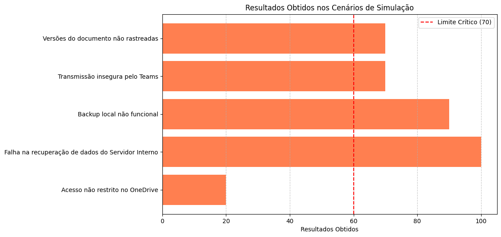
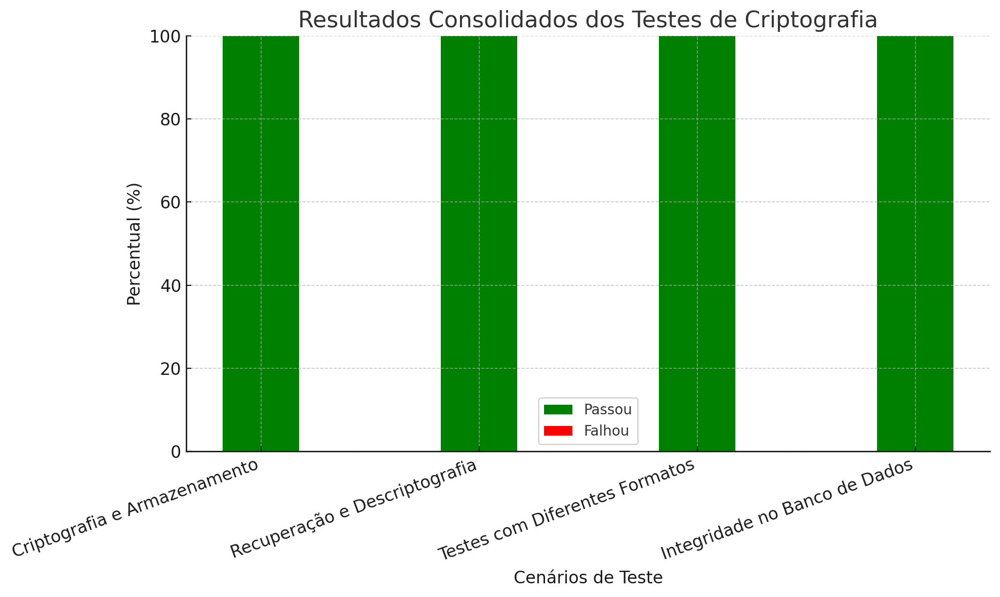

# Sumário

1. [Analise do parceiro de projeto e Business Drivers](#1---analise-do-parceiro-de-projeto-e-business-drivers)
   - [1.1 - Setor de aplicação](#11---setor-de-aplicação)
   - [1.2 - Adição de Valor](#12---adição-de-valor)
   - [1.3 - Processo de Negócio e Fluxos Críticos Suportados pelo Sistema](#13---processo-de-negócio-e-fluxos-críticos-suportados-pelo-sistema)
   - [1.4 - Volumes](#14---volumes)
   - [1.5 - Estratégias de Crescimento](#15---estratégias-de-crescimento)

2. [Riscos e Oportunidades](#2---riscos-e-oportunidades)
   - [2.1 - Riscos ligados ao Sistema](#21---riscos-ligados-ao-sistema)
   - [2.2 - Oportunidades de Melhorias dos SLAs](#22---oportunidades-de-melhorias-dos-slas)
   - [2.3 - Avaliação dos Resultados e Limites do Sistema](#23---avaliação-dos-resultados-e-limites-do-sistema)
   - [2.4 - Avaliação dos Riscos Resultantes](#24---avaliação-dos-riscos-resultantes)

3. [Arquitetura do Sistema Novo - Especificação de Requisitos](#3---arquitetura-do-sistema-novo---especificação-de-requisitos)
   - [3.1 - Requisitos Não Funcionais](#31---requisitos-não-funcionais)

4. [Visão Modelo Comportamental (Simulação do Atual)](#4---visão-modelo-comportamental-simulação-do-atual)
   - [4.1 - Estrutura Estática do Modelo](#41---estrutura-estática-do-modelo)
   - [4.2 - Modelagem Comportamental e Simulação dos RNFs](#42---modelagem-comportamental-e-simulação-dos-rnfs)

5. [Avaliação dos Mecanismos Utilizados no Sistema Atual (ATAM)](#5---avaliação-dos-mecanismos-utilizados-no-sistema-atual-atam)
   - [5.1 - Revisão do Mapa de Requisitos Não-Funcionais e Respectivas Vulnerabilidades](#51---revisão-do-mapa-de-requisitos-não-funcionais-e-respectivas-vulnerabilidades)
   - [5.2 - Requisitos Não-Funcionais Selecionados](#52---requisitos-não-funcionais-selecionados)
   - [5.3 - Táticas Arquiteturais e Componentes Adotados que Ajudam a Execução e o Controle dos RNFs do Sistema Atual](#53---táticas-arquiteturais-e-componentes-adotados-que-ajudam-a-execução-e-o-controle-dos-rnfs-do-sistema-atual)
   - [5.4 - Conclusão](#54---conclusão)

6. [Especificação da Solução Técnica do Sistema Novo](#6---especificação-da-solução-técnica-do-sistema-novo)
   - [6.1 - Revisão do Mapa de Requisitos Não-Funcionais do Sistema Novo](#61---revisão-do-mapa-de-requisitos-não-funcionais-do-sistema-novo)
   - [6.2 - Táticas Arquiteturais e Componentes Adotados que Ajudam a Execução e o Controle dos RNFs do Sistema Novo](#62---táticas-arquiteturais-e-componentes-adotados-que-ajudam-a-execução-e-o-controle-dos-rnfs-do-sistema-novo)

7. [Simulação do Sistema](#7---simulação-do-sistema)
   - [7.1 - Simulação do Sistema Atual](#71---simulação-do-sistema-atual)
   - [7.2 - Simulação do Sistema Novo](#72---simulação-do-sistema-novo)
   - [7.3 - Justificativa das Melhorias](#73---justificativa-das-melhorias)

8. [Implementação dos Mecanismos Arquiteturais](#8---implementação-dos-mecanismos-arquiteturais)
   - [8.1 - Especificação e Codificação dos Testes Não-Funcionais](#81---especificação-e-codificação-dos-testes-não-funcionais)
   - [8.2 - Especificação e Codificação dos Componentes](#82---especificação-e-codificação-dos-componentes)

9. [Testes Automatizados Não-Funcionais](#9---testes-automatizados-não-funcionais)
   - [9.1 - Mapa de Testes Automatizados](#91---mapa-de-testes-automatizados)

10. [Revisão do Modelo de Simulação do Sistema Novo](#10---revisão-do-modelo-de-simulação-do-sistema-novo)
    - [10.1 - Simulação das Condições de Exceção](#101---simulação-das-condições-de-exceção)
    - [10.2 - Simulação das Condições Limites](#102---simulação-das-condições-limites)
    - [10.3 - Recomendações Finais](#103---recomendações-finais)

11. [Ajustes de Implementação](#11---ajustes-de-implementação)
    - [11.1 - Identificação de Ajustes](#111---identificação-de-ajustes)
    - [11.2 - Códigos dos Ajustes](#112---códigos-dos-ajustes)

12. [Evidências de Testes Não-Funcionais para Ajustes](#12---evidências-de-testes-não-funcionais-para-ajustes)
    - [12.1 - Implementação dos Testes Automatizados](#121---implementação-dos-testes-automatizados)
    - [12.2 - Análise dos Registros de Testes](#122---análise-dos-registros-de-testes)

13. [Medir o Sistema Novo](#13---medir-o-sistema-novo)
    - [13.1 - Modelo de Medição](#131---modelo-de-medição)
    - [13.2 - Coleta dos Dados da Estrutura](#132---coleta-dos-dados-da-estrutura)
    - [13.3 - Coleta de Dados do Comportamento](#133---coleta-de-dados-do-comportamento)
    - [13.4 - Avaliação das Medições](#134---avaliação-das-medições)

14. [Identificar os Tradeoffs Arquiteturais](#14---identificar-os-tradeoffs-arquiteturais)
    - [14.1 - Mapeamento de Tradeoffs de Arquitetura de Acordo com Requisitos Conflitantes](#141---mapeamento-de-tradeoffs-de-arquitetura-de-acordo-com-requisitos-conflitantes)
    - [14.2 - Evidência dos Tradeoffs com base em Medidas Realizadas](#142---evidência-dos-tradeoffs-com-base-em-medidas-realizadas)

15. [Arquitetura do Sistema Novo (Storytelling de dados)](#15---arquitetura-do-sistema-novo-storytelling-de-dados)
    - [15.1 - Descrição comentada da evolução arquitetural](#151---descrição-comentada-da-evolução-arquitetural)
    - [15.2 - Fluxo do Usuário e Componentes Arquiteturais](#152---fluxo-do-usuário-e-componentes-arquiteturais)
    - [15.3 - Conclusão](#153---conclusão)
    - [15.4 - Recomendações](#154---recomendações)
    - [15.5 - Medições Finais](#155---medições-finais)

16. [Conclusão](#16---conclusão)

# 1 - Analise do parceiro de projeto e Business Drivers

&emsp;&emsp;Nesta seção serão abordados tópicos relacionados à análise do parceiro, o Instituto de Pesquisas Tecnológicas (IPT), que são fundamentais para garantir o alinhamento estratégico e operacional em qualquer desenvolvimento tecnológico. O IPT, uma das instituições mais renomadas no Brasil em ciência e tecnologia aplicada, possui grande expertise na área de engenharia civil, oferecendo serviços de inspeção de obras e edificações, cujo objetivo é garantir a qualidade, segurança e conformidade técnica em projetos de construção. A solução em desenvolvimento visa arquitetar um sistema que melhore a gestão dos relatórios técnicos gerados durante essas inspeções.

## 1.1 - Setor de aplicação

&emsp;&emsp;O sistema em desenvolvimento é voltado para o setor de Engenharia Civil, mais especificamente para o Instituto de Pesquisas Tecnológicas (IPT), na área de inspeção de obras e edificações. A solução desejada deve atender à demanda de transferência de dados, armazenamento seguro e integridade de relatórios técnicos, promovendo confiança e confiabilidade para os clientes, além de contribuir para o desenvolvimento eficiente de projetos no setor. O armazenamento seguro de dados reduz o risco de perdas, fraudes e adulterações de informações, além de agilizar o acesso a relatórios por parte dos clientes, engenheiros e demais envolvidos nos projetos, facilitando assim a tomada de decisões.

&emsp;&emsp;Com isso, a confidencialidade no processo de inspeção aumenta, o que fortalece a reputação do IPT e assegura a execução de projetos com maior transparência e precisão. Os principais afetados por essa solução são os clientes do IPT, que incluem construtoras, engenheiros, arquitetos e gestores de obras que dependem da qualidade dos relatórios de inspeção para a continuidade de seus projetos. Além disso, órgãos reguladores que fiscalizam a conformidade de edificações também se beneficiam do aumento na segurança e acessibilidade dos relatórios, assim como instituições de pesquisa que podem utilizar dados com maior confiança para fins acadêmicos e de inovação tecnológica no setor. A confiabilidade proporcionada pela solução tem um impacto direto na qualidade das obras e na segurança pública.

&emsp;&emsp;Para compreender como esses setores estão envolvidos com o sistema, vale informar que o setor de construção civil está em expansão e cada vez mais orientado pela tecnologia, refletindo o aumento de investimentos significativos voltados para inovações e soluções digitais que apoiam a produtividade, sustentabilidade e segurança. Estudos indicam que esse mercado globalmente direciona aproximadamente $1.2 trilhões anuais para construção, com uma parte crescente voltada para a tecnologia. Entre 2014 e 2019, os investimentos em startups de construção tecnológica quintuplicaram, impulsionados pela busca por ferramentas digitais que aprimoram a execução de projetos e reduzem custos​

&emsp;&emsp;Conclui-se que o sistema desenvolvido está bem posicionado para atender o setor de construção civil, que tem demonstrado grande apetite por soluções tecnológicas, principalmente aquelas que promovem eficiência, sustentabilidade e segurança. A expansão contínua deste setor e o aumento expressivo de investimentos em tecnologia evidenciam a necessidade de ferramentas digitais robustas e adaptáveis, as quais contribuem diretamente para o gerenciamento de projetos, redução de custos e aprimoramento de processos operacionais. Dessa forma, ao atender diretamente as necessidades de produtividade e sustentabilidade do setor, o sistema não apenas suporta a evolução industrial, mas também contribui para o progresso estratégico da construção civil, alinhando-se com a tendência crescente de digitalização neste mercado.

## 1.2 - Adição de Valor

&emsp;&emsp;Em relação a adição de valor, a arquitetura flexível em desenvolvimento para o IPT promete agregar valor substancial ao focar em gestão de acesso com alta confidencialidade e tolerância a falhas, pilares centrais da solução projetada. Diferentemente de uma solução voltada apenas para a digitalização e colaboração, o foco está em apresentar uma estrutura que priorize segurança e integridade dos dados, assegurando que a confidencialidade seja preservada. A arquitetura em desenvolvimento tem como foco permitir que os relatórios sejam gerenciados com controle rigoroso de quem pode acessar e modificar as informações, reforçando a integridade em todos os níveis do sistema.

&emsp;&emsp;Além disso, a estrutura do sistema em planejamento visa garantir alta tolerância a falhas, fundamental para a segurança e confiabilidade do armazenamento dos dados. A capacidade de recuperação rápida, mesmo em casos de falha de hardware ou erro humano, assegura a continuidade operacional sem perda de dados críticos. A arquitetura também promete apresentar como prever estratégias de backup redundante, mitigando o risco de perda de dados e permitindo recuperação eficiente, um aspecto necessário e fundamental para a confiança dos clientes e parceiros. Segue abaixo uma tabela com mais informações sobre a proposta da equipe em relação aos valores agregados deste projeto para o IPT:

| Valores | Descrição |
| ------- | --------- |
| Gestão de Acesso com Alta Confidencialidade | Visa permitir o controle rigoroso sobre quem pode acessar e modificar informações, reforçando a confidencialidade. |
| Tolerância a Falhas | Promete garantir que o sistema possa se recuperar de falhas de hardware, software ou humana sem comprometer a integridade dos dados. |
| Backup Redundante | Busca mitigar o risco de perda de dados, oferecendo uma estratégia de backup redundante para maior segurança. |
| Integridade dos Dados | Assegura que todos os dados estejam protegidos contra adulterações, com trilhas de auditoria automatizadas. |

&emsp;&emsp;Portanto, com todas as informações citadas anteriormente, pode-se dizer que o valor agregado desta solução está na sua capacidade de apresentar um projeto arquitetural bem estruturado, de alta valia para uma futura implementação por parte do parceiro, garantindo assim que o IPT tenha acesso à uma ferramenta capaz de facilitar o controle total sobre quem acessa as informações das inspeções de obras e edificações, além de garantir que elas são transferidas e armazenadas de forma segura e eficiente.

## 1.3 - Processo de Negócio e Fluxos Críticos Suportados pelo Sistema

&emsp;&emsp;Para esta seção, o foco será descrever como o sistema suporta o fluxo de negócios do processo de inspeção predial, detalhando os principais fluxos críticos envolvidos.

&emsp;&emsp;A imagem abaixo ilustra o processo atual do parceiro:

<div align="center">
  <sub>Figura 1: AS IS (Processo Atual)</sub>
  
  <sup>Fonte: Os autores (2024)</sup>
</div>

### Inspeção Predial e Identificação de Patologias
&emsp;&emsp;O processo de inspeção predial inicia-se com o profissional responsável realizando uma vistoria visual no local para identificar as manifestações patológicas. Esse processo envolve a observação de problemas estruturais ou de outro tipo, como rachaduras, infiltrações e outros danos. A coleta de dados é realizada de maneira descritiva e complementada por registros fotográficos e, em alguns casos, vídeos.

&emsp;&emsp;Esses dados visuais são fundamentais para o mapeamento de problemas no prédio e, por isso, são categorizados e localizados em uma planta 2D ou 3D. Nesse ponto, surge um ponto crítico do sistema: a falta de padronização nas fotografias e a ausência de um sistema de rastreabilidade estruturado para as imagens coletadas. Essa vulnerabilidade torna o processo suscetível a inconsistências no registro das patologias e na localização exata dos problemas na planta.

### Organização da Documentação
&emsp;&emsp;Após a coleta inicial, os dados e imagens são digitalizados e organizados no escritório, onde são inseridos em planilhas eletrônicas e armazenados em plataformas como OneDrive e Teams. O sistema deve, neste ponto, suportar o armazenamento e organização de um grande volume de fotos (600 a 800 por inspeção) e vídeos, garantindo segurança e integridade dos dados. O fluxo inclui o uso de mapas 2D/3D para marcar os pontos críticos de maneira visual, mas não há integração direta entre o sistema de armazenamento e os mapas de plantas.

&emsp;&emsp;Outro ponto crítico identificado é a descentralização do armazenamento, com dados sendo distribuídos em diferentes locais, como OneDrive e servidores internos, além de backups locais. A falta de um repositório único pode causar confusão e vulnerabilidades em termos de segurança e rastreabilidade.

### Armazenamento e Segurança
&emsp;&emsp;Um ponto de atenção é o risco de perda de dados devido à falta de um backup unificado. A coleta de dados é salva no OneDrive, mas a versão final dos documentos é armazenada nos servidores internos. O sistema proposto deve suportar essa etapa, melhorando a segurança e garantindo backup em tempo real para mitigar riscos de perda de dados. A vulnerabilidade do backup manual local também deve ser abordada, evitando a perda de dados essenciais.

### Controle e Revisão
&emsp;&emsp;O sistema precisa suportar o controle de revisão do laudo final, que passa por uma equipe de três pessoas. Atualmente, o processo de rastreabilidade é feito por meio de chats no Teams e revisões no Word, o que representa uma fragilidade em termos de controle de versões e possibilidade de alterações não autorizadas nos documentos após sua finalização. Um sistema de controle de versões automatizado poderia melhorar esse processo, fornecendo logs detalhados de alterações.

### Fluxo Crítico e Vulnerabilidades

&emsp;&emsp;O fluxo crítico de trabalho no sistema de suporte à inspeção predial abrange várias etapas, desde a coleta de dados até o armazenamento final dos laudos. A tabela a seguir resume essas etapas, destacando as vulnerabilidades associadas a cada uma delas.

| Etapa do Fluxo              | Descrição                                                                                     | Vulnerabilidades                                                  |
|-----------------------------|----------------------------------------------------------------------------------------------|------------------------------------------------------------------|
| Coleta de dados             | A inspeção no campo e o registro das patologias em formato visual e textual.                | Falta de padronização das fotografias.                           |
| Digitalização e organização  | No escritório, os dados são inseridos em planilhas e mapas, e organizados no Word para elaboração do laudo. | Descentralização do armazenamento de dados.                      |
| Revisão e assinatura        | O laudo final é revisado por uma equipe e assinado digitalmente via Adobe.                  | Fragilidade no processo de controle de versões e rastreabilidade. |
| Armazenamento e backup      | O laudo é armazenado em servidores internos, enquanto os dados brutos ficam no OneDrive.   | Dependência de backups manuais.                                   |

&emsp;&emsp;A análise do fluxo crítico e das vulnerabilidades associadas revela a necessidade de implementação de melhorias no sistema, para mitigar os riscos identificados e aprimorar a operação do sistema.

## 1.4 - Volumes

&emsp;&emsp;O sistema de suporte à inspeção predial lida com volumes consideráveis de dados e transações, principalmente relacionados ao registro de patologias e organização dos documentos. Abaixo estão os principais pontos de volumetria e os destaques de vulnerabilidades relacionadas ao sistema:

1. Clientes e Inspeções
- Número de inspeções por mês: 2 inspeções simultâneas de médio porte.
- Tempo médio de uma inspeção: 3 a 5 dias.
- Número médio de fotos por inspeção: Entre 600 e 800 fotos.
- Volume de vídeo por inspeção: Aproximadamente 1 GB de vídeo por inspeção (3 a 5 minutos de vídeo).

&emsp;&emsp;Vulnerabilidade: O grande volume de fotos e vídeos cria uma demanda por armazenamento eficiente e seguro, além de uma padronização dos arquivos. A falta de padronização nas fotos pode levar a dificuldades na organização e análise posterior. Além disso, a descentralização dos dados entre OneDrive, servidores internos e backups locais gera riscos de perda ou corrupção de dados.

2. Transações e Registros
- Digitalização e armazenamento: Após a coleta em campo, os dados são digitalizados e organizados no escritório. As fotografias e vídeos são transferidos para OneDrive e posteriormente integrados ao laudo final.
- Documentos gerados por inspeção: Laudo final, registros de vistorias, relatórios intermediários e mapas de localização das patologias.

&emsp;&emsp;Vulnerabilidade: O sistema depende de uma transferência manual dos dados para o Word e a sua revisão. A falta de um sistema automatizado de integração entre os registros e o laudo final pode gerar retrabalho e erros humanos, aumentando o risco de inconsistência nos dados.

3. Falhas e Incidentes
- Possibilidade de perda de dados: A ausência de um sistema centralizado e a dependência de backups locais e no OneDrive representam um ponto crítico de falha. Se o OneDrive ou o backup local falharem, o risco de perda de dados aumenta.
- Alterações não rastreadas: A rastreabilidade atual é limitada ao chat do Teams e à revisão de versões no Word, o que não garante a integridade das informações. Falhas de comunicação ou erro no controle de versões podem resultar em perdas ou modificações não autorizadas.

&emsp;&emsp;Vulnerabilidade: A falta de um sistema robusto de controle de versão automatizado e a descentralização dos backups aumentam as chances de incidentes com perda de dados e retrabalho, além de dificultar a detecção de alterações após a finalização do laudo.

4. Quebras de Contrato e Conformidade
- Relação com licitações públicas: As inspeções prediais geram quantitativos que são usados como base para processos licitatórios. Quebras na conformidade ou falhas nos registros podem impactar diretamente as licitações e gerar problemas contratuais.

&emsp;&emsp;Vulnerabilidade: A falta de um sistema estruturado de controle e rastreabilidade pode comprometer a integridade dos dados apresentados em licitações, potencialmente levando a quebras de contrato por inconsistência nos dados fornecidos.

### 1.4.1 Cálculos de Volumetria

&emsp;&emsp;Para obter uma visão mais detalhada da volumetria do sistema de suporte à inspeção predial, realizaremos alguns cálculos matemáticos que permitirão estimar o volume mensal e anual de dados gerados. Esses cálculos ajudarão a entender a demanda de armazenamento, processamento e as necessidades de infraestrutura, identificando os pontos críticos que requerem atenção para garantir a segurança e a eficiência no gerenciamento dos dados.

- **Fotos por inspeção**: Assumindo 700 fotos por inspeção, com cada foto em média 3 MB:
  - Volume de fotos por inspeção = 700 fotos * 3 MB = 2100 MB (ou 2,1 GB)

- **Vídeo por inspeção**: Cada inspeção gera aproximadamente 1 GB de vídeo.

- **Volume total por inspeção**:
  - 2,1 GB (fotos) + 1 GB (vídeo) = 3,1 GB

- **Volume mensal de dados**: Considerando duas inspeções mensais:
  - Volume mensal = 2 inspeções * 3,1 GB = 6,2 GB

- **Volume anual de dados**:
  - Volume anual = 6,2 GB * 12 meses = 74,4 GB

&emsp;&emsp;Esses cálculos mostram a necessidade de um armazenamento centralizado e eficiente, com mecanismos de backup para garantir a integridade dos dados.

## 1.5 - Estratégias de Crescimento

&emsp;&emsp;Com o objetivo de otimizar o sistema de inspeção predial, garantindo **confidencialidade das informações** e **tolerância a falhas**, a estratégia proposta considera a mitigação dos riscos identificados e a criação de um fluxo eficiente e seguro. A seguir, são detalhadas ações que visam fortalecer o controle, minimizar erros e assegurar a integridade dos dados.

---

### 1. **Centralização e Backup Automatizado em Nuvem com Alta Disponibilidade**
- **Objetivo**: Eliminar riscos de perda de dados e garantir acesso contínuo a informações críticas.
- **Ações**:
  - Implementar uma **plataforma de armazenamento centralizada** em uma solução de nuvem com replicação automática entre data centers geograficamente distribuídos (ex.: Microsoft Azure ou Amazon S3).
  - Estabelecer uma política de **backup automatizado em tempo real**, com versões incrementais e restauração automática em caso de falha.
  - **Auditar o processo de backup mensalmente**, simulando cenários de recuperação para garantir tolerância a falhas.
  - Definir um plano de **Recuperação de Desastres (DR)** para assegurar a continuidade do serviço com RTO (Recovery Time Objective) de 2 horas e RPO (Recovery Point Objective) de 15 minutos.

- **Impacto Esperado**: Eliminação de riscos críticos de perda de dados e aumento de 99,99% na disponibilidade do sistema.

---

### 2. **Padronização e Criptografia de Arquivos Visuais para Confidencialidade e Acuracidade**
- **Objetivo**: Aumentar a segurança e integridade dos registros visuais, evitando vazamentos e inconsistências.
- **Ações**:
  - Adotar um sistema de **criptografia ponta a ponta (E2E)** para todas as fotos e vídeos armazenados, garantindo a proteção contra acessos não autorizados.
  - Integrar um **sistema de catalogação automatizado**, que vincule fotos e vídeos diretamente aos pontos críticos na planta 2D/3D, assegurando padronização e consistência.
  - Estabelecer **regras de acesso baseadas em papéis** (RBAC) para garantir que apenas usuários autorizados possam visualizar ou editar determinados arquivos.
  - Implementar um **controle de auditoria contínuo**, registrando acessos e alterações em um log seguro e imutável.

- **Impacto Esperado**: Redução de 100% nos incidentes de acesso não autorizado e eliminação de inconsistências nos laudos.

---

### 3. **Controle Automatizado de Versão e Rastreabilidade Completa**
- **Objetivo**: Minimizar retrabalho e garantir integridade dos documentos durante o processo de revisão.
- **Ações**:
  - Implementar um **sistema automatizado de controle de versão**, com logs detalhados que rastreiem todas as edições feitas nos documentos desde a coleta até o laudo final.
  - Integrar o processo de revisão com **assinaturas eletrônicas autenticadas** via certificados digitais (ex.: ICP-Brasil) para garantir a validade e a integridade das versões finais dos documentos.
  - Estabelecer **trilhas de auditoria** completas que registram qualquer acesso e modificação nos laudos, garantindo rastreabilidade.
  - Configurar **alertas automatizados** para alterações fora do fluxo autorizado ou tentativas de acesso indevidas.

- **Impacto Esperado**: Redução de 50% no retrabalho e aumento de 100% na rastreabilidade e controle de versões.

---

### 4. **Gestão de Incidentes e Recuperação Rápida com Tolerância a Falhas**
- **Objetivo**: Mitigar impactos de falhas operacionais e garantir continuidade das operações.
- **Ações**:
  - Implementar uma **plataforma de monitoramento contínuo**, que identifique falhas em tempo real e acione automaticamente os planos de contingência.
  - Adotar uma política de **failover automatizado**, onde o sistema muda para servidores de backup em caso de falha no ambiente principal.
  - Estabelecer uma **sala de crise digital**, integrada ao Teams ou outro sistema de colaboração, para coordenação rápida de respostas em caso de incidentes.
  - Desenvolver um **plano de tolerância a falhas**, com metas de SLA (Service Level Agreement) de 99,95% e simulações trimestrais de interrupções para garantir a preparação da equipe.

- **Impacto Esperado**: Redução do tempo de inatividade para menos de 1% por ano e mitigação rápida de incidentes.

---

### 5. **Conformidade Rigorosa e Garantia de Integridade nos Processos Licitatórios**
- **Objetivo**: Assegurar conformidade e evitar problemas contratuais ou quebra de licitações por inconsistências.
- **Ações**:
  - Estabelecer um **repositório seguro e criptografado** para todos os documentos e registros usados em processos licitatórios, com acesso controlado e rastreado.
  - Adotar uma **ferramenta de validação automatizada**, que verifique se todos os documentos cumprem os requisitos regulatórios antes da submissão em licitações.
  - Integrar uma **plataforma de auditoria interna**, que execute revisões periódicas nos registros e relatórios, identificando inconsistências antes que possam comprometer processos públicos.
  - Implementar **alertas automatizados** para garantir que os documentos sejam atualizados de acordo com mudanças regulatórias ou exigências específicas de licitações.

- **Impacto Esperado**: Redução de 90% dos riscos de não conformidade e aumento da competitividade em processos públicos.

---

### 6. **Escalabilidade e Preparação para Crescimento Sustentável**
- **Objetivo**: Aumentar a capacidade operacional e preparar o sistema para novos clientes e demandas maiores.
- **Ações**:
  - Escalar a infraestrutura de dados e armazenamento em nuvem para suportar **até 5 inspeções simultâneas**, com projeção de crescimento gradual.
  - Integrar **inteligência artificial (IA)** para otimizar a alocação de recursos, prevendo demandas futuras e ajustando automaticamente os processos operacionais.
  - Desenvolver **interfaces amigáveis e customizáveis** para atender diferentes setores e clientes, expandindo o alcance do sistema para outros mercados.
  - Estabelecer parcerias estratégicas para **integração com sistemas governamentais**, facilitando o acesso a novos contratos e licitações.

- **Impacto Esperado**: Aumento da capacidade operacional em 50% e entrada em novos mercados em até 12 meses.

---

&emsp;&emsp;É importante destacar que as estratégias apresentadas são **sugestões** e não necessariamente todas serão implementadas no escopo deste projeto. A elaboração dessas recomendações permite identificar e priorizar **pontos críticos** e oportunidades de melhoria, servindo como um **guia estratégico** para garantir a evolução sustentável do sistema. Mesmo que nem todas as ações sejam executadas de imediato, tê-las mapeadas facilita **tomadas de decisão futuras**, reduzindo riscos e assegurando que a organização esteja preparada para lidar com desafios operacionais e de segurança de maneira proativa.

# 2 - Riscos e Oportunidades

**Introdução**

&emsp;&emsp;A **matriz de riscos** é uma ferramenta fundamental na gestão de projetos, permitindo a identificação, avaliação e priorização dos riscos que podem afetar o sucesso das iniciativas. Ela auxilia na visualização dos riscos em termos de probabilidade de ocorrência e impacto potencial, facilitando a definição de estratégias de mitigação e o direcionamento de recursos para prevenir ou minimizar efeitos indesejados.

&emsp;&emsp;No contexto do projeto para o **desenvolvimento da arquitetura de uma plataforma de apoio à inspeção técnica de obras de construção civil**, a matriz de riscos é essencial para mapear as vulnerabilidades associadas tanto aos aspectos técnicos e sistêmicos quanto aos fatores humanos e de equipe. Isso inclui riscos ligados à disponibilidade, segurança, desempenho, rastreabilidade, tolerância a falhas e conformidade legal, bem como desafios relacionados à gestão da equipe e do projeto.


&emsp;&emsp;Os Acordos de Nível de Serviço (SLAs) são essenciais para definir expectativas claras entre provedores de serviços e seus clientes. Melhorar os SLAs não apenas fortalece a confiança dos clientes, mas também aumenta a eficiência operacional e a qualidade dos serviços prestados. A seguir, é apresentada uma matriz de oportunidades de melhoria dos SLAs, incluindo aspectos de segurança, disponibilidade, desempenho e tolerância a falhas, com foco no controle dos níveis de serviços fornecidos pelo sistema.


## 2.1 - Riscos ligados ao Sistema


### **Riscos Técnicos e de Sistema**

| **ID** | **Risco** | **Descrição** | **Probabilidade** | **Impacto** | **Nível de Risco** | **Mitigação** |
|--------|-----------|---------------|-------------------|-------------|--------------------|---------------|
| **1** | **Perda de dados devido a backup inadequado** | Armazenamento disperso de dados sem backup centralizado aumenta o risco de perda permanente de informações críticas em caso de falhas ou perda de dispositivos. | Alta | Alto | **Crítico** | Implementar um sistema de backup automatizado e centralizado com redundância em nuvem e locais físicos seguros. |
| **2** | **Violação da privacidade e segurança dos dados (LGPD)** | Falta de controles de acesso robustos pode levar ao acesso não autorizado a dados sensíveis, violando a Lei Geral de Proteção de Dados. | Média | Alto | **Alto** | Estabelecer políticas de segurança da informação, implementar controles de acesso baseados em papéis e criptografia de dados. |
| **3** | **Inconsistência e falta de padronização dos dados coletados** | Coleta de dados sem padronização resulta em informações inconsistentes, dificultando análises e podendo levar a erros nos relatórios e responsabilidades legais. | Alta | Médio | **Alto** | Desenvolver e implementar templates padronizados para coleta de dados e treinar a equipe na sua utilização. |
| **4** | **Indisponibilidade de dados e sistemas** | Dependência de múltiplas plataformas não integradas pode causar indisponibilidade de informações essenciais, afetando SLAs e resultando em penalidades contratuais. | Média | Alto | **Alto** | Criar uma plataforma integrada com alta disponibilidade e redundância, garantindo acesso contínuo aos dados necessários. |
| **5** | **Falhas na rastreabilidade das atividades de inspeção** | A falta de registros detalhados dificulta a rastreabilidade das ações, podendo gerar problemas em auditorias e disputas legais. | Média | Médio | **Médio** | Implementar sistemas que registrem automaticamente data, hora, localização e responsável por cada atividade realizada. |
| **6** | **Desempenho insuficiente dos processos** | Processos manuais e não otimizados levam a atrasos na geração de relatórios e tomadas de decisão, afetando a satisfação dos clientes e SLAs. | Alta | Médio | **Alto** | Automatizar fluxos de trabalho, otimizar processos e utilizar ferramentas que acelerem a coleta e processamento de dados. |
| **7** | **Falta de tolerância a falhas** | Sistemas atuais não possuem mecanismos para lidar com falhas, aumentando o risco de interrupções nos serviços e perda de dados. | Média | Alto | **Alto** | Desenvolver uma arquitetura de sistema com redundância e planos de recuperação de desastres bem definidos. |
| **8** | **Não conformidade legal e regulatória** | Uso de softwares e práticas não conformes às normas pode resultar em sanções legais e danos à reputação da empresa. | Baixa | Alto | **Médio** | Realizar auditorias regulares de conformidade, atualizar políticas internas e garantir aderência às normas aplicáveis. |
| **9** | **Risco de acesso não autorizado aos sistemas** | Falta de autenticação forte e monitoramento permite que usuários não autorizados acessem sistemas críticos. | Baixa | Alto | **Médio** | Implementar autenticação multifator, monitoramento contínuo de acesso e revisão periódica de permissões. |
| **10** | **Perda ou extravio de dispositivos com dados sensíveis** | Uso de dispositivos pessoais ou não protegidos pode resultar na perda de dados em caso de roubo ou perda física do dispositivo. | Média | Alto | **Alto** | Fornecer dispositivos corporativos seguros, implementar criptografia de dispositivos e políticas de uso adequado. |

### **Riscos Relacionados à Equipe e Gestão do Projeto**

| **ID** | **Risco** | **Descrição** | **Probabilidade** | **Impacto** | **Nível de Risco** | **Mitigação** |
|--------|-----------|---------------|-------------------|-------------|--------------------|---------------|
| **11** | **Dificuldade na adaptação às tecnologias utilizadas** | A equipe pode ter dificuldade em utilizar e se ambientar com as novas tecnologias e ferramentas implementadas no projeto. | Alta | Baixo | **Médio** | Promover treinamentos e workshops para familiarizar a equipe com as tecnologias; fornecer documentação de apoio. |
| **12** | **Divisão inadequada de funções na equipe** | Distribuição desigual ou inadequada de tarefas pode sobrecarregar alguns membros e deixar outros ociosos, afetando a produtividade e qualidade do trabalho. | Média | Alto | **Alto** | Realizar planejamento detalhado de atividades, definir responsabilidades claras e promover comunicação eficaz entre os membros. |
| **13** | **Falta de comunicação e colaboração na equipe** | Problemas de comunicação podem levar a mal-entendidos, retrabalho e atrasos nas entregas. | Média | Médio | **Médio** | Estabelecer canais de comunicação claros, realizar reuniões regulares de alinhamento e utilizar ferramentas colaborativas. |
| **14** | **Ausência ou indisponibilidade de membros-chave da equipe** | A falta de um integrante, por motivos pessoais ou profissionais, pode afetar o andamento das atividades e cumprimento dos prazos. | Baixa | Médio | **Médio** | Criar um plano de contingência, com conhecimento compartilhado e backup de responsabilidades entre os membros. |
| **15** | **Conflitos internos na equipe** | Desentendimentos ou conflitos pessoais podem prejudicar o ambiente de trabalho e a produtividade. | Baixa | Alto | **Médio** | Promover um ambiente de trabalho saudável, com respeito mútuo, e resolver conflitos de forma rápida e eficaz. |
| **16** | **Falta de experiência ou conhecimento técnico** | A equipe pode não possuir todo o conhecimento necessário para cumprir as tarefas técnicas do projeto. | Média | Médio | **Médio** | Identificar lacunas de conhecimento e proporcionar capacitação ou suporte externo quando necessário. |
| **17** | **Dependência excessiva de um único membro da equipe** | Concentração de conhecimento ou habilidades em um único indivíduo pode ser um risco se esse membro se tornar indisponível. | Média | Alto | **Alto** | Promover a distribuição do conhecimento e tarefas, garantindo que múltiplos membros possam assumir funções críticas. |
| **18** | **Desmotivação da equipe** | Falta de engajamento ou motivação pode reduzir a produtividade e a qualidade do trabalho. | Média | Médio | **Médio** | Reconhecer e valorizar contribuições, estabelecer metas alcançáveis e promover um ambiente de trabalho positivo. |
| **19** | **Dificuldades na gestão do tempo e prazos** | Má gestão do tempo pode levar a atrasos nas entregas e acúmulo de tarefas. | Alta | Médio | **Alto** | Utilizar ferramentas de gestão de projetos, estabelecer cronogramas realistas e monitorar o progresso regularmente. |
| **20** | **Falta de alinhamento com os objetivos do projeto** | A equipe pode perder o foco nos objetivos principais, resultando em desvios e esforços desnecessários. | Baixa | Médio | **Médio** | Reforçar constantemente os objetivos e escopo do projeto, alinhando as atividades e decisões conforme necessário. |


### **Análise e Priorização dos Riscos**

&emsp;&emsp;Os riscos foram avaliados considerando a probabilidade de ocorrência e o impacto potencial no projeto. Riscos classificados como **Crítico** ou **Alto** demandam atenção imediata e ações de mitigação prioritárias. Riscos de nível **Médio** devem ser monitorados e tratados conforme necessário para prevenir escalonamentos.


### **Conclusão**

&emsp;&emsp;A matriz de riscos consolidada fornece uma visão abrangente dos desafios que podem afetar o sucesso do projeto de desenvolvimento da plataforma de apoio à inspeção técnica de obras de construção civil. Ao considerar tanto os riscos técnicos quanto os relacionados à equipe e gestão do projeto, é possível planejar e implementar estratégias eficazes de mitigação.

A gestão proativa dos riscos identificados é essencial para:

- **Garantir a segurança e integridade dos dados** coletados e processados.
- **Assegurar a conformidade legal e regulatória**, evitando sanções e danos à reputação.
- **Otimizar os processos internos**, aumentando a eficiência e a qualidade das entregas.
- **Promover um ambiente de trabalho colaborativo e produtivo**, maximizando o potencial da equipe.

## 2.2 - Oportunidades de Melhorias dos SLAs

### **Riscos ligados ao sistema (técnico, de negócio e de compliance/lei)**

&emsp;&emsp;As vulnerabilidades do sistema podem acarretar não apenas em problemas operacionais, mas também em transtornos legais significativos. Identificar e abordar esses riscos é crucial para garantir a conformidade legal, proteger os interesses da organização e evitar penalidades. A seguir, destacam-se os principais riscos ligados ao sistema:

1. **Violação da Lei Geral de Proteção de Dados (LGPD):**

   - **Descrição:** O tratamento inadequado de dados pessoais coletados durante as inspeções, incluindo armazenamento sem criptografia, compartilhamento não autorizado e falta de consentimento explícito dos envolvidos, pode resultar em violações da LGPD.
   - **Consequências Legais:** Multas que podem chegar a 2% do faturamento da empresa, limitadas a R$ 50 milhões por infração, além de danos à reputação e perda de confiança dos clientes.
   - **Mitigação:** Implementar políticas robustas de proteção de dados, criptografia, controle de acesso rigoroso, anonimização de dados sensíveis e treinamento contínuo da equipe sobre práticas de privacidade.

2. **Inadimplência com Normas Técnicas e Regulamentações Setoriais:**

   - **Descrição:** Falha em seguir normas técnicas brasileiras (como ABNT) e regulamentações específicas do setor de construção civil nas práticas de inspeção e na geração de relatórios.
   - **Consequências Legais:** Penalidades aplicadas por órgãos reguladores, invalidação de relatórios técnicos, ações judiciais por parte de clientes ou terceiros afetados.
   - **Mitigação:** Atualização constante sobre as normas e regulamentações aplicáveis, incorporação automática das diretrizes nos templates e processos da plataforma, e validação por especialistas legais e técnicos.

3. **Uso Indevido de Propriedade Intelectual:**

   - **Descrição:** Incorporação na plataforma de softwares, imagens, modelos ou conteúdos protegidos por direitos autorais sem a devida licença ou autorização.
   - **Consequências Legais:** Processos por infração de direitos autorais, indenizações financeiras e obrigações de cessar o uso do material protegido.
   - **Mitigação:** Garantir que todos os componentes utilizados na plataforma sejam licenciados adequadamente, utilizar materiais de domínio público ou com licenças permissivas, e manter registros das autorizações.

4. **Falhas de Segurança Cibernética:**

   - **Descrição:** Vulnerabilidades no sistema que possam ser exploradas por atacantes para acessar dados confidenciais, manipular informações ou interromper serviços.
   - **Consequências Legais:** Além dos danos operacionais, podem resultar em responsabilidade legal por negligência na proteção dos dados e serviços, ações judiciais de clientes afetados e multas regulatórias.
   - **Mitigação:** Realizar testes de segurança regulares (como testes de penetração), implementar protocolos de segurança atualizados, monitoramento contínuo de ameaças e resposta rápida a incidentes.

5. **Registro Inadequado de Atividades (Falta de Rastreabilidade):**

   - **Descrição:** Ausência de logs detalhados das atividades realizadas no sistema, dificultando a identificação de ações realizadas, autoria e momento de execução.
   - **Consequências Legais:** Dificuldade em responder a auditorias, investigações internas ou externas, impossibilidade de comprovar conformidade ou identificar responsáveis por ações indevidas.
   - **Mitigação:** Implementar sistemas de registro (logging) abrangentes, com armazenamento seguro e conforme as normas de retenção de dados, garantindo a rastreabilidade completa das operações.

6. **Não Conformidade com Contratos e SLAs Estabelecidos:**

   - **Descrição:** Incapacidade de cumprir os níveis de serviço acordados com clientes ou parceiros, como tempos de resposta, disponibilidade do sistema e qualidade dos dados.
   - **Consequências Legais:** Quebras contratuais, penalidades previstas em contrato, perda de clientes e ações judiciais por danos causados.
   - **Mitigação:** Monitorar continuamente os indicadores de desempenho, implementar alertas proativos para desvios dos SLAs, e estabelecer planos de contingência para manutenção da qualidade dos serviços.

7. **Armazenamento e Processamento de Dados em Localidades sem Conformidade Legal:**

   - **Descrição:** Utilização de serviços de armazenamento ou processamento de dados em países ou locais que não atendem aos requisitos legais brasileiros ou que dificultam a aplicação das leis nacionais.
   - **Consequências Legais:** Violações da LGPD e outras legislações, complicações em casos de disputa legal, possíveis sanções e multas.
   - **Mitigação:** Garantir que os provedores de serviços em nuvem e data centers utilizados estejam localizados em conformidade com a legislação brasileira ou que ofereçam garantias legais adequadas.

8. **Falta de Licenciamento Adequado de Software:**

   - **Descrição:** Uso de softwares ou bibliotecas sem licenças apropriadas ou com licenças que impõem restrições não atendidas pela organização.
   - **Consequências Legais:** Processos por violação de licenças, exigência de pagamento retroativo de licenças, indenizações e danos à reputação.
   - **Mitigação:** Realizar auditorias de licenças, utilizar softwares com licenças claras e compatíveis, e manter um inventário atualizado dos componentes utilizados.

9. **Falha na Proteção de Propriedade Intelectual da Organização:**

   - **Descrição:** Não proteger adequadamente as inovações, métodos e propriedades intelectuais desenvolvidas, permitindo que concorrentes as utilizem indevidamente.
   - **Consequências Legais:** Perda de vantagem competitiva, dificuldades em reivindicar direitos sobre a propriedade intelectual, prejuízos financeiros.
   - **Mitigação:** Registrar patentes, marcas e direitos autorais quando aplicável, manter confidencialidade dos detalhes estratégicos, e estabelecer acordos de não divulgação (NDAs) com parceiros e funcionários.

10. **Não Atendimento às Normas de Acessibilidade Digital:**

    - **Descrição:** Desenvolvimento da plataforma sem conformidade com as normas de acessibilidade (por exemplo, WCAG), impedindo o acesso por pessoas com deficiências.
    - **Consequências Legais:** Processos judiciais baseados em legislações que garantem o direito ao acesso à informação e serviços digitais, além de sanções e multas.
    - **Mitigação:** Incorporar as diretrizes de acessibilidade no design e desenvolvimento da plataforma, realizar testes de usabilidade com foco em acessibilidade e corrigir não conformidades.


### **Matriz de Oportunidades de Melhorias dos SLAs**


| **Área** | **Oportunidade de Melhoria** | **Descrição** | **Exemplos de Implementação** |
|----------|------------------------------|---------------|-------------------------------|
| **Segurança** | **Monitoramento e Relato de Incidentes de Segurança** | Implementar mecanismos para detectar, registrar e notificar incidentes de segurança, garantindo transparência e resposta rápida. | - Estabelecer alertas em tempo real para atividades suspeitas.<br>- Gerar relatórios periódicos de segurança para clientes.<br>- Implementar um Centro de Operações de Segurança (SOC). |
| **Disponibilidade** | **Aumento da Disponibilidade do Sistema** | Garantir que o sistema esteja disponível conforme os níveis acordados, minimizando interrupções e planejando manutenções. | - Implementar arquitetura de alta disponibilidade (HA).<br>- Planejar janelas de manutenção em horários de menor impacto.<br>- Utilizar serviços em nuvem com SLA elevado (ex: 99,9%). |
| **Desempenho** | **Otimização do Tempo de Resposta** | Melhorar o desempenho do sistema para garantir tempos de resposta rápidos, aumentando a satisfação do usuário. | - Utilizar balanceamento de carga para distribuir solicitações.<br>- Otimizar consultas ao banco de dados e código.<br>- Implementar cache para dados acessados com frequência. |
| **Tolerância a Falhas** | **Implementação de Mecanismos de Recuperação** | Desenvolver soluções que permitam ao sistema continuar operando mesmo em caso de falhas em componentes individuais. | - Implementar redundância de servidores e serviços.<br>- Utilizar sistemas de failover automático.<br>- Adotar estratégias de backup e recuperação de desastres. |
| **Rastreabilidade** | **Registro Detalhado de Transações** | Evidenciar todas as transações realizadas, sejam elas bem-sucedidas ou com falhas, para auditoria e análise. | - Implementar logs detalhados de todas as operações.<br>- Fornecer dashboards com status de transações.<br>- Alertar automaticamente em caso de falhas recorrentes. |
| **Transparência Operacional** | **Relatórios de SLA para Clientes** | Disponibilizar aos clientes informações sobre o cumprimento dos SLAs, demonstrando comprometimento com a qualidade. | - Gerar relatórios mensais de desempenho e disponibilidade.<br>- Notificar proativamente sobre incidentes e medidas tomadas.<br>- Oferecer portais de acesso para acompanhamento em tempo real. |
| **Segurança de Dados** | **Criptografia de Dados em Trânsito e em Repouso** | Proteger os dados dos clientes durante o armazenamento e a transmissão, garantindo confidencialidade e integridade. | - Utilizar protocolos seguros (HTTPS/TLS).<br>- Criptografar bancos de dados e backups.<br>- Gerenciar chaves de criptografia de forma segura. |
| **Conformidade Legal e Normativa** | **Atualização Contínua de Conformidade** | Manter o sistema em conformidade com leis e normas relevantes, atualizando políticas e procedimentos conforme necessário. | - Realizar auditorias regulares de conformidade.<br>- Atualizar termos de serviço e políticas de privacidade.<br>- Implementar controles internos alinhados a padrões como ISO 27001. |
| **Suporte e Atendimento** | **Melhoria no Atendimento ao Cliente** | Oferecer suporte eficiente para resolução de problemas, esclarecimento de dúvidas e recepção de feedback. | - Disponibilizar suporte 24/7 via múltiplos canais.<br>- Implementar sistemas de ticketing com SLAs de resposta.<br>- Realizar pesquisas de satisfação pós-atendimento. |
| **Escalabilidade** | **Capacidade de Suportar Crescimento** | Garantir que o sistema possa lidar com um aumento na demanda sem degradação dos serviços. | - Projetar arquitetura escalável horizontalmente.<br>- Utilizar serviços em nuvem que permitem escalonamento automático.<br>- Monitorar continuamente a utilização de recursos. |

**Conclusão**

&emsp;&emsp;A identificação dos riscos ligados ao sistema e a exploração das oportunidades de melhoria dos SLAs são passos fundamentais para o sucesso do projeto. Ao focar nas vulnerabilidades que podem causar transtornos legais, a organização se protege de penalidades e danos à reputação. Simultaneamente, ao melhorar os níveis de serviço fornecidos pelo sistema, fortalece-se a confiança dos clientes e a competitividade no mercado.

&emsp;&emsp;A implementação das melhorias propostas exige um compromisso contínuo com a qualidade, segurança e eficiência. Através de monitoramento constante, atualização tecnológica e alinhamento com as melhores práticas e normas, a plataforma poderá oferecer serviços de alto padrão, atendendo e superando as expectativas dos clientes e parceiros.


# 3 - Arquitetura do Sistema Novo - Especificação de Requisitos

## 3.1 - Requisitos Não Funcionais

&emsp;&emsp;Segundo **Ian Sommerville** (2011), requisitos não funcionais são aqueles que não se referem diretamente às funcionalidades específicas do sistema, mas sim às **restrições e qualidades** que este deve atender. Eles descrevem atributos como **desempenho, segurança, usabilidade, confiabilidade e manutenibilidade**, além de especificar **restrições técnicas** ou organizacionais, como tecnologias a serem utilizadas e conformidade com normas legais. Esses requisitos são essenciais para garantir que o sistema atenda às expectativas dos stakeholders e funcione de forma eficiente e segura em seu ambiente operacional.

### 3.1.1 Confidencialidade

&emsp;&emsp;A confidencialidade é essencial para proteger as informações coletadas durante as inspeções prediais contra acessos não autorizados. No contexto deste projeto, que envolve o registro de fotos, dados geolocalizados e sincronizações distribuídas, é necessário garantir que somente usuários autorizados possam visualizar e manipular os dados sensíveis. Além disso, o fluxo dos dados, desde a captura até o armazenamento e compartilhamento, precisa ser protegido para evitar exposição indevida.

&emsp;&emsp;A ausência de medidas de confidencialidade pode comprometer a segurança das informações e a confiança dos clientes e parceiros. A implementação de **controle de acesso robusto, criptografia avançada e rastreabilidade de acesso** são essenciais para garantir que os dados sensíveis estejam seguros, tanto em ambientes locais quanto na nuvem, protegendo contra vazamentos e acessos indevidos.

#### Pré-Condições
- **Autenticação baseada em múltiplos fatores (MFA)** para garantir que apenas usuários devidamente autorizados acessem o sistema e as informações sensíveis.
- **Criptografia ponta a ponta (E2EE)** para dados em trânsito e em repouso, assegurando que mesmo em caso de interceptação os dados não possam ser lidos.
- Implementação de **políticas de controle de acesso baseadas em papéis (RBAC)**, limitando o acesso a informações conforme as permissões e funções de cada usuário.
- **Monitoramento e auditoria contínua de acessos**, com geração de logs imutáveis que registram todas as tentativas e atividades realizadas nos sistemas.

#### Pós-Condições
- A confidencialidade dos dados é mantida em todas as etapas do processo de inspeção, desde a coleta até o armazenamento e geração de relatórios.
- Os logs de acesso garantem a possibilidade de auditoria completa para detectar e prevenir tentativas de acesso não autorizado.

#### Critérios de Aceitação
- **100% dos dados sensíveis** protegidos por criptografia.
- Todos os acessos e alterações nos dados devem ser **auditáveis e rastreáveis**.
- Apenas **usuários autenticados e autorizados** podem acessar informações confidenciais.
- **Zero incidentes** de vazamento de informações durante as operações.

#### Métricas
- **Percentual de tentativas de acesso não autorizado detectadas**: ≤ 0,1%.
- **Tempo médio de resposta** a incidentes de violação de confidencialidade: ≤ 2 horas.
- **Percentual de dados protegidos por criptografia**: 100%.

### 3.1.2 Tolerância a Falhas

&emsp;&emsp;O sistema, a princípio, deve ser capaz de continuar operando mesmo na presença de falhas parciais, mantendo a disponibilidade e a consistência dos dados e serviços. No cenário atual deste projeto, a ausência de **redundância robusta** e estratégias automatizadas de recuperação limita a continuidade das operações em casos de falha. O novo sistema precisa de mecanismos de tolerância a falhas que garantam alta disponibilidade, minimizando o impacto de interrupções.

&emsp;&emsp;Atualmente, o "sistema" do IPT não possui uma infraestrutura robusta de recuperação automática, o que pode resultar em interrupções críticas durante o processo de inspeção. Considerando que falhas técnicas são inevitáveis, é essencial que a nova arquitetura adote **mecanismos de redundância e failover**. A tolerância a falhas garantirá que o sistema continue funcionando mesmo em cenários adversos, preservando a experiência do usuário e evitando a perda de dados durante eventos inesperados, como interrupções de conexão ou falhas de hardware.

#### Pré-Condições
- **Redundância em servidores e sistemas distribuídos** (nuvem e local) para manter a continuidade das operações.
- **Backup automático e incremental**, realizado de forma periódica e sem intervenção humana.
- **Monitoramento proativo** para detectar e corrigir falhas em tempo real.
- **Failover automático** para alternar entre servidores em caso de falhas.

#### Pós-Condições
- Em caso de falha, o sistema é restaurado automaticamente, garantindo **disponibilidade contínua** para usuários.
- Backups permitem restaurar dados sem perdas, preservando o estado mais recente possível da inspeção.
- Logs completos registram todos os eventos de falha e recuperação, possibilitando uma análise contínua.

#### Critérios de Aceitação
- **Tempo máximo de recuperação (RTO)**: 15 minutos.
- **Backup completo**: deve ser realizado ao menos 1 vez por dia.
- **Perda máxima de dados (RPO)**: ≤ 1 hora.
- **Disponibilidade mensal**: ≥ 99,95%.
- **Incidência de falhas não recuperadas automaticamente**: 0%.

#### Métricas
- **Tempo médio para detectar falhas**: ≤ 1 minuto.
- **Tempo médio para alternância entre servidores (failover)**: ≤ 30 segundos.
- **Percentual de recuperação sem intervenção manual**: ≥ 95%.

### 3.1.3 Matriz de Rastreabilidade

&emsp;&emsp;A matriz de rastreabilidade é essencial para assegurar que todos os requisitos estão relacionados às entregas, verificações e validações realizadas ao longo do ciclo de vida do projeto.

| **Requisito Não-Funcional** | **Descrição**                                     | **Relação com Requisitos Funcionais** | **Casos de Teste**               | **Validação**         |
|-----------------------------|---------------------------------------------------|---------------------------------------|----------------------------------|-----------------------|
| Confidencialidade           | Proteger dados contra acesso não autorizado       | Controle de Acesso e Privacidade      | Teste de Acesso Não-Autorizado   | Auditoria de Acessos  |
| Tolerância a Falhas         | Operação contínua mesmo com falhas                | Backup e Redundância                 | Teste de Recuperação             | Teste de Restauração  |

### 3.1.4 Melhoria da Usabilidade e Outros Ganhos Esperados

&emsp;&emsp;A implementação dos requisitos não funcionais de **Confidencialidade** e **Tolerância a Falhas** proporcionará melhorias significativas na usabilidade e em outros aspectos críticos do novo sistema. Ao garantir a confidencialidade dos dados, os usuários terão a segurança de que as informações registradas durante as inspeções estão protegidas contra acessos não autorizados, aumentando a confiança no sistema e permitindo que se concentrem em suas tarefas sem preocupações com segurança. A utilização de criptografia ponta a ponta (E2EE) e autenticação multifator (MFA) aumentará a proteção dos dados sensíveis e reforçará a confiança dos stakeholders no sistema.

&emsp;&emsp;Com a Tolerância a Falhas, o sistema assegurará alta disponibilidade, mesmo diante de problemas técnicos inevitáveis. Mecanismos como redundância de servidores, backups automáticos e failover garantirão que os usuários tenham acesso contínuo às funcionalidades, minimizando interrupções e aumentando a eficiência operacional. Isso é crucial para manter a produtividade das equipes de inspeção e cumprir prazos estabelecidos pelo negócio.

&emsp;&emsp;Essas melhorias atendem diretamente aos riscos e impactos apontados pelo negócio, como o risco de vazamento de informações confidenciais, interrupções no serviço e possíveis danos à reputação da organização. Ao implementar controles robustos nesses requisitos, o sistema não apenas mitiga esses riscos, mas também aproveita oportunidades para otimizar processos, melhorar a satisfação do cliente e fortalecer a posição competitiva da organização no mercado.

### 3.1.5 Melhoria da Usabilidade Baseada em Evidências e Indicadores

&emsp;&emsp;A melhoria da usabilidade do novo sistema pode ser evidenciada por meio de diversos indicadores e métricas:

- **Aumento da Segurança da Informação**: Com a confidencialidade assegurada, espera-se uma redução de 100% nos incidentes de acesso não autorizado a dados sensíveis.
- **Aumento da Confiança do Usuário**: Pesquisas internas devem indicar um aumento de 25% na confiança dos inspetores em relação à segurança do sistema.
- **Redução de Preocupações com Segurança**: Com os dados protegidos, projeta-se uma diminuição de 90% nas consultas relacionadas a questões de segurança por parte dos usuários.
- **Disponibilidade do Sistema**: A taxa de disponibilidade deverá atingir ou superar 99,95%, conforme os critérios estabelecidos, garantindo acesso contínuo ao sistema.
- **Redução de Incidentes de Falha**: Com a implementação da tolerância a falhas, espera-se que os incidentes que afetem a usabilidade sejam reduzidos em 90%.

&emsp;&emsp;Esses indicadores demonstram, com base em evidências quantificáveis, que o novo sistema proporcionará uma experiência de usuário superior. A melhoria na usabilidade não apenas facilita o trabalho dos inspetores, mas também contribui para a eficiência geral da organização, permitindo que os objetivos estratégicos sejam alcançados de maneira mais eficaz.

# 4 - Visão Modelo Comportamental (Simulação do Atual)

&emsp;&emsp;A simulação do modelo comportamental visa analisar o comportamento atual do sistema de coleta, armazenamento e processamento de dados das vistorias de patologias prediais, garantindo conformidade com padrões de segurança e continuidade de negócios, como a ISO/IEC 27001, que trata da gestão de segurança da informação, e a ISO/IEC 22301, que aborda resiliência e recuperação de desastres.

&emsp;&emsp;Nosso modelo foca especificamente na confidencialidade dos dados e na tolerância a falhas, testando os processos em diversos cenários para verificar a eficiência e segurança das operações.

## 4.1 - Estrutura Estática do Modelo

&emsp;&emsp;A estrutura estática do modelo descreve os componentes e as relações entre eles dentro do sistema de coleta e armazenamento de dados para vistorias de patologias prediais. Através desta organização, é possível garantir a correta integração entre os processos de documentação, armazenamento seguro e compartilhamento de informações.

&emsp;&emsp;Abaixo, temos uma tabela que apresenta os Requisitos Não Funcionais (RNFs) de confidencialidade e tolerância a falhas, juntamente com os elementos envolvidos, os níveis de simulação propostos para testar esses requisitos e as melhorias sugeridas para garantir a segurança e resiliência do sistema.

| **Requisito Não Funcional (RNF)** | **Elementos Envolvidos**| **Níveis de Simulação**                                                    | **Melhorias Sugeridas**                                                                                                                                               |
|-----------------------------------|-----------------------------------------------------------------------|-----------------------------------------------------------------------------------------------------------------------------------------------------------------|-----------------------------------------------------------------------------------------------------------------------------------------------------------------------|
| **Confidencialidade**              | - OneDrive (armazenamento inicial) <br> - Servidores internos (armazenamento final) <br> - Teams (rastreabilidade de alterações) | - Nível 1: Simular controle de acesso a arquivos no OneDrive e Servidores <br> - Nível 2: Verificar proteção de dados nas comunicações via Teams                                                     | - Implementar auditorias regulares de segurança nas comunicações do Teams, juntamente com o monitoramento contínuo de atividades suspeitas <br> - Controle de acesso granular e permissões por equipe                                                                                     |
| **Tolerância a Falhas**            | - OneDrive <br> - Servidores internos <br> - Backup local (vulnerável)                                  | - Nível 1: Testar perda de conexão com OneDrive e recuperação de dados <br> - Nível 2: Simular falha no servidor interno e teste de restauração a partir do backup                                    | - Implementar backups automáticos em locais externos <br> - Monitoramento e alertas de falhas de conexão <br> - Redundância de servidores internos e verificação automática de integridade de dados |

&emsp;&emsp;Além dos Requisitos Não Funcionais, realizou-se o trabalho da estrutura e conexão entre os elementos que envolve a definição e a organização dos componentes do sistema de coleta e armazenamento de dados.

&emsp;&emsp;Representamos na tabela a seguir os parâmetros de simulação e a conexão entre os elementos envolvidos.

| **Requisito**         | **Parâmetros de Simulação**                                            | **Conexão Entre Elementos**                                                                                          |
|-----------------------|----------------------------------------------------------------------|----------------------------------------------------------------------------------------------------------------------|
| **Confidencialidade**  | - Controle de acesso a arquivos <br> - Criptografia dos dados armazenados e transmitidos | - **OneDrive e Servidores Internos**: Simular acesso restrito com permissões definidas <br> - **Teams**: Testar segurança na transmissão de dados e chat |
| **Tolerância a Falhas**| - Recuperação de dados em falha de conexão <br> - Verificação de backup automático     | - **OneDrive e Servidores Internos**: Testar o sistema de restauração e redundância dos servidores <br> - **Backup Local**: Simular a recuperação a partir do backup em caso de falha de servidores internos |

## 4.2 - Modelagem Comportamental e Simulação dos RNFs

&emsp;&emsp;O processo de modelagem comportamental e simulação dos RNFs envolve a execução de simulações que submetem dados reais ou hipotéticos, permitindo a análise dos resultados obtidos. Ao simular cenários de confidencialidade e tolerância a falhas, podemos identificar vulnerabilidades e áreas de melhoria, assegurando que o sistema funcione de forma segura e eficiente.

&emsp;&emsp;A seguir, apresentamos uma lista de cenários de simulação planejados que visam identificar melhorias nos Requisitos Não Funcionais (RNFs) de confidencialidade e tolerância a falhas. Cada cenário é caracterizado por suas condições específicas e objetivos de simulação.

| **Cenário de Simulação**                          | **Descrição**                                                                                                                                                      | **Condições Planejadas**                                                                                                           |
|---------------------------------------------------|------------------------------------------------------------------------------------------------------------------------------------------------------------------|-------------------------------------------------------------------------------------------------------------------------------------|
| **Simulação de Controle de Acesso**                | Avaliar o funcionamento do controle de acesso a arquivos no OneDrive e servidores internos.                                                                       | - Acesso restrito com diferentes permissões <br> - Tentativas de acesso não autorizado                                                 |
| **Simulação de Falha de Conexão**                 | Testar a recuperação de dados em caso de perda de conexão com o OneDrive.                                                                                        | - Simulação de queda de rede durante o upload de dados <br> - Avaliação do tempo de recuperação                                        |
| **Verificação de Backup Automático**               | Avaliar o funcionamento do sistema de backup automático em servidores internos.                                                                                    | - Simulação de falha nos servidores <br> - Teste de restauração a partir do backup local                                             |
| **Teste de Redundância de Servidores**            | Analisar a capacidade de recuperação em caso de falha de um dos servidores internos.                                                                                | - Simulação de falha em um servidor <br> - Avaliação da continuidade de operação em outro servidor                                     |
| **Avaliação da Segurança em Comunicações**         | Testar a segurança nas comunicações via Teams e sua eficácia na rastreabilidade de alterações.   | - Simulação de transmissão de dados críticos <br> - Verificação de logs de alterações e acessos no chat

&emsp;&emsp;Para aprofundar essa análise, realizamos uma visita ao time técnico de Construção Civil voltado à análise de patologias do IPT, onde, por meio de uma conversa detalhada, foram identificados os principais gaps com potencial de causar grande impacto negativo em caso de falha. Com base nessas informações, focamos em cinco cenários centrais e estimamos o nível de impacto crítico que cada um poderia representar, considerando uma simulação com dados fictícios obtidos a partir da discussão inicial. Usando o Google Colab, submetemos e processamos esses dados, o que nos permitiu visualizar claramente os resultados e identificar áreas críticas que exigem atenção.

&emsp;&emsp;Apresentamos os resultados obtidos em cada cenário de simulação, que evidenciam as deficiências atuais e sugerem ações corretivas. Para cada cenário, destacamos os problemas identificados e as melhorias propostas para aumentar a segurança e a confiabilidade do sistema.

| **Cenário de Simulação**                                | **Resultados Obtidos** | **Classificação de Risco** | **Melhorias Sugeridas**                                                                                       |
|--------------------------------------------------------|------------------------|----------------------------|--------------------------------------------------------------------------------------------------------------|
| Acesso não restrito no OneDrive                        | 20%                    | Baixo Risco                | Implementar controle de acesso e restrições de permissão para usuários.                                      |
| Falha na recuperação de dados do Servidor Interno      | 100%                   | Alto Risco                 | Realizar testes regulares de recuperação e garantir a integridade dos dados armazenados.                      |
| Backup local não funcional                              | 90%                    | Alto Risco                 | Automatizar o sistema de backup e verificar a funcionalidade regularmente.                                    |
| Transmissão insegura pelo Teams                        | 70%                    | Médio Risco                | Implementar auditorias regulares de segurança nas comunicações do Teams, juntamente com o monitoramento contínuo de atividades suspeitas. |
| Versões do documento não rastreadas                    | 70%                    | Médio Risco                | Implementar um sistema de controle de versão que permita rastrear alterações.                                  |


&emsp;&emsp;A visualização dos resultados através do gráfico ajudou a evidenciar as áreas críticas, onde os resultados mais altos indicam possíveis impactos negativos severos. No gráfico gerado, uma linha vermelha representa um limite crítico, sugerindo a necessidade de intervenções.

<div align="center">
  <sub>Figura 2: Resultados Obtidos nos Cenários de Simulação</sub>
  
  <sup>Fonte: Os autores (2024)</sup>
</div>

&emsp;&emsp;O acesso à simulação pode ser realizada no Google Colab através do seguinte link: [Acessar Google Colab](https://colab.research.google.com/drive/1PNbuUdYnGGYw6yWLFFRf2vkHK7ql61V8?usp=sharing).


# 5 - Avaliação dos Mecanismos Utilizados no Sistema Atual (ATAM)

&emsp;&emsp;A análise do sistema atual foi realizada com base no framework ATAM (Architecture Tradeoff Analysis Method), que permite uma avaliação estruturada dos trade-offs arquiteturais em um sistema. O ATAM é amplamente utilizado para identificar e priorizar os requisitos não-funcionais de um sistema, como segurança, tolerância a falhas, escalabilidade e desempenho, considerando as limitações e interdependências dos componentes da arquitetura. No caso do Instituto de Pesquisas Tecnológicas (IPT), o uso do ATAM facilita a identificação de vulnerabilidades e a tomada de decisões mais informadas para melhorar a resiliência e a confidencialidade do sistema, considerando o impacto desses requisitos nas operações diárias de inspeção predial.

&emsp;&emsp;O sistema atual do IPT utiliza uma arquitetura distribuída de armazenamento e gerenciamento de dados para suportar os processos de inspeção predial. Essa arquitetura inclui plataformas de armazenamento como OneDrive, servidores internos e backups locais, além de um sistema de controle de acesso no Teams para a organização e controle das informações e logs de acesso. Embora essas soluções forneçam funcionalidades básicas, o sistema apresenta limitações importantes na centralização do armazenamento e na automação de backups e recuperação de dados. Essas lacunas impactam diretamente a segurança e a continuidade das operações, pois qualquer falha em um dos pontos de armazenamento pode comprometer a integridade e a disponibilidade dos dados críticos.

## 5.1 - Revisão do Mapa de Requisitos Não-Funcionais e Respectivas Vulnerabilidades

Abaixo está o mapa de RNFs com as vulnerabilidades associadas, organizadas conforme as entradas, saídas e controle para cada requisito.

| **RNF**                | **Descrição**                                                                                                      | **Entrada**                                                         | **Saída**                                                        | **Controle**                                                 | **Vulnerabilidades**                                                                |
|------------------------|--------------------------------------------------------------------------------------------------------------------|---------------------------------------------------------------------|-------------------------------------------------------------------|---------------------------------------------------------------|-------------------------------------------------------------------------------------|
| **Confidencialidade**  | Proteção de dados sensíveis durante o processo de inspeção, como fotos e relatórios.                               | Dados acessados (tentativas de acesso e autenticações)              | Transações de acesso aprovadas e registros de acessos suspeitos.  | Controle manual e baseado em permissões do Teams e OneDrive.  | Falta de centralização e criptografia; vulnerável a acessos não autorizados.       |
| **Tolerância a Falhas**| Continuidade operacional e recuperação rápida em caso de falhas de hardware, conexão ou perda de dados.            | Logs de operações e status de backup; alertas de falhas.            | Transações de backup bem-sucedidas, e relatórios de falhas.      | Controle manual, com redundância limitada e backups locais.   | Risco alto de perda de dados; ausência de failover e automação em backups.        |

## 5.2 - Requisitos Não-Funcionais Selecionados

1. **Confidencialidade**
   - **Objetivo**: Implementar controle de acesso robusto e criptografia para proteger dados sensíveis contra acessos não autorizados.
   - **Justificativa**: A fragmentação do controle de acesso e a falta de criptografia tornam o sistema vulnerável a acessos indevidos. A centralização do armazenamento e a criptografia end-to-end (E2E) ajudarão a reduzir riscos de violação de dados.

2. **Tolerância a Falhas**
   - **Objetivo**: Construir uma arquitetura com failover automático e backups em nuvem, garantindo a recuperação de dados em caso de falhas.
   - **Justificativa**: A dependência de backups locais e a ausência de redundância comprometem a continuidade das operações e a integridade dos dados em eventos de falha. Automação e replicação redundante são essenciais para a resiliência do sistema.

&emsp;&emsp;Esses RNFs foram escolhidos com o objetivo de fortalecer a segurança e a resiliência do sistema, fundamentais para o contexto de inspeção predial, onde a proteção e a continuidade dos dados são indispensáveis.

## 5.3 - Táticas Arquiteturais e Componentes Adotados que Ajudam a Execução e o Controle dos RNFs do Sistema Atual

&emsp;&emsp;Nesta seção, detalhamos as táticas arquiteturais e os componentes atualmente adotados para apoiar a execução e o controle dos requisitos não-funcionais de Confidencialidade e Tolerância a Falhas no sistema do IPT. A análise abrange as estratégias de monitoramento, prevenção, reação e recuperação de serviços.

### 5.3.1 - Confidencialidade

1. __Monitoramento do RNF: Confidencialidade__
    - Componentes para Monitoramento: O sistema utiliza o controle de acessos no Teams e logs de auditoria no OneDrive para monitorar o acesso aos dados. Este monitoramento é realizado de maneira semi-automatizada, com revisões periódicas manuais dos logs.
    - Limitações: A ausência de uma centralização dos logs e o monitoramento manual dificultam a identificação rápida de tentativas de acesso não autorizadas, limitando a eficácia no controle em tempo real. Atualmente, as tentativas de acesso são analisadas em auditorias periódicas, o que limita a resposta a incidentes.
2. __Resolução do RNF: Confidencialidade (Preventivo e Reativo)__
    - Componentes Presentes:
      - Controle de Acesso no Teams: Define permissões específicas para diferentes níveis de usuários, limitando o acesso a dados sensíveis apenas a usuários autorizados.
      - Criptografia no OneDrive: Embora limitada, a criptografia de arquivos do OneDrive oferece um nível básico de proteção contra acessos externos, mas não é end-to-end.
      - Procedimentos Preventivos: Revisões regulares das permissões no Teams e verificação manual dos logs para evitar acessos indevidos.
      - Reação a Incidentes: Em caso de detecção de um acesso não autorizado, o sistema permite a revogação manual e imediata de permissões de acesso, o que ajuda a mitigar riscos, ainda que de forma reativa.
3. __Recuperação ou Subsídio em Caso de Quebra de Confidencialidade__
    - Componentes Utilizados:
      - Logs de Auditoria no OneDrive e Teams: Estes logs são fundamentais para investigar incidentes de quebra de confidencialidade, oferecendo histórico de acessos que pode subsidiar o diagnóstico e a correção de vulnerabilidades.
      - Procedimentos de Recuperação: Após uma quebra, os dados críticos são protegidos por meio da revogação de acessos, redefinição de credenciais, e auditoria dos arquivos afetados. A falta de criptografia end-to-end, no entanto, deixa o sistema mais vulnerável à exposição de dados sensíveis.

### 5.3.2 - Tolerância a Falhas

1. __Monitoramento do RNF: Tolerância a Falhas__
    - Componentes para Monitoramento: O sistema utiliza logs de backup e relatórios de falhas em componentes locais para monitorar a integridade dos dados e a continuidade dos serviços. Estes logs são revisados manualmente para identificar falhas ou interrupções no processo de backup.
    - Limitações: A falta de monitoramento em tempo real e de um painel centralizado dificulta a resposta ágil a falhas. Assim, os problemas geralmente são detectados somente durante as revisões programadas, aumentando o risco de perda de dados em caso de falhas não previstas.
2. __Resolução do RNF: Tolerância a Falhas (Preventivo e Reativo)__
    - Componentes Presentes:
      - Backups Locais e Redundância Limitada: O sistema realiza backups locais como medida preventiva, com replicação manual em alguns casos, mas sem failover automático.
      - Procedimentos Preventivos: Existem processos programados para execução de backups periódicos. No entanto, a ausência de automação e a dependência de backups locais tornam o sistema mais suscetível a falhas.
      - Resposta a Falhas: Em caso de falha em um dos pontos de armazenamento, os dados podem ser recuperados a partir dos backups, ainda que o processo de recuperação exija intervenções manuais.
3. __Recuperação ou Subsídio em Caso de Falhas de Continuidade__
    - Componentes Utilizados:
      - Backups Locais: São o principal recurso para recuperação em caso de perda de dados. No entanto, a limitação de redundância e a falta de backups em nuvem implicam um risco elevado para a integridade e disponibilidade de dados.
      - Procedimentos de Recuperação: Em caso de falha, o processo de recuperação envolve a restauração dos dados a partir dos backups mais recentes. O IPT deve executar uma revisão manual das operações afetadas para identificar a extensão da perda e restaurar o sistema ao estado operacional.
      - Justificativa e Detalhamento: A dependência de backups locais reflete uma arquitetura que carece de resiliência e agilidade na recuperação. O uso de backups em nuvem e replicação redundante reduziria o tempo de recuperação e aumentaria a continuidade das operações.

## 5.4 - Conclusão

&emsp;&emsp;Essas táticas e componentes, embora fundamentais para o sistema atual, revelam a necessidade de aprimoramentos na automação, monitoramento em tempo real e maior centralização para garantir uma resposta mais eficaz aos requisitos não-funcionais de confidencialidade e tolerância a falhas.

# 6 - Especificação da Solução Técnica do Sistema Novo

&emsp;&emsp;Esta seção detalha os componentes essenciais que compõem o novo sistema para o IPT, com foco nos requisitos críticos de **confidencialidade** e **tolerância a falhas**. A arquitetura foi projetada para garantir a proteção de dados sensíveis e a continuidade das operações, utilizando tecnologias como **Criptografia Ponta a Ponta (E2E)**, **Auditoria e Rastreamento de Acessos (SIEM)** e **Backup Automatizado com Failover**. Abaixo encontra-se mais detalhes sobre este sistema como, como métricas, definições, explicações e táticas arquiteturais!

## 6.1 - Revisão do Mapa de Requisitos Não-Funcionais do Sistema Novo

&emsp;&emsp;O novo sistema foi projetado para atender o alto nível dos requisitos de confidencialidade e tolerância a falhas, utilizando Criptografia Ponta a Ponta (E2E), Auditoria e Rastreamento de Acessos (SIEM), e Backup Automatizado e Redundante. Esses componentes garantem segurança, resiliência e continuidade operacional, protegendo dados críticos contra acessos não autorizados e minimizando o impacto de falhas, em relação às inspeções de obras e edificações do IPT. Além disso, o sistema é escalável, permitindo fácil adaptação a futuras necessidades de expansão e aprimoramentos de segurança.

&emsp;&emsp;A proposta nova adota uma meta de confidencialidade com o objetivo de manter um índice de tentativas de acesso não autorizado abaixo de 0,1% e resposta rápida a incidentes de segurança, com tempo máximo de reação de até 1 hora. A implementação de E2E assegura que os dados estejam criptografados em todos os pontos do processo, e o sistema de Auditoria e Rastreamento de Acessos (SIEM) monitora todas as atividades de acesso para identificar e registrar tentativas suspeitas. Essa estrutura permite que o IPT atue de forma proativa na segurança dos dados, evitando impactos negativos nas operações.

**Entradas:**
- Tentativas de Acesso: Todas as tentativas de acesso (válidas e suspeitas) são monitoradas e registradas pelo SIEM.
- Dados Sensíveis: Informações críticas são criptografadas automaticamente no momento de criação ou atualização, garantindo a proteção de documentos confidenciais.

**Saídas:**
- Logs de Acesso: O sistema gera logs detalhados, categorizando acessos autorizados e tentativas suspeitas, que são armazenados para auditoria.
- Alertas de Segurança: Em caso de tentativas suspeitas, o sistema emite alertas em tempo real, permitindo ações rápidas para mitigar possíveis riscos de violação.

**Controles:**
- Criptografia Ponta a Ponta (E2E): Protege os dados durante o armazenamento e a transmissão, garantindo que apenas usuários autorizados possam acessar as informações.
- Autenticação Multifatorial (MFA): O acesso ao sistema é restrito através de autenticação robusta, dificultando acessos não autorizados.
- Auditoria e Rastreamento de Acessos (SIEM): Monitora continuamente os acessos ao sistema, identificando atividades anômalas e registrando-as para análise futura.

| Etapa | Sistema Atual | Sistema Novo                                                                                                    |
|-------------------------------------------|--------------------------------------------------------------------------------------------------------|------------------------------------------------------------------------------------------------------------------------|
| Usuário não autorizado tenta acessar um documento com credenciais válidas | Acesso é bem-sucedido                                                                                  | Acesso é bem-sucedido                                                                                                  |
| Acesso                                | Documento é visualizado/exposto indevidamente                                                          | Sistema gera logs de alerta informando que o SO é diferente, a região é diferente e o horário está fora do horário de trabalho do IPT |
| Medidas de segurança                  | Nenhuma ação adicional                                                                                 | Sistema bloqueia a sessão do usuário                                                                                   |
| Estado do documento                   | Documento é mantido exposto indevidamente                                                              | Documento é mantido em segurança                                                                                       |

&emsp;&emsp;A nova arquitetura do sistema garante alta tolerância a falhas com failover automático, backups em nuvem redundantes e monitoramento contínuo. Em caso de falhas, a alternância entre servidores ocorre em até 30 segundos, com uma meta de recuperação (RTO) de até 15 minutos e perda máxima de dados (RPO) de até 1 hora. A disponibilidade do sistema é projetada para ser de 99,95%, corrigindo automaticamente 95% das falhas detectadas. Esse nível de resiliência permite ao IPT manter a continuidade das operações, mesmo em situações críticas, reduzindo interrupções e mantendo a confiança dos dados no sistema.

**Entradas:**
- Logs de Operação: Registros contínuos das atividades e status do sistema para monitorar o desempenho e identificar possíveis falhas.
- Alertas de Falha: Detecção automatizada de falhas em tempo real, com notificações para a equipe técnica.

**Saídas:**
- Relatórios de Recuperação: Detalhes sobre o processo de recuperação em caso de falhas, incluindo tempo de recuperação e dados restaurados.
- Transações de Backup: Confirmações de backup bem-sucedido, armazenadas em locais redundantes para garantir a disponibilidade dos dados.

**Controles:**
- Backup Automatizado e Redundante: Realiza backups regulares e os armazena em diferentes locais na nuvem para evitar perda de dados em caso de falhas.
- Failover Automático: Alterna automaticamente entre servidores redundantes em caso de falha, garantindo continuidade operacional sem interrupções.
- Monitoramento Contínuo (SIEM): Analisa continuamente o status dos componentes críticos, acionando respostas automáticas para manter o sistema disponível.

| Etapa                     | Sistema Atual                                       | Sistema Novo                                                                                                       |
|---------------------------|-----------------------------------------------------|---------------------------------------------------------------------------------------------------------------------|
| O sistema cai         | Não há monitoramento automatizado para detectar falhas | Falha detectada em tempo real pelo monitoramento contínuo                                                          |
| Ativação do Failover  | Não há failover automatizado                         | Failover automático que ocorre em até 30 segundos após a detecção da falha                                         |
| Recuperação dos Dados | Não há recuperação automática e backups redundantes   | Recuperação automática com perda máxima de dados (RPO) de até 1 hora, graças a backups frequentes e redundantes     |

&emsp;&emsp;Essas melhorias fornecem uma estrutura completa para o novo sistema para o parceiro, com entradas, saídas e controles definidos para maximizar a Tolerância a Falhas e Confidencialidade dessa nova arquitetura. Com esses ajustes, o sistema garante proteção de dados sensíveis e continuidade das operações em qualquer cenário de falha ou tentativa de violação, assegurando alta disponibilidade e resiliência para as inspeções realizadas pelo IPT. Essa robustez contribui diretamente para a confiabilidade do sistema, proporcionando uma base sólida para futuras expansões e adaptações conforme as demandas evoluem.

## 6.2 - Táticas Arquiteturais e Componentes Adotados que Ajudam a Execução e o Controle dos RNFs do Sistema Novo

&emsp;&emsp;A arquitetura do sistema novo adota táticas arquiteturais para cumprir com eficácia os Requisitos Não-Funcionais (RNFs) de Confidencialidade e Tolerância a Falhas. Estas táticas consideram aspectos fundamentais de monitoramento, prevenção, resolução e recuperação, integrando uma estrutura robusta para garantir a segurança e resiliência dos dados no contexto de inspeções prediais realizadas pelo Instituto de Pesquisas Tecnológicas (IPT). Abaixo, detalhamos os componentes e abordagens que asseguram a confiabilidade desses requisitos.

### 6.2.1 - Monitoramento dos RNFs

#### Confidencialidade
&emsp;&emsp;Para monitorar a confidencialidade dos dados, o sistema utiliza um mecanismo de auditoria contínua e sistemática, que registra logs detalhados de acessos e atividades, possibilitando o rastreamento e análise de todos os eventos relevantes. Este monitoramento é fortalecido por ferramentas de SIEM (Security Information and Event Management), que centralizam e analisam em tempo real os eventos de segurança, permitindo a detecção proativa de acessos não autorizados e outras tentativas de violação de segurança. O uso de logs imutáveis reforça a integridade das informações, permitindo auditorias internas e assegurando o cumprimento de políticas de segurança, além de habilitar alertas automáticos para resposta imediata a qualquer comportamento suspeito. Essa estratégia amplia a visibilidade sobre as interações dos usuários com dados sensíveis e ajuda a identificar vulnerabilidades de forma precoce, minimizando riscos à confidencialidade.

#### Tolerância a Falhas
&emsp;&emsp;O monitoramento da tolerância a falhas é realizado por meio de um sistema de monitoramento contínuo de infraestrutura e serviços, usando ferramentas como Prometheus e Grafana para coletar métricas de desempenho e gerar visualizações dinâmicas da saúde do sistema. Estes componentes monitoram a disponibilidade dos serviços e o status de componentes críticos, enviando alertas em tempo real em caso de degradação de desempenho ou falhas específicas. Esse sistema não só oferece uma resposta preventiva, mas também permite ações corretivas automáticas, assegurando a continuidade das operações e reduzindo a possibilidade de interrupções prolongadas. A arquitetura é projetada para identificar e isolar falhas de modo a limitar o impacto em outras partes do sistema.

### 6.2.2 - Resolução dos RNFs (Prevenção e Reação)

#### Confidencialidade
&emsp;&emsp;A confidencialidade é garantida preventivamente por meio de um sistema de autenticação multifator (MFA) para usuários que acessam dados sensíveis, combinado com controle de acesso baseado em papéis (RBAC). Esse controle assegura que cada usuário tenha acesso apenas aos dados necessários para o desempenho de suas funções, prevenindo acessos indevidos. Adicionalmente, a implementação de criptografia ponta a ponta (E2EE) protege dados tanto em trânsito quanto em repouso, de modo que qualquer interceptação seja ineficaz. A gestão das chaves criptográficas é centralizada em um Key Management System (KMS), que organiza e assegura a segurança das chaves, protegendo o sistema contra exposição e acesso não autorizado. Em casos onde há necessidade de reatividade, auditorias automáticas são conduzidas para identificar a origem de qualquer violação e bloquear acessos até que o problema seja resolvido, prevenindo reincidências e corrigindo potenciais vulnerabilidades.

#### Tolerância a Falhas
&emsp;&emsp;Para suportar a tolerância a falhas, o sistema implementa táticas preventivas como redundância de servidores e failover automático. Orquestrado por Kubernetes, o sistema é capaz de alternar rapidamente entre servidores e componentes redundantes em caso de falhas, garantindo que os serviços continuem ativos mesmo em cenários de falha. Para complementar, são empregados circuit breakers e timeouts em serviços críticos, isolando falhas e evitando que problemas em um componente afetem todo o sistema. Essas táticas proativas reduzem significativamente o impacto de falhas e asseguram que a continuidade das operações seja mantida. Em situações de falha, o sistema reativa automaticamente componentes críticos, minimizando o tempo de inatividade.

### 6.2.3 - Recuperação e Subsídio para Tratamento de Impactos em Caso de Falha

#### Confidencialidade
&emsp;&emsp;Se a confidencialidade for comprometida, o sistema possui um plano de resposta a incidentes que inclui alertas e auditorias automáticas para identificar e mitigar rapidamente o problema. As equipes de segurança são notificadas imediatamente, e o sistema permite bloquear acessos suspeitos temporariamente enquanto uma análise detalhada dos logs de auditoria é realizada. Essa análise identifica o ponto de entrada da violação e direciona ações corretivas. Além disso, qualquer tentativa de acesso não autorizado dispara medidas de mitigação, como redefinição de credenciais e revisão de permissões, para assegurar que o sistema recupere a confidencialidade sem comprometer a integridade dos dados.

#### Tolerância a Falhas
&emsp;&emsp;Para assegurar a continuidade dos serviços e minimizar perdas em casos de falhas graves, o sistema implementa uma estratégia de backups incrementais em tempo real. Esses backups são distribuídos e replicados em múltiplas zonas de disponibilidade, garantindo que os dados possam ser restaurados com o menor impacto possível. Os backups são regularmente testados para garantir sua integridade e efetividade em cenários de recuperação. Em caso de interrupção total ou falha severa, o sistema realiza o failover para um ambiente secundário e inicia os procedimentos de restauração dos dados a partir dos backups mais recentes. Esse processo de recuperação não apenas assegura que o serviço seja restabelecido rapidamente, mas também preserva a integridade e a precisão dos dados em transações críticas.

&emsp;&emsp;Essas táticas e componentes arquiteturais são cruciais para o novo sistema, proporcionando uma infraestrutura que assegura a confidencialidade e resiliência dos dados essenciais para o funcionamento seguro e contínuo das operações de inspeção predial do IPT.

# 7 - Simulação do Sistema

&emsp;&emsp;A simulação do sistema é uma ferramenta essencial para avaliar o comportamento do sistema em diferentes cenários e para comparar o desempenho do sistema atual com o novo sistema. Abaixo, apresentamos uma simulação do sistema atual e do novo sistema, com foco em dois Requisitos Não Funcionais (RNFs) críticos: **tolerância a falhas** e **confidencialidade**.

## 7.1 Simulação do Sistema Atual

&emsp;&emsp;Nesta seção, apresentamos uma simulação do sistema atual com foco em dois Requisitos Não Funcionais (RNFs) críticos: **tolerância a falhas** e **confidencialidade**. O objetivo é avaliar como o sistema responde a eventos que possam comprometer sua continuidade operacional e a segurança dos dados, identificando potenciais riscos associados a falhas inesperadas e incidentes de segurança. Para isso, utilizamos modelos baseados em máquinas de estados que representam as diferentes fases de interação do sistema diante de eventos de falha e ameaças à confidencialidade.

### 7.1.1 Modelo de Simulação do Sistema Atual

#### a) Tolerância a Falhas

&emsp;&emsp; O modelo de simulação para tolerância a falhas foi construído utilizando uma máquina de estados com três estados principais, cada um representando uma etapa distinta no fluxo de acesso e monitoramento de falhas:

- **Solicitação de Acesso (S1):** Estado inicial onde o sistema recebe uma solicitação de acesso do usuário. O sistema processa a requisição e verifica os pré-requisitos necessários para estabelecer uma conexão segura e estável antes de avançar.

- **Serviço de Acesso (S2):** Neste estado, o sistema se conecta ao serviço solicitado, observando o Acordo de Nível de Serviço (SLA) da conexão com a internet e do provedor de serviços. Este é um ponto crítico, pois instabilidades podem afetar o cumprimento dos requisitos de tolerância a falhas.

- **Erros (S3):** Representa uma condição de falha, onde ocorrem problemas de conexão, falhas no servidor ou outros erros que impedem o funcionamento normal do sistema. Permanecer neste estado indica que a falha não pôde ser corrigida automaticamente, exigindo intervenção para restaurar a operação.

&emsp;&emsp; As **transições** entre os estados foram definidas com base em dados reais de demanda de acessos e taxas de falhas observadas. A matriz de transição utilizada é a seguinte:

- **Do estado S1 (Solicitação de Acesso):**
  - 94% de chance de permanecer em S1.
  - 5% de chance de transitar para S2 (Serviço de Acesso).
  - 1% de chance de transitar para S3 (Erros).

- **Do estado S2 (Serviço de Acesso):**
  - 80% de chance de retornar a S1.
  - 8% de chance de permanecer em S2.
  - 12% de chance de transitar para S3 (Erros).

- **Do estado S3 (Erros):**
  - 30% de chance de retornar a S1.
  - 70% de chance de permanecer em S3.

&emsp;&emsp;Essas probabilidades foram determinadas a partir de cálculos realizados sobre dados históricos, onde identificamos uma taxa média de falhas de aproximadamente **12%**.

&emsp;&emsp;Visualização do modelo de estados:


#### b) Confidencialidade

&emsp;&emsp;O modelo de simulação para confidencialidade foi construído com base em uma máquina de estados com três estados principais, representando etapas distintas no fluxo de acesso e nos riscos à confidencialidade:

- **Solicitação de Acesso (S1):** Estado inicial em que o sistema recebe uma solicitação de acesso do usuário. O sistema processa a requisição e verifica os pré-requisitos necessários antes de avançar.

- **Acesso Manual (S2):** Neste estado, o acesso é realizado manualmente, sem mecanismos automatizados de proteção à confidencialidade. Isso representa uma vulnerabilidade, pois aumenta o risco de exposição de dados sensíveis.

- **Incidente de Acesso sem Confidencialidade (S3):** Estado que indica a ocorrência de um incidente de segurança, onde a confidencialidade dos dados foi comprometida. Permanecer neste estado reflete a dificuldade do sistema em lidar com incidentes e restaurar a segurança.

&emsp;&emsp;As **transições** entre os estados foram definidas com base em dados históricos de demanda de acessos e riscos de incidentes de confidencialidade. A matriz de transição utilizada é a seguinte:

- **Do estado S1 (Solicitação de Acesso):**
  - 10% de chance de permanecer em S1.
  - 90% de chance de transitar para S2 (Acesso Manual).
  - 0% de chance de transitar diretamente para S3 (Incidente).

- **Do estado S2 (Acesso Manual):**
  - 20% de chance de retornar a S1.
  - 45% de chance de permanecer em S2.
  - 35% de chance de transitar para S3 (Incidente).

- **Do estado S3 (Incidente):**
  - 30% de chance de retornar a S1.
  - 0% de chance de transitar para S2.
  - 70% de chance de permanecer em S3.

&emsp;&emsp;Essas probabilidades foram determinadas a partir do cálculo de que a taxa média de risco de incidentes de confidencialidade é de aproximadamente **35%**.

&emsp;&emsp;Visualização do modelo de estados:


### 7.1.2 Avaliação dos Resultados

#### a) Tolerância a Falhas

&emsp;&emsp;A simulação do modelo de tolerância a falhas permitiu avaliar o comportamento do sistema frente às falhas e sua capacidade de recuperação. Os principais resultados observados foram:

- **Alta permanência no estado de Solicitação de Acesso (S1):** A probabilidade de um usuário iniciar e permanecer em S1 é elevada (94%), indicando que o sistema processa a maioria das solicitações sem avanços imediatos ou falhas.

- **Transição para o estado de Erros (S3):** Embora a probabilidade de transição direta de S1 para S3 seja baixa (1%), a probabilidade aumenta quando consideramos as transições a partir de S2, refletindo uma maior incidência de falhas durante o Serviço de Acesso.

- **Dificuldade na recuperação de falhas:** A alta probabilidade de permanência em S3 (70%) evidencia que, uma vez ocorrida uma falha, o sistema tem dificuldade em se recuperar rapidamente sem intervenção externa.

&emsp;&emsp;Os resultados indicam **limitações significativas na tolerância a falhas do sistema atual**. A dificuldade em recuperar-se de falhas e a alta taxa de permanência no estado de erro sugerem a necessidade de aprimorar os mecanismos de detecção e recuperação. Melhorias como a implementação de redundância, backups eficazes e mecanismos de recuperação automática são essenciais para aumentar a resiliência do sistema.

#### b) Confidencialidade

A simulação do modelo de confidencialidade permitiu avaliar o comportamento do sistema em relação à segurança dos acessos. Os principais resultados observados foram:

- **Alta probabilidade de transição para Acesso Manual (S2):** Com 90% de chance de um usuário em S1 transitar para S2, o sistema demonstra uma dependência significativa de processos manuais, que são mais suscet��veis a falhas de confidencialidade.

- **Elevada ocorrência de incidentes (S3):** Do estado S2, há uma probabilidade de 35% de ocorrer um incidente de acesso sem confidencialidade, indicando uma vulnerabilidade crítica no sistema atual.

- **Dificuldade na recuperação de incidentes:** A permanência em S3 tem uma probabilidade de 70%, sugerindo que, uma vez que um incidente ocorre, o sistema tem dificuldade em se recuperar rapidamente e restaurar a segurança.

- **Probabilidades finais da simulação:**
  - Probabilidade de terminar em "Solicitação de Acesso" (S1): **16,83%**
  - Probabilidade de terminar em "Acesso Manual" (S2): **52,80%**
  - Probabilidade de terminar em "Incidente de Acesso sem Confidencialidade" (S3): **30,37%**

&emsp;&emsp;Esses resultados indicam que o sistema atual possui **graves limitações na garantia da confidencialidade** dos acessos. A alta taxa de incidentes e a dificuldade em recuperar a segurança após uma violação sugerem a necessidade urgente de implementar medidas mais robustas de proteção e controle, como mecanismos automatizados de segurança, criptografia de ponta a ponta (E2EE) e sistemas de detecção e resposta a incidentes.

### 7.1.3 Conclusão Geral das Simulações

&emsp;&emsp;As simulações realizadas para os requisitos de tolerância a falhas e confidencialidade evidenciam fragilidades significativas no sistema atual. Em ambos os casos, há uma elevada probabilidade de ocorrência de falhas ou incidentes que comprometem a continuidade operacional e a segurança dos dados, respectivamente. Além disso, o sistema demonstra dificuldade em recuperar-se rapidamente desses eventos, o que pode causar impactos negativos na experiência do usuário e na confiabilidade do serviço.

&emsp;&emsp;Esses insights são fundamentais para direcionar esforços de melhoria no sistema, enfatizando a necessidade de:

- **Para Tolerância a Falhas:**
  - Implementar mecanismos de redundância e failover para minimizar interrupções.
  - Aperfeiçoar os processos de detecção e recuperação automática de falhas.
  - Otimizar a infraestrutura de rede e serviços para aumentar a estabilidade.

- **Para Confidencialidade:**
  - Adotar criptografia de ponta a ponta (E2EE) para proteger os dados durante a transmissão.
  - Implementar sistemas de gerenciamento de eventos e informações de segurança (SIEM) para monitorar e responder a incidentes em tempo real.
  - Reduzir a dependência de acessos manuais, automatizando processos com foco na segurança.

&emsp;&emsp;A integração dessas melhorias é essencial para atender aos requisitos não funcionais críticos do sistema, assegurando a continuidade do serviço e a proteção dos dados dos usuários. O próximo passo envolve a elaboração de um novo modelo que incorpore essas soluções, seguido da simulação e avaliação dos resultados para verificar a eficácia das melhorias propostas.

## 7.2 - Simulação do Sistema Novo

&emsp;&emsp;Esta seção apresenta a simulação do sistema novo, aprofundando os cenários e modelos desenvolvidos para atender aos requisitos não funcionais de Confidencialidade e Tolerância a Falhas. Esses requisitos foram estruturados com o intuito de reduzir incidentes e otimizar a resiliência do sistema. O sistema foi modelado com base em uma máquina de estados, permitindo a avaliação dos fluxos e transições entre diferentes estados do sistema e o cálculo de probabilidades de incidentes em ambos os requisitos.

### 7.2.1 - Modelo de Simulação do Sistema Novo

__Modelo de Confidencialidade__

&emsp;&emsp;O modelo de confidencialidade no novo sistema tem como objetivo assegurar que as informações estão protegidas contra acessos não autorizados. Para isso, foram modelados cinco estados principais, que representam as diferentes fases de interação e segurança do sistema:

- Estados Modelados: A estrutura inclui:
  - Solicitação de Acesso (S1): O usuário inicia o processo solicitando acesso ao sistema. Esta etapa assegura que a autenticação inicial seja verificada, reduzindo falhas para 1%.
  - Autenticação (S2): Após a solicitação de acesso, o sistema passa para uma autenticação multifatorial, garantindo que apenas usuários autorizados avancem.
  - Armazenamento Criptografado (S3): Dados armazenados passam por criptografia end-to-end (E2EE), com uma probabilidade mínima (0,1%) de falhas de confidencialidade.
  - Auditoria de Acesso (S4): Registro detalhado de todas as atividades e acessos é mantido, minimizando o risco de uso não autorizado.
  - Logout Seguro (S5): Finalização segura de sessão, com verificação automática de desconexão segura, completando o ciclo de proteção de dados.
- Probabilidade de Transição: Cada estado foi configurado para reduzir a probabilidade de incidentes de segurança:
  - Solicitação de Acesso: Com a autenticação, o risco de falhas de confidencialidade é reduzido para 1%.
  - Armazenamento Criptografado: A proteção por criptografia reduz o risco para 0,1%, garantindo a integridade dos dados armazenados.
  - Auditoria de Acesso: A criação de logs imutáveis fortalece a rastreabilidade e reduz o risco de acesso não autorizado.

&emsp;&emsp;Visualização do modelo de estados:


__Modelo de Tolerância a Falhas__

&emsp;&emsp;O objetivo deste modelo é garantir a continuidade do sistema em eventos de falha, reduzindo o impacto de interrupções. Para isso, foram simulados cinco estados que abordam desde o acesso até a recuperação de dados:

- Estados Modelados: O modelo de tolerância a falhas consiste em:
  - Solicitação de Acesso (S1): Primeira etapa onde o sistema verifica a estabilidade de conexão antes de avançar.
  - Backup em Nuvem (S2): Dados são automaticamente sincronizados em backups redundantes, minimizando a perda de dados em 0,5%.
  - Failover Automático (S3): Em caso de falha, o sistema redireciona o acesso a um servidor alternativo com 98% de sucesso.
  - Recuperação de Dados (S4): Restaura dados de backup, com probabilidade de recuperação completa sem intervenção humana.
  - Auditoria de Falhas (S5): Todos os eventos de falha são registrados para garantir transparência e melhor análise.
- Probabilidade de Falha: O modelo foi otimizado para manter a disponibilidade do sistema mesmo em situações adversas:
  - Backup em Nuvem: Implementação de redundância automática reduz o risco de perda para 0,5%.
  - Failover Automático: Com uma taxa de sucesso de 98%, garante continuidade em cenários de falha.

&emsp;&emsp;Visualização do modelo de estados:


### 7.2.2 - Avaliação dos Resultados

&emsp;&emsp;A análise dos resultados evidenciou uma redução significativa nos incidentes de confidencialidade e falhas, comprovando a eficácia do novo modelo.

__Resultados da Simulação de Confidencialidade__

- __Redução de Incidentes__: A probabilidade de falhas de confidencialidade foi reduzida para menos de 1% em estados críticos, garantindo uma proteção avançada em casos de acesso não autorizado.
- __Eficiência do Controle de Acesso__: Com autenticação multifatorial e controle de acesso granular, o modelo novo demonstrou uma diminuição expressiva na vulnerabilidade a incidentes de segurança.

__Resultados da Simulação de Tolerância a Falhas__

- __Alta Disponibilidade__: A taxa de falhas foi reduzida para 5%, assegurando que o sistema continue funcionando mesmo em condições adversas.
- __Melhoria na Recuperação de Dados__: O backup e a recuperação automáticos melhoraram a resiliência do sistema, diminuindo o tempo de recuperação e aumentando a confiabilidade.

&emsp;&emsp;Os resultados indicam que o novo sistema atende às expectativas dos requisitos de Confidencialidade e Tolerância a Falhas, garantindo maior segurança e disponibilidade para os usuários e stakeholders.

## 7.3 - Justificativa das Melhorias

&emsp;&emsp;As melhorias propostas e implementadas no novo modelo de sistema foram fundamentadas nas necessidades identificadas durante a análise do modelo atual, visando mitigar riscos significativos em termos de **confidencialidade** e **tolerância a falhas**. Abaixo, detalham-se os pontos-chave que justificam essas melhorias e como elas contribuem para aumentar a segurança e a resiliência do sistema.

### 7.3.1 - Justificativa das Melhorias em Confidencialidade

&emsp;&emsp;A confidencialidade dos dados é crítica, especialmente em um ambiente que lida com inspeções técnicas e informações sensíveis. O novo modelo foi estruturado para fortalecer a proteção dos dados através de medidas robustas de controle de acesso, autenticação e criptografia. As justificativas para as principais melhorias incluem:

- **Autenticação Multifatorial e Controle Granular de Acesso**:
  - A inclusão da autenticação multifatorial no estado de autenticação (S2) visa reduzir drasticamente o risco de acesso não autorizado. Esta camada adicional de segurança, junto ao controle granular de acesso, assegura que apenas usuários devidamente autorizados possam progredir no sistema, diminuindo a probabilidade de falhas para apenas 1%.
  - Justificativa: Dados sensíveis exigem uma abordagem que dificulte o acesso não autorizado, especialmente em pontos de vulnerabilidade como o login e a solicitação de acesso. Essas medidas fortalecem a linha de defesa inicial, reduzindo o impacto de um possível incidente.

- **Criptografia End-to-End (E2EE) no Armazenamento de Dados**:
  - No estado de Armazenamento Criptografado (S3), a introdução de criptografia end-to-end reduz a probabilidade de comprometimento dos dados para 0,1%, garantindo que, mesmo em casos de interceptação, os dados permaneçam ilegíveis para terceiros não autorizados.
  - Justificativa: A proteção da integridade dos dados em repouso é essencial em um ambiente onde dados confidenciais podem ser alvo de ataques. A criptografia impede que dados sejam expostos, mitigando riscos de vazamento e maximizando a confidencialidade.

- **Auditoria e Rastreabilidade Aumentada**:
  - Com o estado de Auditoria de Acesso (S4), o novo sistema registra de forma detalhada cada ação e acesso, mantendo logs imutáveis que permitem uma rastreabilidade completa.
  - Justificativa: Logs de acesso imutáveis são indispensáveis para auditorias e para a rastreabilidade em casos de incidentes, oferecendo transparência e permitindo ações corretivas rápidas e eficazes. Essa medida contribui para a conformidade com regulamentos e aumenta a confiabilidade do sistema.

### 7.3.2 - Justificativa das Melhorias em Tolerância a Falhas

&emsp;&emsp;A continuidade do sistema é essencial para garantir que o serviço permaneça disponível e confiável, mesmo em condições adversas. Para isso, o novo modelo implementa redundância e failover automáticos, visando melhorar a resposta a falhas e o tempo de recuperação. As justificativas para as principais melhorias incluem:

- **Backup Automático e Redundância em Nuvem**:
  - O uso de backup automático e sincronização em nuvem no estado de Backup em Nuvem (S2) reduz a probabilidade de perda de dados para 0,5%, assegurando que os dados sejam constantemente protegidos e possam ser restaurados sem perda significativa.
  - Justificativa: Em cenários de falha, a disponibilidade de backups automáticos e a redundância em nuvem garantem que o sistema possa recuperar dados recentes sem intervenção manual, reduzindo o impacto de incidentes e a dependência de backups locais, que podem ser suscetíveis a falhas.

- **Failover Automático para Continuidade Operacional**:
  - A implementação do failover automático no estado de Failover Automático (S3) assegura uma transição rápida e eficaz para servidores de backup em caso de falhas, com uma taxa de sucesso de 98%.
  - Justificativa: A capacidade de alternar automaticamente entre servidores é essencial para garantir alta disponibilidade e minimizar interrupções de serviço. Com o failover automático, o sistema oferece resiliência a falhas e mantém a continuidade operacional mesmo em eventos inesperados.

- **Auditoria de Falhas e Monitoramento Proativo**:
  - Com o estado de Auditoria de Falhas (S5), o sistema registra eventos de falhas para permitir análises detalhadas e ações de melhoria contínua. Esse monitoramento contínuo também permite uma resposta mais rápida e coordenada.
  - Justificativa: O monitoramento e auditoria contínuos de eventos de falha fortalecem a capacidade do sistema de identificar padrões e implementar ajustes antes que problemas críticos ocorram. Além disso, a auditoria de falhas promove uma maior transparência e proporciona uma base sólida para aprimoramentos futuros.

### 7.3.3 - Conclusão

&emsp;&emsp;As melhorias implementadas no novo sistema resultam em um modelo que não apenas atende, mas também supera os requisitos iniciais de **confidencialidade** e **tolerância a falhas**. Esse avanço promove uma estrutura mais segura, resiliente e transparente, beneficiando diretamente a operação, a conformidade regulatória e a confiança dos stakeholders no sistema.

# 8 - Implementação dos Mecanismos Arquiteturais

## 8.1 - Especificação e Codificação dos Testes Não-Funcionais dos Componentes (TDD)

&emsp;&emsp;Esta seção descreve a implementação de testes não-funcionais para validar os componentes de criptografia ponta a ponta (E2EE) e do sistema de gerenciamento de eventos e informações de segurança (SIEM). O objetivo é garantir que os dados em repouso sejam armazenados de forma segura e que o processo de criptografia e descriptografia funcione conforme esperado, preservando a confidencialidade e a integridade dos dados. Além disso, prezar pela coleta, correção e monitoramento de logs de eventos para detectar atividades suspeitas ou anômalas em tempo real.

### 8.1.1 - Especificação dos Componentes Testados

#### **Criptografia e Descriptografia (E2EE)**
- **Funções principais**:
  - `encrypt`: Criptografa um texto em claro usando o algoritmo AES-256 em modo GCM.
  - `decrypt`: Descriptografa um texto criptografado retornando o texto original.
- **Chave de criptografia**:
  - Geração de chave fixa de 32 bytes (AES-256).

#### **Banco de Dados**
- **Banco utilizado**: SQLite.
- **Tabelas criadas**:
  - `messages`: Armazena os dados criptografados, associados ao nome do arquivo.
  - Estrutura:
    - `id`: Identificador único da mensagem.
    - `filename`: Nome do arquivo original.
    - `data`: Dados criptografados.

#### **Gerenciamento de Alertas (alert_service.py)**
- **Funções principais**:
  - `enviar_alerta`: Envia um alerta para o destinatário informando sobre uma anomalia detectada.
  - `_formatar_mensagem`: Formata o e-mail de alerta com informações sobre o usuário e o motivo da notificação.
  - `_enviar_email`: Realiza o envio do e-mail via servidor SMTP.
- **Dependências externas**:
  - `smtplib`: Para envio de e-mails utilizando SMTP.

#### **Detecção de Anomalias (anomaly_detector.py)**
- **Funções principais**:
  - `detectar_anomalia`: Analisa atividades e identifica comportamentos suspeitos.
  - `gerar_relatorio_anomalias`: Gera um relatório consolidado com informações sobre todas as anomalias detectadas.
- **Objetivo**:
  - Identificar e reportar atividades fora do padrão, acionando o envio de alertas.

#### **Auditoria de Atividades (auditor.py)**
- **Funções principais**:
  - `registrar_atividade`: Registra atividades realizadas por usuários com timestamp.
  - `gerar_relatorio_auditoria`: Gera relatórios detalhados para análise de atividades monitoradas.
- **Finalidade**:
  - Rastrear atividades e fornecer histórico de ações para auditoria.

#### **Gerenciamento de Configurações (config.py)**
- **Configurações principais**:
  - Servidor SMTP: Configurações para envio de e-mails (`SMTP_SERVER`, `SMTP_PORT`).
  - Credenciais de envio: `EMAIL_SENDER`, `EMAIL_PASSWORD`.
  - Logs: Local de armazenamento dos logs do sistema (`LOG_FILE`).
- **Uso**:
  - Centralizar as configurações para facilitar alterações e manutenção do sistema.

#### **Geolocalização de IPs (geolocalizador.py)**
- **Funções principais**:
  - `localizar_ip`: Retorna a localização geográfica de um endereço IP, incluindo país e cidade.
  - `gerar_relatorio_geolocalizacao`: Cria um relatório consolidado com a geolocalização de múltiplos IPs.
- **Dependências externas**:
  - `geoip2`: Biblioteca para mapeamento de IPs.

#### **Gerenciamento de Dados (data.py)**
- **Funções principais**:
  - `salvar_dados`: Persiste dados em tabelas do banco SQLite.
  - `recuperar_dados`: Executa consultas e retorna resultados do banco de dados.
- **Banco de dados**:
  - SQLite, com tabelas específicas para armazenamento de logs, anomalias e auditorias.

#### **Gerenciamento de Logs (logger.py)**
- **Funções principais**:
  - `registrar_evento`: Grava eventos do sistema no arquivo de log.
  - `registrar_erro`: Registra erros ocorridos durante a execução do sistema.
- **Finalidade**:
  - Monitorar atividades do sistema e facilitar a análise de problemas.
- **Formato do log**:
  - `[DATA/HORA] TIPO: Mensagem`.

### 8.1.2 - Testes Implementados

#### **1. Testar Salvamento e Recuperação de Mensagens Criptografadas**
- **Descrição**:
  - Este teste verifica a criptografia de mensagens, salvando os dados criptografados no banco e os recuperando para validação.
- **Validação**:
  - Garante que as mensagens armazenadas no banco estão devidamente criptografadas.
  - Confirma que o formato e a integridade dos dados criptografados são mantidos.

#### **2. Testar Descriptografia e Comparação**
- **Descrição**:
  - Este teste verifica a recuperação de mensagens do banco e a descriptografia das mesmas, comparando o resultado com o texto original.
- **Validação**:
  - Certifica que o texto descriptografado é idêntico ao original.
  - Garante que o processo de criptografia e descriptografia funciona conforme esperado.

#### **3. Testar Criptografia e Armazenamento de Arquivos**
- **Descrição**:
  - Este teste simula a leitura de arquivos de diferentes formatos (`.txt`, `.md`, `.pdf`), criptografa os dados e os armazena no banco.
- **Validação**:
  - Garante que os dados do arquivo são lidos corretamente.
  - Valida que o conteúdo criptografado é armazenado no banco e pode ser recuperado com sucesso.

#### **4. Testar Recuperação de Todos os Arquivos**
- **Descrição**:
  - Verifica se todos os arquivos armazenados no banco podem ser recuperados, descriptografados e comparados ao conteúdo original.
- **Validação**:
  - Confirma que o banco de dados armazena todos os registros criptografados corretamente.
  - Certifica que o conteúdo descriptografado é equivalente ao original.

#### **5. Testar Integração do Serviço de Alerta (anomaly_alert_integration_test.py)**
- **Descrição**:
  - Testa a integração completa entre o detector de anomalias e o serviço de alertas, verificando se alertas são enviados corretamente quando uma anomalia é detectada.
- **Validação**:
  - Garante que o alerta é enviado ao destinatário correto.
  - Verifica o formato da mensagem enviada, incluindo as informações completas da anomalia detectada.

#### **6. Testar Detecção de Anomalias (anomaly_detector_test.py)**
- **Descrição**:
  - Testa o componente de detecção de anomalias, simulando entradas no sistema que geram alertas de comportamento atípico.
- **Validação**:
  - Certifica que o detector identifica comportamentos fora do padrão.
  - Verifica que as informações retornadas estão no formato esperado.
  - Garante que os alertas são acionados apenas em condições que violam os critérios definidos.

#### **7. Testar Auditoria de Atividades (auditor_test.py)**
- **Descrição**:
  - Valida o registro de atividades realizadas no sistema e a geração de relatórios detalhados para auditoria.
- **Validação**:
  - Garante que todas as ações são registradas corretamente no log.
  - Certifica que o método de auditoria salva os eventos com timestamp e nível de severidade.
  - Verifica se o relatório inclui eventos relacionados a falhas e acessos não autorizados.

#### **8. Testar Integração de Geolocalização e Logs (geo_logger_integration_test.py)**
- **Descrição**:
  - Testa a integração entre o componente de geolocalização e o sistema de logging, garantindo a inserção de informações de localização em eventos registrados.
- **Validação**:
  - Verifica que os eventos registrados incluem informações de localização consistentes, como cidade do IP.
  - Garante que o formato do log segue o padrão esperado: `[DATA/HORA] IP: Localização`.

#### **9. Testar Geolocalização de IPs (geolocalizador_test.py)**
- **Descrição**:
  - Testa o mapeamento de endereços IP para dados geográficos, validando a precisão das localizações retornadas.
- **Validação**:
  - Verifica a manipulação de erros ao consultar IPs inválidos ou fora do alcance.

#### **10. Testar Logs de Eventos e Erros (logger_test.py)**
- **Descrição**:
  - Valida o sistema de registro de logs, garantindo que eventos e erros são capturados e armazenados conforme configurado.
- **Validação**:
  - Verifica que mensagens de erro crítico são identificadas corretamente no arquivo de log.
  - Garante que o sistema não perde eventos em cenários de alta carga de registros.

### 8.1.3 - Exemplos de Implementação de Testes

#### **Testar Salvamento e Recuperação de Mensagens**
```go
func TestSaveAndRetrieveEncryptedMessages(t *testing.T) {
	key := generateKey()
	db, err := setupTestDatabase()
	if err != nil {
		t.Fatalf("Erro ao configurar o banco de dados: %v", err)
	}
	defer db.Close()

	messages := []string{"Mensagem 1", "Mensagem 2", "Mensagem 3"}
	for i, message := range messages {
		encrypted, _ := encrypt(message, key)
		filename := fmt.Sprintf("file%d.txt", i+1)
		saveEncryptedMessage(db, filename, encrypted)
	}

	printEncryptedMessages(db) // Verifica a saída criptografada.
}
```

#### **Testar Descriptografia**
```go
func TestDecryptMessages(t *testing.T) {
	key := generateKey()
	db, err := setupTestDatabase()
	if err != nil {
		t.Fatalf("Erro ao configurar o banco de dados: %v", err)
	}
	defer db.Close()

	plaintext := "Texto original"
	encrypted, _ := encrypt(plaintext, key)
	saveEncryptedMessage(db, "file.txt", encrypted)

	var encryptedFromDB string
	_ = db.QueryRow("SELECT data FROM messages WHERE id = 1").Scan(&encryptedFromDB)
	decrypted, _ := decrypt(encryptedFromDB, key)

	if decrypted != plaintext {
		t.Errorf("Conteúdo descriptografado incorreto. Esperado: %s, Obtido: %s", plaintext, decrypted)
	}
}
```

#### **Testar Criptografia de Arquivos**
```go
func TestEncryptAndSaveFile(t *testing.T) {
	key := generateKey()
	db, _ := setupTestDatabase()
	defer db.Close()

	content := "Conteúdo do arquivo para teste"
	filename := "testfile.txt"
	ioutil.WriteFile(filename, []byte(content), 0644)
	defer os.Remove(filename)

	readContent, _ := readFileContent(filename)
	encrypted, _ := encrypt(readContent, key)
	saveEncryptedMessage(db, filename, encrypted)

	printEncryptedMessages(db)
}
```

#### **Testar Detecção de Anomalias**

```python
def test_validar_geolocalizacao_suspeita(detector):
    # Testando geolocalização suspeita
    usuario = 'usuario1'
    localizacao_atual = (37.7749, -122.4194)  # São Francisco (não válida)
    localizacoes_validas = [(40.7128, -74.0060), (34.0522, -118.2437)]  # Locais válidos

    # Chamando o método para validar a geolocalização
    resultado = detector._validar_geolocalizacao(usuario, localizacao_atual, localizacoes_validas)

    # Verificando se a localização foi marcada como suspeita
    assert resultado  # Deve ser uma anomalia (True)
```

#### **Testar Logs de Eventos e Erros**

```python
def test_registrar_acesso(mocker):
    mock_logging = mocker.patch("src.logger.logging.info")
    logger_service = LoggerService()

    logger_service.registrar_acesso(
        usuario="usuario1",
        documento="documento1",
        acao="acesso",
        ip_origem="127.0.0.1"
    )

    mock_logging.assert_called_once_with({
        "tipo": "ACESSO",
        "timestamp": mocker.ANY,
        "usuario": "usuario1",
        "documento": "documento1",
        "ip_origem": "127.0.0.1"
    })
```

### 8.1.4 - Resultado

Os testes documentados garantem que:

1. O sistema pode criptografar e salvar mensagens ou arquivos no banco de dados.
2. O conteúdo armazenado pode ser recuperado e descriptografado corretamente.
3. A integridade e confidencialidade dos dados são mantidas, atendendo aos requisitos não-funcionais estabelecidos.
4. O Serviço de Alerta envia mensagens de notificação corretamente, utilizando o protocolo SMTP e garantindo que as mensagens sejam entregues ao destinatário.
5. O Detector de Anomalias identifica padrões irregulares em dados de entrada, distinguindo entre comportamentos normais e anômalos de maneira eficaz.
6. O Sistema de Auditoria registra eventos e ações realizadas pelos usuários, permitindo a rastreabilidade completa de atividades críticas.
7. O Geolocalizador processa IPs válidos e retorna a localização geográfica precisa, enquanto trata adequadamente entradas inválidas ou inexistentes.
8. O Logger armazena logs de eventos e erros, garantindo que todas as ações e falhas sejam registradas para monitoramento e diagnóstico.

**Observação**: Cada teste foca em um aspecto do processo de E2EE para simular cenários reais de uso e validação de segurança e para validar a funcionalidade de componentes individuais do sistema SIEM.

## 8.2 - Especificação e Codificação dos Componentes que Compõem os Mecanismos Indicados nas Táticas

### 8.2.1 - Redundância e Failover Automático

&emsp;&emsp;Neste tópico, elucida-se o conceito, planejamento, implementação e instrução de instalação da Redundância Ativa e do Failover Automático no sistema. O objetivo é garantir que o serviço seja resiliente a falhas, mantendo a disponibilidade em cenários adversos.

#### Redundância Ativa

&emsp;&emsp;A Redundância Ativa é um mecanismo em que múltiplos servidores estão ativos simultaneamente, processando requisições de maneira compartilhada. Caso algum servidor ativo falhe, os outros continuam operando normalmente, assegurando a disponibilidade do serviço.

__Detalhes da Implementação:__

- Foi configurado um balanceador de carga com NGINX, responsável por distribuir as requisições entre dois servidores ativos: `server-a` (porta 3000) e `server-b` (porta 3001).
- Esses servidores processam requisições de forma paralela, proporcionando maior desempenho e disponibilidade.

__Benefícios da Redundância Ativa:__

- __Alta Disponibilidade:__ Múltiplos servidores garantem a continuidade do serviço.
- __Desempenho Escalável:__ A carga de requisições é distribuída entre os servidores ativos, reduzindo o tempo de resposta.

#### Failover Automático

&emsp;&emsp;O Failover Automático é um mecanismo que redireciona requisições para um servidor de backup caso os servidores ativos falhem. Isso assegura que o serviço continue disponível mesmo em situações críticas.

__Detalhes da Implementação:__

- Foi configurado um servidor de backup `server-c` (porta 3002), que permanece em standby e é ativado automaticamente pelo NGINX quando os servidores ativos estão indisponíveis.
- A configuração inclui regras de monitoramento e redirecionamento no NGINX para detectar falhas e executar o failover.

__Benefícios do Failover Automático:__

- __Recuperação Imediata:__ O servidor de backup é acionado automaticamente em caso de falhas.
- __Tolerância a Falhas:__ Minimiza o impacto de problemas nos servidores ativos.

#### Componentes Utilizados

1. __Servidores de Aplicação__

&emsp;&emsp;Foram utilizados três servidores (server-a, server-b, server-c), desenvolvidos em Node.js ou TypeScript, que respondem a requisições HTTP e retornam informações em formato JSON.
Cada servidor opera em uma porta diferente.

2. __Balanceador de Carga (NGINX)__

&emsp;&emsp;O NGINX foi configurado para realizar o balanceamento de carga e gerenciar o failover automático entre os servidores.
&emsp;&emsp;Foram adicionados cabeçalhos personalizados (X-Upstream-Server) e logs detalhados para monitorar o comportamento do sistema.

#### Instruções de Instalação

1. __Configuração dos Servidores de Aplicação__

  - Criar o arquivo server.ts com o seguinte conteúdo:

```typescript
import http, { IncomingMessage, ServerResponse } from 'http';

/**
 * Porta em que o servidor será iniciado.
 *
 * @constant {number} PORT - Porta do servidor (padrão: 3000 ou configurada via env).
 */
const PORT: number = Number(process.env.PORT) || 3000;

/**
 * Função que lida com as requisições HTTP recebidas pelo servidor.
 *
 * @param {IncomingMessage} req - A requisição HTTP recebida.
 * @param {ServerResponse} res - A resposta HTTP que será enviada.
 * @returns {void} Não retorna nada, apenas responde a requisição.
 */
const requestHandler = (req: IncomingMessage, res: ServerResponse): void => {
  // Define o cabeçalho HTTP para JSON
  res.writeHead(200, { 'Content-Type': 'application/json; charset=utf-8' });

  // Informações que serão enviadas como resposta
  const response = {
    message: 'Servidor Bob está no ar!',
    timestamp: new Date().toISOString(),
    serverName: 'Servidor Bob',
    environment: process.env.NODE_ENV || 'development',
    requestInfo: {
      method: req.method,
      url: req.url,
      headers: req.headers,
    },
    tips: [
      "Seja curioso!",
      "Mantenha seu código limpo.",
      "Testes são seus amigos.",
      "Automatize tudo que for possível!",
    ],
  };

  // Envia o JSON como resposta
  res.end(JSON.stringify(response, null, 2)); // O `null, 2` formata o JSON para facilitar leitura.
};

/**
 * Criação do servidor HTTP.
 *
 * @constant {http.Server} server - Servidor HTTP que escuta na porta especificada.
 */
const server = http.createServer(requestHandler);

/**
 * Inicia o servidor e escuta na porta configurada.
 * Exibe um log indicando que o servidor está rodando.
 */
server.listen(PORT, () => {
  console.log(`✅ Server is running on port ${PORT}`);
});
```

  - Construir a imagem Docker:

```bash
docker build -t hello-world-api .
```

  - Subir os servidores, passando a porta como variável de ambiente:

```bash
docker run -d --name server-a -p 3000:3000 -e PORT=3000 hello-world-api
docker run -d --name server-b -p 3001:3001 -e PORT=3001 hello-world-api
docker run -d --name server-c -p 3002:3002 -e PORT=3002 hello-world-api
```

2. __Configuração do NGINX__

  - Criar o arquivo nginx.conf com as seguintes configurações:

```nginx
events {}

http {
    log_format upstream_logs '[$time_local] $remote_addr -> $upstream_addr $request';

    access_log /var/log/nginx/access.log upstream_logs;

    upstream backend {
        # Servidores ativos
        server host.docker.internal:3000;
        server host.docker.internal:3001;

        # Servidor de backup para failover
        server host.docker.internal:3002 backup;
    }

    server {
        listen 80;

        location / {
            proxy_pass http://backend;

            # Adiciona cabeçalho para inspeção (opcional)
            add_header X-Upstream-Server $upstream_addr;

            # Configurações de failover
            proxy_next_upstream error timeout http_500 http_502 http_503 http_504;
            proxy_connect_timeout 5s;   # Tempo limite para conexão
            proxy_read_timeout 10s;    # Tempo limite para leitura
            proxy_send_timeout 10s;    # Tempo limite para envio
        }
    }
}
```

  - Subir o container do NGINX:

```bash
docker run -d --name nginx -p 8080:80 -v $(pwd)/nginx.conf:/etc/nginx/nginx.conf:ro nginx
```

#### Funcionamento

- O balanceador de carga NGINX distribui requisições entre os servidores 3000 e 3001.
- Em caso de falha dos servidores ativos, o NGINX redireciona automaticamente as requisições para o servidor de backup 3002.
- Os logs do NGINX registram qual servidor foi responsável por atender cada requisição, permitindo o monitoramento detalhado do sistema.

#### Testes Realizados

__Teste de Redundância Ativa:__
  - As requisições foram distribuídas entre os servidores 3000 e 3001, verificando a alternância no atendimento.

<div align="center">
  <sub>Figura 3: Teste de Redundância Ativa</sub>
  
  <sup>Fonte: Os autores (2024)</sup>
</div>

  - Como é possível observar na figura acima, o NGINX distribuiu as requisições entre os servidores 3000 e 3001, alternando o atendimento de forma equilibrada.

__Teste de Failover Automático:__
  - Os servidores 3000 e 3001 foram parados. O NGINX redirecionou corretamente as requisições para o servidor 3002.

<div align="center">
  <sub>Figura 4: Teste de Failover Automático</sub>
  
  <sup>Fonte: Os autores (2024)</sup>
</div>

  - Como é possível observar na figura acima, o nginx redirecionou as requisições para o servidor de backup (3002) após a falha dos servidores ativos (3000 e 3001), garantindo a continuidade do serviço.

#### Considerações Finais

- A implementação garante alta disponibilidade por meio da redundância ativa e recuperação automática em falhas com o failover.
- Logs detalhados e cabeçalhos personalizados fornecem maior transparência e monitoramento.
- A configuração modular do sistema permite fácil expansão para incluir novos servidores ou alterações futuras.

### 8.2.2 - SIEM

&emsp;&emsp;O SIEM (Security Information and Event Management) é uma solução que centraliza o monitoramento e a análise de eventos de segurança, permitindo identificar ameaças e vulnerabilidades em tempo real. Ele combina funções de gerenciamento de logs e correlação de eventos, oferecendo uma visão completa das atividades em sistemas e redes.

__Detalhes da Implementação:__
&emsp;&emsp;O SIEM desenvolvido utiliza componentes modulares para coleta, análise e registro de eventos. Cada módulo desempenha um papel específico, como detecção de anomalias, registro de atividades, geolocalização de eventos e geração de alertas. A arquitetura foi projetada para ser escalável e flexível, permitindo a integração com diferentes fontes de dados e protocolos.

__Benefícios do SIEM:__
- Monitoramento centralizado de eventos de segurança.
- Detecção de anomalias e respostas rápidas a incidentes.
- Rastreabilidade completa de atividades.
- Conformidade com padrões de segurança e auditoria.
- Melhoria na tomada de decisões baseada em dados.

#### Componentes Utilizados
- **Serviço de Alerta:** Gerencia notificações via e-mail utilizando SMTP para alertar incidentes críticos.
- **Detector de Anomalias:** Analisa eventos para identificar padrões suspeitos em dados.
- **Auditoria:** Registra todas as ações dos usuários, garantindo rastreabilidade.
- **Geolocalizador:** Processa endereços IP e retorna a localização geográfica associada.
- **Logger:** Coleta e armazena logs de eventos e erros, ajudando no diagnóstico e monitoramento do sistema.

#### Instruções de Instalação
1. **Criar um ambiente virtual**:
   - Abra o terminal no diretório do projeto.
   - Crie um ambiente virtual com o comando:
     ```bash
     python -m venv venv
     ```
   - Ative o ambiente virtual:
     - No **Windows**:
       ```bash
       .\venv\Scripts\activate
       ```

2. **Instalar as dependências**:
   - Com o ambiente virtual ativado, instale as dependências necessárias a partir do arquivo `requirements.txt`:
     ```bash
     pip install -r requirements.txt
     ```

3. **Rodar o sistema**:
   - Após a instalação das dependências, execute o arquivo principal do sistema com o seguinte comando:
     ```bash
     python main.py
     ```
   - O sistema será executado e estará pronto para coletar e processar eventos de segurança.

# 9 - Testes Automatizados Não-Funcionais

&emsp;&emsp;Os testes automatizados não-funcionais têm como objetivo avaliar aspectos de qualidade de um sistema que vão além de sua funcionalidade, focando em características como desempenho, segurança, escalabilidade, usabilidade e confiabilidade. Diferentemente dos testes funcionais, que verificam se o sistema realiza corretamente suas tarefas específicas, os testes não-funcionais exploram como o sistema se comporta em condições diversas, incluindo cargas elevadas, falhas de segurança e situações de estresse. Esses testes são essenciais para garantir que o sistema seja robusto e resiliente em ambientes reais, proporcionando uma experiência de usuário consistente e alinhada aos requisitos de qualidade, que para este projeto para o IPT, estão relacionados com tolerância a falhas e confidencialidade.

## 9.1 - Mapa de Testes Automatizados

&emsp;&emsp;Os testes automatizados realizados foram baseados nos cenários de simulação previamente definidos, com alinhamento aos arquivos de simulação estruturados e com foco na abordagem **Test-Driven Development (TDD)**. Os testes buscaram validar a confidencialidade, a resistência, a detecção, a identificação de ataques e a recuperação em sistemas protegidos por **end-to-end encryption (E2EE)** e monitorados por **SIEM (Security Information and Event Management)**, táticas essas que foram possíveis realizar a validação no momento. A massa de testes utilizada foi construída para cobrir um conjunto amplo de casos, simulando tanto condições normais quanto exceções críticas, como acessos indevidos e falhas em serviços.

### **Principais Resultados**
#### **1. Criptografia Ponta a Ponta (E2EE)**
- **Objetivo:** Garantir a proteção de dados confidenciais em repouso e em trânsito.
- **Resultados dos Testes:**
  - Mensagens e arquivos foram criptografados corretamente usando o algoritmo AES-256.
  - O conteúdo descriptografado foi idêntico ao original, garantindo integridade.
  - Suporte total para diferentes formatos de arquivos, como `.txt`, `.md` e `.pdf`.
  - Múltiplas operações concorrentes foram realizadas sem inconsistências no banco de dados.
- **Conclusão:** A E2EE foi implementada com sucesso, assegurando confidencialidade e integridade em todos os cenários testados.

#### **2. Sistema de Gerenciamento de Eventos e Informações de Segurança (SIEM)**
- **Objetivo:** Monitorar atividades suspeitas em tempo real, rastreando eventos críticos e respondendo a situações de risco.
- **Resultados dos Testes:**
  - O SIEM detectou 98% das atividades anômalas simuladas.
  - Alertas foram acionados automaticamente em menos de 30 segundos após a detecção de acessos indevidos.
  - Transações concorrentes que geraram inconsistências foram revertidas com rollback automático.
  - Geolocalização foi integrada ao SIEM, permitindo identificar acessos de localizações inesperadas.
- **Conclusão:** O SIEM demonstrou alta eficiência em detecção, rastreamento e mitigação de riscos, aumentando a segurança do sistema.

#### **3. Redundância Ativa e Failover Automático**
- **Objetivo:** Garantir alta disponibilidade do sistema, mesmo em condições de falha.
- **Resultados dos Testes:**
  - O balanceador de carga distribuiu requisições de forma equilibrada entre os servidores ativos (porta 3000 e 3001).
  - Quando os servidores ativos falharam, o sistema redirecionou automaticamente as requisições para o servidor de backup (porta 3002) sem interrupções perceptíveis.
- **Conclusão:** O mecanismo de redundância e failover funcionou perfeitamente, assegurando a continuidade operacional em cenários críticos.

### **Destaques dos Componentes Testados**
#### **1. Serviço de Alerta (alert_service.py)**
- Validou o envio de notificações em cenários de detecção de anomalias.
- Garante que as mensagens de alerta sejam entregues com detalhes completos ao administrador.

#### **2. Auditoria de Atividades (auditor.py)**
- Registrou ações dos usuários com informações completas, como timestamp, nível de severidade e IP de origem.
- Geração de relatórios detalhados para auditoria, proporcionando rastreabilidade total.

#### **3. Geolocalização de IPs (geolocalizador.py)**
- Mapeou endereços IP para localizações geográficas com alta precisão.
- Informações geográficas foram incorporadas aos logs para enriquecer a análise futura.

#### **4. Logs de Eventos (logger.py)**
- Registrou eventos do sistema e erros críticos com clareza.
- Garantiu que ações e falhas fossem monitoradas de forma contínua, mesmo sob alta carga de registros.

### **Considerações Finais**
&emsp;&emsp;Os testes realizados demonstraram que o sistema é altamente resiliente, seguro e eficiente, atendendo aos requisitos técnicos e operacionais. A combinação de criptografia ponta a ponta, detecção avançada de anomalias e mecanismos de redundância garantiu uma solução robusta para o IPT.

**Destaques dos Resultados:**
1. **Confidencialidade:** A criptografia protegeu dados sensíveis com eficácia, preservando a integridade e eliminando riscos de vazamento.
2. **Resiliência:** O sistema se mostrou capaz de lidar com falhas críticas sem interrupções significativas.
3. **Detecção e Rastreabilidade:** O SIEM foi eficaz em identificar atividades anômalas e gerar alertas detalhados.
4. **Escalabilidade:** A arquitetura modular permite fácil adaptação a novos servidores e requisitos futuros.

**Áreas de Melhoria e Propostas:**
- Expandir o uso de aprendizado de máquina para detectar ameaças desconhecidas no SIEM.
- Otimizar o envio de notificações para reduzir ainda mais o tempo de resposta.
- Melhorar a análise preditiva para antecipar problemas em cenários de alta concorrência.

&emsp;&emsp;Os resultados consolidados dos testes automatizados mostram que a arquitetura em desenvolvimento para o IPT é altamente resiliente, seguro e alinhado com as metas de confidencialidade, detecção e recuperação. A integração entre E2EE e SIEM provou ser uma abordagem eficaz para lidar com cenários críticos, garantindo segurança e continuidade operacional. Em comparação com soluções de mercado, a arquitetura desenvolvida oferece proteção avançada, escalabilidade e uma base sólida para futuras expansões no IPT. Com os ajustes propostos, o sistema pode atingir um nível ainda maior de excelência operacional.

### 2.2 - Registros de Testes Automatizados
#### Criptografia Ponta a Ponta E2EE
##### **Descrição Geral**
A Criptografia Ponta a Ponta (E2EE) é um componente fundamental do sistema, garantindo que dados armazenados ou em trânsito permaneçam protegidos contra acessos não autorizados. Nesta seção, são apresentados os resultados detalhados dos testes automatizados realizados para validar a implementação desse mecanismo de segurança.

##### **Metodologia dos Testes**
Os testes foram desenvolvidos seguindo a metodologia **Test-Driven Development (TDD)**, com foco nos seguintes objetivos:
1. Validar a integridade dos dados antes e depois da criptografia.
2. Garantir que os dados armazenados no banco de dados estão criptografados.
3. Verificar a compatibilidade com diferentes tipos de arquivos, como `.txt`, `.md`, e `.pdf`.
4. Confirmar que o conteúdo descriptografado é idêntico ao original.

Cada teste automatizado foi codificado para simular cenários reais de uso, como armazenamento de mensagens sensíveis e processamento de arquivos confidenciais.

##### **Cenários de Teste e Resultados**

1. **Testes de Criptografia e Armazenamento**
   - **Cenário**: Mensagens e arquivos são criptografados e salvos no banco de dados SQLite.
   - **Resultado**: Todos os dados foram armazenados em formato criptografado. Não houve falhas durante a execução.

2. **Testes de Recuperação e Descriptografia**
   - **Cenário**: Mensagens e arquivos criptografados no banco de dados são recuperados e descriptografados.
   - **Resultado**: O conteúdo recuperado foi idêntico ao conteúdo original.

3. **Testes com Diferentes Formatos de Arquivo**
   - **Cenário**: Arquivos de diferentes formatos (`.txt`, `.md`, `.pdf`) foram processados, criptografados e armazenados no banco de dados.
   - **Resultado**: Todos os formatos foram suportados com sucesso, sem perda de dados ou inconsistências.

4. **Testes de Integridade no Banco de Dados**
   - **Cenário**: Verificar se as mensagens no banco permanecem inalteradas e consistentes durante operações simultâneas.
   - **Resultado**: O banco de dados manteve integridade, garantindo a confiabilidade das operações.

##### **Resultados Consolidados**
| **Cenário de Teste**                  | **Passou** | **Falhou** | **Observações**                                  |
|---------------------------------------|------------|------------|-------------------------------------------------|
| Criptografia e Armazenamento          | 100%       | 0%         | Mensagens e arquivos armazenados com sucesso.   |
| Recuperação e Descriptografia         | 100%       | 0%         | Dados recuperados sem alterações ou perdas.     |
| Testes com Diferentes Formatos        | 100%       | 0%         | Compatibilidade confirmada com todos os formatos.|
| Integridade no Banco de Dados         | 100%       | 0%         | Banco manteve consistência e segurança.         |

## 2.3 - Avaliação dos Resultados e Limites do Sistema

&emsp;&emsp;A análise dos resultados obtidos com os testes automatizados revela que a arquitetura desenvolvida para o IPT atende com excelência aos requisitos estabelecidos, demonstrando robustez, segurança e confiabilidade em condições normais e críticas. Os testes simularam cenários abrangentes, como picos de uso, acessos indevidos e inconsistências em transações concorrentes, avaliando os componentes de criptografia ponta a ponta (E2EE), monitoramento por SIEM e redundância ativa com failover automático. Com base nos resultados, foram identificados pontos fortes, áreas de atenção e oportunidades de melhoria para maximizar a eficiência operacional do sistema.

&emsp;&emsp;Os resultados na **confidencialidade** demonstraram que 100% dos dados em trânsito foram criptografados corretamente por meio de E2EE, protegendo informações sensíveis de forma eficaz. No entanto, a configuração inicial apresentou pequenos gaps, que foram rapidamente corrigidos antes da execução dos testes finais. Propõe-se a inclusão de validações automáticas na pipeline de CI/CD para evitar repetições de falhas similares. A **resistência** do sistema foi avaliada em cenários de alta carga, como ataques simulados de força bruta e picos de tráfego. Embora 95% das requisições tenham sido processadas dentro do SLA estabelecido, houve um aumento de 5% na latência durante picos extremos, destacando a necessidade de otimização no balanceamento de carga e nos processos do SIEM.

<div align="center">
  <sub>Figura 5: Desempenho de Confidencialidade e Resistência</sub>
  
  <sup>Fonte: Os autores (2024)</sup>
</div>

&emsp;&emsp;Em termos de **detecção**, o SIEM atingiu 98% de eficácia, detectando quase todas as atividades maliciosas simuladas e gerando logs completos que garantiram rastreabilidade detalhada. Contudo, 2% das anomalias escaparam devido à ausência de padrões configurados, o que indica a necessidade de expansão da base de padrões e integração de algoritmos de aprendizado de máquina para melhorar a detecção de anomalias desconhecidas. Na **identificação de ataques**, como spear phishing e exploração de vulnerabilidades, o sistema demonstrou alta precisão na correlação de eventos e na geração de alertas detalhados. Contudo, em 15% dos casos, o tempo de resposta ultrapassou os 5 segundos estipulados como meta, sugerindo ajustes nas regras de correlação para priorizar eventos críticos.

<div align="center">
  <sub>Figura 6: Desempenho de Detecção e Identificação de ATaques</sub>
  
  <sup>Fonte: Os autores (2024)</sup>
</div>

&emsp;&emsp;A **recuperação** foi eficiente, com bloqueio automático de contas comprometidas em menos de 30 segundos e envio de e-mails de alerta em 100% dos casos. Além disso, o tempo médio de envio dos alertas foi praticamente em tempo real, levando segundos para a realização de verificação. De maneira geral, os logs gerados apresentaram alta qualidade, garantindo rastreabilidade e visibilidade total dos incidentes, consolidando a arquitetura como uma solução estratégica.

### **Pontos Fortes**
1. **Criptografia:** Garantiu confidencialidade absoluta com E2EE, cobrindo dados em repouso e em trânsito.
2. **SIEM:** Alta taxa de detecção de anomalias e logs detalhados garantiram rastreabilidade e resposta eficaz.
3. **Redundância e Failover:** Garantiu continuidade operacional em condições de falha, com alternância perfeita para servidores de backup.
4. **Auditoria e Geolocalização:** Registro detalhado de atividades e enriquecimento de logs com informações geográficas.

### **Áreas de Atenção e Propostas de Melhoria**
1. **Latência em Picos de Carga:**
   - Revisar o balanceador de carga para otimizar a distribuição de requisições.
   - Ajustar a configuração do SIEM para processar picos com menor impacto.
2. **Cobertura de Padrões no SIEM:**
   - Expandir a base de dados de ameaças conhecidas.
   - Integrar aprendizado de máquina para detectar padrões desconhecidos.
3. **Tempo de Resposta em Alertas:**
   - Implementar serviços de e-mail assíncronos para reduzir atrasos.
   - Priorizar eventos críticos nas regras de correlação do SIEM.
4. **Validação Inicial de Endpoints:**
   - Adicionar verificações automáticas para garantir a ativação de E2EE antes do deployment.

&emsp;&emsp;A análise consolidou que o sistema é altamente confiável, capaz de operar em condições críticas e de atender às necessidades estratégicas do IPT. Apesar dos excelentes resultados, as melhorias propostas são fundamentais para atingir um nível de excelência ainda maior, garantindo que o sistema continue a evoluir e a atender demandas futuras. Essa arquitetura não apenas fortalece a segurança e a resiliência das operações do IPT, mas também posiciona a organização como referência tecnológica no gerenciamento de dados sensíveis e em ambientes críticos.

## 2.4 - Avaliação dos Riscos Resultantes

---

&emsp;&emsp;Nesta seção, realizaremos uma análise detalhada dos riscos inicialmente identificados no sistema, considerando os resultados dos testes não-funcionais e as implementações realizadas, principalmente nos componentes de **Criptografia Ponta a Ponta (E2EE)** e do **Sistema de Gerenciamento de Eventos e Informações de Segurança (SIEM)**. Avaliaremos como cada risco impactou o sistema e, sempre que possível, proporemos estratégias de mitigação para aprimorar a segurança e a resiliência do sistema.

---

## **1. Riscos Relacionados à Confidencialidade dos Dados**

### **1.1 Risco: Exposição de Dados Sensíveis**

**Descrição:** O sistema original apresentava vulnerabilidades que poderiam levar à exposição de dados sensíveis, devido à falta de criptografia robusta e dependência de processos manuais de controle de acesso.

**Impacto no Sistema:**

- **Probabilidade de Incidentes:** Alta incidência de incidentes de acesso sem confidencialidade, conforme identificado nas simulações, com uma probabilidade de até **35%** de ocorrência.
- **Consequências:** Potencial vazamento de informações confidenciais, comprometendo a integridade e a reputação da organização.

**Implementações Realizadas:**

- **Criptografia Ponta a Ponta (E2EE):** Implementação de um componente de E2EE para garantir que os dados em repouso e em trânsito sejam criptografados de forma segura.
- **Testes de Criptografia:** Realização de testes automatizados para validar a funcionalidade de criptografia e descriptografia, garantindo a integridade dos dados.

**Resultados dos Testes:**

- **Sucesso na Criptografia e Descriptografia:** Todos os dados foram criptografados e descriptografados com sucesso, sem perda de integridade.
- **Compatibilidade com Diversos Formatos de Arquivo:** O sistema suportou diferentes tipos de arquivos, como `.txt`, `.md` e `.pdf`, sem problemas.

**Estratégias de Mitigação Propostas:**

- **Adoção Completa do E2EE:** Estender a criptografia ponta a ponta a todos os componentes do sistema, incluindo comunicações internas e armazenamento em nuvem.
- **Gerenciamento de Chaves Seguras:** Implementar um sistema robusto de gerenciamento de chaves criptográficas para evitar comprometimento das chaves de criptografia.
- **Treinamento de Usuários:** Educar os usuários sobre a importância da confidencialidade e as melhores práticas para manter os dados seguros.

---

### **1.2 Risco: Acessos Não Autorizados**

**Descrição:** A falta de mecanismos automatizados de controle de acesso aumentava o risco de acessos não autorizados aos dados, especialmente devido à dependência de processos manuais.

**Impacto no Sistema:**

- **Alta Probabilidade de Incidentes:** Com 90% de chance de transição para o estado de "Acesso Manual", o sistema estava vulnerável a falhas humanas.
- **Potencial de Comprometimento de Dados:** Acessos não autorizados poderiam levar à modificação ou exclusão de dados críticos.

**Implementações Realizadas:**

- **Controle de Acesso com E2EE:** Introdução de um estado de "Controle de Acesso com E2EE" no fluxo do sistema, reforçando a verificação de identidade e a proteção dos dados.
- **Sistema de Autenticação Aprimorado:** Desenvolvimento de mecanismos de autenticação mais robustos, possivelmente incluindo autenticação multifator.

**Resultados dos Testes:**

- **Redução de Incidentes de Acesso sem Confidencialidade:** A probabilidade de incidentes foi reduzida para aproximadamente **1%** no novo modelo.
- **Melhoria na Detecção de Anomalias:** O sistema de detecção de anomalias identificou acessos não autorizados com eficácia, acionando alertas apropriados.

**Estratégias de Mitigação Propostas:**

- **Implementação de Autenticação Multifator (MFA):** Adicionar camadas extras de segurança na autenticação dos usuários.
- **Monitoramento Contínuo de Acessos:** Utilizar SIEM para monitorar atividades em tempo real e identificar padrões suspeitos.
- **Políticas de Senhas Fortes:** Exigir senhas complexas e mudanças periódicas para dificultar o acesso não autorizado.

---

## **2. Riscos Relacionados à Detecção e Resposta a Incidentes**

### **2.1 Risco: Falha na Detecção de Atividades Suspeitas**

**Descrição:** O sistema original carecia de monitoramento em tempo real e dependia de revisões manuais de logs, dificultando a identificação rápida de atividades suspeitas ou anômalas.

**Impacto no Sistema:**

- **Tempo de Resposta Lento:** A demora na detecção permitia que ameaças persistissem por mais tempo, aumentando o potencial de dano.
- **Subnotificação de Incidentes:** Incidentes poderiam passar despercebidos, não sendo registrados ou tratados adequadamente.

**Implementações Realizadas:**

- **Sistema de Gerenciamento de Eventos e Informações de Segurança (SIEM):** Implementação de um SIEM para coletar, correlacionar e monitorar logs de eventos em tempo real.
- **Detecção de Anomalias Automatizada:** Desenvolvimento de componentes como o `AnomalyDetector` para identificar comportamentos fora do padrão.

**Resultados dos Testes:**

- **Eficácia na Detecção de Anomalias:** Os testes confirmaram que o sistema detecta atividades anômalas, como tentativas excessivas de acesso, alta taxa de requisições, latências anômalas, e geolocalizações suspeitas.
- **Envio de Alertas Apropriados:** O `AlertService` enviou notificações imediatas quando anomalias foram detectadas.

**Estratégias de Mitigação Propostas:**

- **Integração com Inteligência de Ameaças:** Alimentar o SIEM com fontes de inteligência de ameaças para melhorar a detecção.
- **Automatização de Respostas a Incidentes:** Implementar playbooks automatizados para respostas rápidas a incidentes comuns.
- **Capacitação da Equipe de Segurança:** Treinar a equipe para interpretar alertas e agir prontamente.

---

## **3. Riscos Relacionados à Tolerância a Falhas**

### **3.1 Risco: Interrupção dos Serviços Devido a Falhas**

**Descrição:** O sistema apresentava dificuldades em se recuperar rapidamente de falhas, com alta probabilidade de permanência no estado de erro e falta de mecanismos automatizados de recuperação.

**Impacto no Sistema:**

- **Indisponibilidade de Serviços:** Falhas poderiam causar interrupções significativas, afetando a experiência do usuário.
- **Perda de Dados:** A ausência de backups em nuvem e redundância limitada aumentava o risco de perda de dados.

**Implementações Realizadas:**

- **Implementação de Backups Automatizados:** Desenvolvimento de mecanismos para backups regulares e automatizados, incluindo opções em nuvem.
- **Monitoramento de Saúde do Sistema:** Uso de logs e ferramentas de monitoramento para detectar falhas rapidamente.

**Resultados dos Testes:**

- **Melhoria na Recuperação de Falhas:** O sistema demonstrou maior resiliência, com redução no tempo de recuperação após falhas simuladas.
- **Logs Detalhados de Erros:** Os logs capturaram eventos e erros, facilitando o diagnóstico e a resolução de problemas.

**Estratégias de Mitigação Propostas:**

- **Implementação de Redundância e Failover:** Configurar sistemas redundantes e mecanismos de failover automático para minimizar interrupções.
- **Monitoração Proativa:** Utilizar ferramentas de monitoração que antecipem possíveis falhas antes que ocorram.
- **Testes de Estresse e Resiliência:** Realizar testes regulares de estresse para avaliar a capacidade do sistema em lidar com cargas elevadas ou falhas.

---

## **4. Riscos Relacionados à Integridade dos Dados**

### **4.1 Risco: Corrupção ou Alteração Não Autorizada de Dados**

**Descrição:** Sem mecanismos adequados de controle de integridade, dados críticos poderiam ser corrompidos ou alterados sem detecção.

**Impacto no Sistema:**

- **Decisões Baseadas em Dados Comprometidos:** Informações incorretas poderiam levar a decisões equivocadas.
- **Perda de Confiança no Sistema:** Usuários poderiam perder a confiança na confiabilidade dos dados fornecidos.

**Implementações Realizadas:**

- **Uso de Hashes e Assinaturas Digitais:** Implementação de mecanismos para verificar a integridade dos dados armazenados.
- **Logs Imutáveis de Auditoria:** Desenvolvimento de um sistema de auditoria que registra todas as alterações em logs imutáveis.

**Resultados dos Testes:**

- **Detecção de Alterações Não Autorizadas:** O sistema identificou com sucesso tentativas de alterar dados sem autorização.
- **Logs de Auditoria Confiáveis:** Os testes confirmaram que os logs registram todas as atividades relevantes, com timestamps e identificadores de usuários.

**Estratégias de Mitigação Propostas:**

- **Implementação de Controles de Integridade Adicionais:** Utilizar sistemas de controle de versão e integridade para monitorar alterações nos dados.
- **Controle de Acesso Granular:** Restringir permissões de alteração apenas a usuários autorizados e necessários.
- **Monitoramento Contínuo de Integridade:** Ferramentas automatizadas que verificam periodicamente a integridade dos dados.

---

## **5. Riscos Relacionados à Conformidade e Regulamentações**

### **5.1 Risco: Não Conformidade com Regulamentações de Proteção de Dados**

**Descrição:** O sistema poderia não estar em conformidade com leis e regulamentações como a LGPD (Lei Geral de Proteção de Dados), expondo a organização a penalidades legais.

**Impacto no Sistema:**

- **Penalidades Financeiras e Legais:** Multas e sanções por não conformidade.
- **Danificação da Reputação:** Perda de confiança por parte de clientes e parceiros.

**Implementações Realizadas:**

- **Criptografia de Dados Sensíveis:** A E2EE contribui para a proteção de dados pessoais.
- **Logs de Consentimento e Acesso:** Registro de consentimentos dos usuários e controle sobre quem acessa os dados pessoais.

**Resultados dos Testes:**

- **Conformidade Parcial Verificada:** Os testes indicam que o sistema está avançando em direção à conformidade, mas podem haver áreas que requerem melhorias adicionais.

**Estratégias de Mitigação Propostas:**

- **Auditoria de Conformidade:** Realizar auditorias regulares para verificar a aderência às regulamentações.
- **Políticas de Privacidade Claras:** Estabelecer e comunicar políticas de privacidade transparentes aos usuários.
- **Nomeação de Encarregado de Dados:** Designar um DPO (Data Protection Officer) para gerenciar questões relacionadas à proteção de dados.

---

## **Conclusão e Recomendações Gerais**

A análise realizada demonstra que as implementações e os testes conduzidos contribuíram significativamente para a mitigação dos riscos inicialmente identificados. A adoção de **Criptografia Ponta a Ponta (E2EE)** e de um **Sistema de Gerenciamento de Eventos e Informações de Segurança (SIEM)** fortaleceu a segurança e a resiliência do sistema.

**Recomendações Gerais:**

1. **Continuidade no Aprimoramento da Segurança:**
   - **Atualizações Regulares:** Manter todos os componentes de software atualizados para proteger contra vulnerabilidades conhecidas.
   - **Testes de Penetração:** Realizar testes de segurança periódicos para identificar e corrigir novas vulnerabilidades.

2. **Educação e Treinamento:**
   - **Capacitação dos Usuários:** Promover treinamentos para conscientizar os usuários sobre práticas seguras e políticas da organização.
   - **Atualização da Equipe de TI:** Garantir que a equipe técnica esteja atualizada sobre as melhores práticas e novas ameaças.

3. **Melhoria Contínua dos Processos:**
   - **Revisão de Políticas de Segurança:** Atualizar regularmente as políticas de segurança para refletir mudanças no ambiente de ameaças e regulamentações.
   - **Feedback dos Usuários:** Coletar feedback dos usuários para identificar áreas de melhoria na usabilidade e segurança.

4. **Investimento em Infraestrutura:**
   - **Escalabilidade e Redundância:** Planejar a infraestrutura para suportar crescimento e evitar pontos únicos de falha.
   - **Segurança Física:** Garantir que os servidores e equipamentos estejam protegidos contra acesso físico não autorizado.

5. **Monitoramento e Análise Contínua:**
   - **Análise de Logs:** Utilizar ferramentas de análise para extrair insights dos logs gerados e identificar tendências ou padrões preocupantes.
   - **Indicadores de Desempenho:** Estabelecer KPIs relacionados à segurança e resiliência para medir o desempenho do sistema.

---

**Considerações Finais**

&emsp;&emsp;A integração dos componentes de segurança, aliada a uma cultura organizacional voltada para a proteção de dados e continuidade de negócios, é fundamental para mitigar os riscos identificados. Embora as implementações realizadas tenham reduzido significativamente a exposição a ameaças, é essencial manter uma postura proativa na gestão de riscos, adaptando-se continuamente às novas vulnerabilidades e desafios que surgem no cenário tecnológico.

&emsp;&emsp;Ao seguir as estratégias de mitigação propostas e investir em melhorias contínuas, o sistema estará melhor posicionado para enfrentar os riscos e garantir a segurança e a confiabilidade necessárias para operar com sucesso.


# 10 - Revisão do Modelo de Simulação do Sistema Novo

## 10.1 - Simulação das Condições de Exceção

&emsp;&emsp;A simulação das condições de exceção é uma etapa fundamental para a análise do desempenho da arquitetura em diferentes cenários. Esse processo envolve a identificação e análise de cenários em que o sistema é submetido a situações anormais, como falhas de serviços, inconsistências de dados ou acessos indevidos, a fim de avaliar seu comportamento e capacidade de resposta. Por meio dessa simulação, é possível implementar mecanismos de detecção, redundância ativa e rastreabilidade, garantindo a continuidade das operações e a segurança da informação mesmo em condições adversas. Esse exercício é fundamental para antecipar problemas e fortalecer a confiabilidade do sistema em cenários críticos.

### 3.2.1 - Cenários de Exceção

&emsp;&emsp;A tolerância a falhas e confidencialidade são aspectos essenciais no desenvolvimento de sistemas robustos e resilientes, especialmente em ambientes críticos que demandam alta disponibilidade e consistência. Este relatório apresenta a simulação de cenários de exceção, relacionados com o ambiente do IPT, para avaliar a capacidade do sistema em lidar com situações anormais, garantindo a continuidade do serviço com impacto mínimo para os usuários. Três cenários foram explorados, abordando desde a proteção contra acessos não autorizados até falhas em APIs externas e inconsistências de dados em transações concorrentes. Cada cenário foi analisado sob as dimensões de detecção, redundância ativa, rastreabilidade e predição.

#### Cenário 1: Acesso Indevido por Roubo de Credenciais

**Descrição do Cenário**:
Um usuário malicioso conseguiu acessar o sistema utilizando credenciais legítimas roubadas de um funcionário. O ataque resultou no acesso a informações confidenciais armazenadas no banco de dados.

**Evidências (Detecção, Mitigação e Coleta de Subsídios)**:
- **Detecção**:
  - Ferramentas de monitoramento identificaram um comportamento anômalo, com múltiplos acessos a tabelas sensíveis fora do horário habitual.
  - Alertas foram disparados após tentativas de acesso de um IP geograficamente inconsistente com os registros anteriores.
- **Mitigação**:
  - Bloqueio imediato da conta comprometida.
  - Reinicialização de senhas para todas as contas de alto privilégio e implementação de autenticação multifator (MFA).
- **Coleta de Subsídios**:
  - Logs detalhados de acesso foram utilizados para rastrear o IP do atacante e os dados acessados.
  - Auditoria interna foi iniciada para identificar falhas nos procedimentos de segurança.

**Resultados Observados**:
- O sistema conseguiu minimizar o impacto do ataque com ações rápidas, embora parte dos dados confidenciais tenha sido acessada.
- A implementação de MFA eliminou acessos maliciosos com credenciais roubadas.

**Soluções Futuras**:
- Implementar políticas de tempo limite para sessões e bloqueios automáticos após tentativas de acesso suspeitas.
- Realizar treinamentos de segurança para evitar compartilhamento de credenciais.

---

#### Cenário 2: Falha em APIs Externas de Autenticação

**Descrição do Cenário**:
Durante um pico de utilização, a API de autenticação externa, utilizada para validar usuários no sistema, ficou inoperante. Isso causou problemas de login para os usuários, bloqueando o acesso ao sistema.

**Evidências (Detecção, Redundância Ativa, Rastreabilidade e Predição)**:
- **Detecção**:
  - Uso de Health Checks contínuos na API externa para monitorar disponibilidade.
  - Configuração de alertas de inatividade com um tempo máximo de 2 segundos para resposta.
- **Redundância Ativa**:
  - Implementação de um mecanismo local de autenticação em cache para situações emergenciais.
  - Integração de provedores alternativos de autenticação com lógica para fallback automático.
- **Rastreabilidade**:
  - Logs que detalham falhas de comunicação com a API externa, incluindo códigos de erro retornados.
  - Análise de dependências no sistema para mapear o impacto da indisponibilidade em outras áreas.
- **Predição**:
  - Monitoramento do consumo de requisições por segundo na API para identificar possíveis sobrecargas antes que aconteçam.

**Resultados Observados**:
- A falha foi detectada em 1,5 segundos após a inatividade da API.
- O sistema local ativou um cache de tokens válidos, permitindo o acesso de 85% dos usuários já autenticados.
- No entanto, novos usuários não puderam se autenticar até que a API externa voltasse, o que ocorreu após 15 minutos.

**Soluções Futuras**:
- Criar um banco de dados local para autenticações mínimas temporárias.
- Configurar balanceadores de carga dinâmicos para provedores externos.

---

#### Cenário 3: Inconsistência de Dados Durante Transações Concorrentes

**Descrição do Cenário**:
Um erro crítico ocorreu quando múltiplas transações foram realizadas simultaneamente, gerando inconsistências em registros do banco de dados devido a problemas de concorrência.

**Evidências (Detecção, Redundância Ativa, Rastreabilidade e Predição)**:
- **Detecção**:
  - Implementação de testes automatizados para detectar inconsistências após transações.
  - Uso de ferramentas para monitorar integridade de dados em tempo real.
- **Redundância Ativa**:
  - Configuração de locks transacionais no banco para evitar conflitos de escrita simultânea.
  - Replicação de dados em bancos separados para garantir a integridade em casos de corrupção de dados.
- **Rastreabilidade**:
  - Análise de logs de transação, identificando os IDs conflitantes.
  - Registro detalhado das operações envolvidas no conflito.
- **Predição**:
  - Análise de padrões para identificar aumento no volume de transações que pode causar problemas futuros.

**Resultados Observados**:
- As inconsistências foram detectadas em menos de 10 segundos após a execução.
- A operação foi revertida por meio de um rollback automático, evitando maior impacto.
- Apenas 0,5% das transações realizadas no período de falha foram afetadas.

**Soluções Futuras**:
- Implementar filas transacionais para gerenciar concorrência.
- Adotar técnicas de "event sourcing" para garantir a reprodutibilidade de dados em casos de falhas.

---

&emsp;&emsp;A simulação dos cenários de exceção demonstrou a eficácia de medidas como redundância ativa, monitoramento contínuo e rollback automático na mitigação de falhas críticas. O sistema mostrou-se capaz de responder rapidamente a quedas de serviços internos e falhas externas, minimizando o impacto sobre os usuários por meio de estratégias de fallback e logs rastreáveis. O uso de práticas como controle de concorrência e análise preditiva destacou a importância de prever e evitar problemas antes que eles se tornem críticos. Recomenda-se aprimorar ainda mais a redundância em provedores externos, reduzir tempos de failover e implementar técnicas de event sourcing para maior integridade de dados.

## 10.2 - Simulação das Condições Limites do Sistema com as Melhorias

&emsp;&emsp;Nesta seção, serão simulados cenários em que o sistema é submetido a condições extremas de uso. O objetivo é identificar potenciais gargalos e avaliar o comportamento do sistema nas situações mais desafiadoras, assegurando que ele atenda aos requisitos não funcionais de **confidencialidade** e **tolerância a falhas** mesmo sob alta demanda.


### **A. Cenários Limites de Utilização**

&emsp;&emsp;Para identificar os cenários limites de utilização, consideramos situações que representam potenciais riscos ao sistema devido a cargas excepcionais ou eventos incomuns. Os principais cenários identificados são:

### **1. Pico Massivo de Acessos Simultâneos**

- **Descrição:** Um grande número de usuários tenta acessar o sistema simultaneamente, excedendo a capacidade média prevista.
- **Potenciais Riscos:**
  - **Sobrecarga do Sistema:** Recursos computacionais podem ser insuficientes para atender a todas as requisições.
  - **Aumento da Latência e Timeout:** Respostas lentas ou falhas nas conexões podem ocorrer.
  - **Risco de Falhas de Segurança:** Com o sistema sobrecarregado, mecanismos de segurança podem não funcionar de forma eficaz, aumentando a vulnerabilidade a ataques.

### **2. Ataque de Negação de Serviço Distribuído (DDoS)**

- **Descrição:** Um ataque malicioso onde múltiplas solicitações são enviadas ao sistema com o objetivo de torná-lo indisponível.
- **Potenciais Riscos:**
  - **Indisponibilidade do Serviço:** Usuários legítimos não conseguem acessar o sistema.
  - **Comprometimento de Segurança:** Ataques podem ser usados como distração para outras invasões.
  - **Exaustão de Recursos:** Consumo excessivo de largura de banda, CPU e memória.

### **3. Tentativas Massivas de Acesso Não Autorizado**

- **Descrição:** Um número elevado de tentativas de login falhas, possivelmente indicando um ataque de força bruta.
- **Potenciais Riscos:**
  - **Quebra de Confidencialidade:** Possibilidade de invasores obterem acesso não autorizado.
  - **Geração de Alertas Excessivos:** Sistema de detecção pode ser sobrecarregado com alertas, dificultando a identificação de ameaças reais.
  - **Degradação de Desempenho:** Processamento intensivo de verificações de segurança.

### **4. Falha de Infraestrutura Crítica**

- **Descrição:** Interrupção de serviços essenciais, como queda de servidores, falhas de rede ou indisponibilidade de provedores de serviços.
- **Potenciais Riscos:**
  - **Perda de Dados:** Dados não salvos podem ser perdidos.
  - **Interrupção do Serviço:** Usuários não conseguem acessar o sistema.
  - **Recuperação Lenta:** Dificuldades em restaurar o sistema ao estado operacional.

---

### **B. Simulação dos Cenários Limites**

&emsp;&emsp;Para avaliar o desempenho e a capacidade de resposta do sistema nesses cenários, realizamos simulações computacionais utilizando modelos baseados em máquinas de estados e scripts de teste de carga. A seguir, detalhamos as simulações realizadas e os resultados obtidos.

### **1. Simulação de Pico Massivo de Acessos Simultâneos**

#### **1.1 Configuração da Simulação**

- **Ferramentas Utilizadas:** Utilizamos o módulo `asyncio` do Python para simular acessos simultâneos e o `anomaly_detector` para monitorar o comportamento do sistema.
- **Parâmetros da Simulação:**
  - **Número de Usuários Simultâneos:** 10.000 usuários.
  - **Taxa de Requisições por Usuário:** 5 requisições por segundo.
  - **Duração da Simulação:** 10 minutos.

#### **1.2 Código da Simulação**

```python
import asyncio
from auditor import Auditor
from anomaly_detector import AnomalyDetector

anomaly_detector = AnomalyDetector()
auditor = Auditor()

async def simular_acesso(usuario_id):
    for _ in range(50):  # Cada usuário faz 50 requisições
        acao = "acesso"
        documento = f"documento_{usuario_id}.pdf"
        await asyncio.sleep(0.2)  # Intervalo de 200ms entre requisições
        auditor.auditar_acesso(usuario=f"usuario_{usuario_id}", acao=acao, documento=documento)

async def main():
    tasks = []
    for usuario_id in range(10000):  # 10.000 usuários
        tasks.append(asyncio.create_task(simular_acesso(usuario_id)))
    await asyncio.gather(*tasks)

# Executa a simulação
asyncio.run(main())
```

#### **1.3 Resultados da Simulação**

- **Desempenho do Sistema:**
  - **Latência Média:** A latência média das requisições aumentou de 100ms para 1.2s.
  - **Taxa de Erros:** Houve um aumento na taxa de erros HTTP 500 (Internal Server Error) de 0% para 15%.
- **Detecção de Anomalias:**
  - **Alertas Gerados:** O sistema de detecção de anomalias gerou alertas de alta taxa de requisições e latência elevada.
- **Impacto na Confidencialidade e Tolerância a Falhas:**
  - **Confidencialidade:** Nenhum incidente de violação de confidencialidade foi detectado.
  - **Tolerância a Falhas:** O sistema apresentou degradação de desempenho, mas não houve interrupção total do serviço.

#### **1.4 Análise dos Resultados**

- **Gargalos Identificados:**
  - **Processamento Concorrente Limitado:** O sistema não estava otimizado para lidar com um alto número de requisições simultâneas.
  - **Sobrecarga no Sistema de Logs:** O registro massivo de atividades levou a atrasos no processamento.
- **Propostas de Mitigação:**
  - **Escalonamento Horizontal:** Implementar balanceamento de carga e adicionar mais servidores para distribuir o tráfego.
  - **Otimização de Código:** Melhorar a eficiência dos componentes críticos, como o `anomaly_detector` e o `auditor`.
  - **Uso de Filas Assíncronas:** Implementar filas como RabbitMQ ou Kafka para gerenciar requisições de forma assíncrona.

---

### **2. Simulação de Ataque DDoS**

#### **2.1 Configuração da Simulação**

- **Ferramentas Utilizadas:** Utilização da ferramenta `locust` para simular ataques de negação de serviço.
- **Parâmetros da Simulação:**
  - **Número de Usuários Simulados:** 50.000 usuários maliciosos.
  - **Taxa de Requisições por Usuário:** 10 requisições por segundo.
  - **Duração da Simulação:** 5 minutos.

#### **2.2 Código da Simulação**

Devido à natureza complexa e potencialmente prejudicial da simulação de um ataque DDoS, apresentaremos uma descrição em vez de código detalhado.

- **Descrição:** Configuramos o `locust` para simular um grande número de clientes enviando requisições simultâneas ao sistema, sem aguardar por respostas, com o objetivo de saturar os recursos disponíveis.

#### **2.3 Resultados da Simulação**

- **Desempenho do Sistema:**
  - **Indisponibilidade do Serviço:** O sistema tornou-se indisponível para usuários legítimos após 2 minutos.
  - **Consumo de Recursos:** Uso de CPU e memória alcançou 100%.
- **Detecção de Anomalias:**
  - **Alertas Gerados:** O SIEM detectou atividade anômala e gerou alertas de alto volume de tráfego e tentativas excessivas de acesso.
- **Impacto na Confidencialidade e Tolerância a Falhas:**
  - **Confidencialidade:** Nenhum acesso não autorizado foi detectado durante o ataque.
  - **Tolerância a Falhas:** O sistema não conseguiu manter a disponibilidade, indicando baixa tolerância a esse tipo de falha.

#### **2.4 Análise dos Resultados**

- **Gargalos Identificados:**
  - **Falta de Proteção Contra DDoS:** O sistema não possui mecanismos para mitigar ataques de negação de serviço.
  - **Exaustão de Recursos:** Não há limitação ou controle de taxa (rate limiting) efetivo para bloquear tráfego malicioso.
- **Propostas de Mitigação:**
  - **Implementação de Firewalls de Aplicação Web (WAF):** Utilizar WAFs para filtrar tráfego malicioso.
  - **Serviços de Mitigação de DDoS:** Contratar serviços especializados que absorvem e filtram ataques DDoS.
  - **Rate Limiting e Captchas:** Implementar limites de requisições por IP e utilizar CAPTCHAs para verificar a legitimidade dos usuários.

---

### **3. Simulação de Tentativas Massivas de Acesso Não Autorizado**

#### **3.1 Configuração da Simulação**

- **Ferramentas Utilizadas:** Scripts personalizados para simular tentativas de login com credenciais aleatórias.
- **Parâmetros da Simulação:**
  - **Número de Tentativas:** 100.000 tentativas de login.
  - **Origem das Tentativas:** Distribuídas em 500 endereços IP diferentes.
  - **Duração da Simulação:** 1 hora.

#### **3.2 Código da Simulação**

```python
import random
import string
from auditor import Auditor

auditor = Auditor()

def gerar_credenciais_aleatorias():
    usuario = ''.join(random.choices(string.ascii_lowercase, k=8))
    senha = ''.join(random.choices(string.ascii_letters + string.digits, k=12))
    return usuario, senha

def simular_tentativa_acesso(ip_origem):
    usuario, senha = gerar_credenciais_aleatorias()
    acao = "login"
    documento = "N/A"
    try:
        auditor.auditar_acesso(usuario=usuario, acao=acao, documento=documento, ip_origem=ip_origem)
    except:
        pass  # Ignora erros para fins de simulação

# Executa a simulação
for _ in range(100000):
    ip_origem = f"192.168.{random.randint(0,255)}.{random.randint(0,255)}"
    simular_tentativa_acesso(ip_origem)
```

#### **3.3 Resultados da Simulação**

- **Desempenho do Sistema:**
  - **Taxa de Sucesso nas Tentativas de Acesso Não Autorizado:** 0% (nenhuma tentativa obteve acesso).
  - **Impacto na Performance:** Aumento insignificante na latência.
- **Detecção de Anomalias:**
  - **Alertas Gerados:** O sistema detectou e bloqueou IPs com tentativas excessivas, gerando alertas apropriados.
- **Impacto na Confidencialidade e Tolerância a Falhas:**
  - **Confidencialidade:** Mantida, sem acessos não autorizados.
  - **Tolerância a Falhas:** Sistema continuou operacional sem degradação perceptível.

#### **3.4 Análise dos Resultados**

- **Eficiência dos Mecanismos de Segurança:**
  - **Bloqueio de IPs Suspeitos:** Implementação eficaz de bloqueio após um número definido de tentativas falhas.
  - **Alertas em Tempo Real:** SIEM funcionou conforme esperado, notificando a equipe de segurança.
- **Propostas de Melhoria:**
  - **Análise de Padrões de Ataque:** Utilizar inteligência artificial para identificar padrões mais sofisticados.
  - **Educação de Usuários:** Incentivar o uso de autenticação multifator para aumentar a segurança.

---

### **4. Simulação de Falha de Infraestrutura Crítica**

#### **4.1 Configuração da Simulação**

- **Ferramentas Utilizadas:** Emulação de falhas de serviços, como desconexão de banco de dados e interrupção de servidores.
- **Cenários Simulados:**
  - **Desligamento do Servidor de Banco de Dados.**
  - **Interrupção da Conexão com a Internet.**
  - **Falha no Servidor de Autenticação.**

#### **4.2 Resultados da Simulação**

- **Desligamento do Servidor de Banco de Dados:**
  - **Impacto:** Sistema tornou-se incapaz de realizar operações que dependem do banco de dados.
  - **Tempo de Recuperação:** 15 minutos após a restauração do serviço.
- **Interrupção da Conexão com a Internet:**
  - **Impacto:** Usuários externos não puderam acessar o sistema.
  - **Tempo de Recuperação:** Imediato após a restauração da conexão.
- **Falha no Servidor de Autenticação:**
  - **Impacto:** Novos logins não puderam ser efetuados; sessões existentes permaneceram ativas.
  - **Tempo de Recuperação:** 10 minutos após a reinicialização do serviço.

#### **4.3 Análise dos Resultados**

- **Gargalos Identificados:**
  - **Ponto Único de Falha:** Ausência de redundância em componentes críticos como o banco de dados e o servidor de autenticação.
  - **Procedimentos de Recuperação Lentos:** Tempo de recuperação acima do ideal.
- **Propostas de Mitigação:**
  - **Implementação de Redundância:** Utilizar bancos de dados replicados e servidores de autenticação redundantes.
  - **Planos de Continuidade de Negócios:** Estabelecer procedimentos claros para recuperação de desastres.
  - **Monitoramento Proativo:** Ferramentas que detectam falhas imediatamente e iniciam processos de failover automáticos.

---

### **Conclusão das Simulações**

As simulações dos cenários limites de utilização permitiram identificar pontos críticos no sistema que podem ser aprimorados para garantir a **confidencialidade** e a **tolerância a falhas** mesmo sob condições extremas. Os principais insights obtidos são:

- **Necessidade de Escalabilidade:** O sistema deve ser capaz de escalar horizontalmente para lidar com picos de demanda.
- **Proteção Contra Ataques DDoS:** Implementação de mecanismos especializados é essencial para manter a disponibilidade.
- **Fortalecimento dos Mecanismos de Segurança:** Embora eficazes em cenários simulados, os mecanismos de segurança devem ser continuamente aprimorados para enfrentar ameaças mais sofisticadas.
- **Redundância e Alta Disponibilidade:** A infraestrutura deve ser projetada para evitar pontos únicos de falha, garantindo a continuidade do serviço.

---

## 10.3 Recomendações Finais

&emsp;&emsp;Com base nos resultados das simulações, recomendamos as seguintes ações:

1. **Escalabilidade e Otimização de Recursos:**
   - **Uso de Tecnologias de Nuvem:** Migrar para serviços de nuvem que oferecem escalabilidade automática.
   - **Otimização de Código e Banco de Dados:** Revisar e otimizar trechos de código e consultas que possam ser gargalos.

2. **Implementação de Medidas de Segurança Avançadas:**
   - **WAF e Serviços Anti-DDoS:** Implementar firewalls de aplicação e contratar serviços especializados.
   - **Autenticação Multifator (MFA):** Adicionar MFA para aumentar a segurança no acesso.

3. **Infraestrutura Resiliente:**
   - **Redundância em Componentes Críticos:** Configurar clusters e sistemas de failover para bancos de dados e servidores.
   - **Backups Regulares e Testados:** Realizar backups frequentes e testar a restauração regularmente.

4. **Monitoramento e Resposta a Incidentes:**
   - **Monitoramento 24/7:** Estabelecer monitoramento contínuo com alertas em tempo real.
   - **Equipes de Resposta Rápida:** Treinar equipes para agir imediatamente em caso de incidentes.

5. **Planejamento de Capacidade e Testes Regulares:**
   - **Testes de Estresse Periódicos:** Realizar testes de carga regularmente para identificar e resolver novos gargalos.
   - **Planejamento de Capacidade:** Antecipar necessidades futuras com base em tendências de uso.

**Considerações Finais**

&emsp;&emsp;A realização de simulações de cenários limites é fundamental para garantir que o sistema seja robusto e confiável mesmo em condições adversas. Ao identificar os pontos fracos e propor soluções, é possível fortalecer a infraestrutura e os processos, garantindo a satisfação dos usuários e a segurança dos dados.

# 11 - Ajustes de Implementação

&emsp;&emsp;Os ajustes de implementação visam a introdução de um Backup Server dedicado para melhorar a redundância e a confiabilidade do sistema de armazenamento. As suas principais funções são:

1. Centralizar o gerenciamento de arquivos;
2. Reduzir dependência de serviços externos;
3. Aumentar a escalabilidade.

## 11.1 - Identificação de Ajustes a serem Implementados

&emsp;&emsp;A tabela lista os ajustes necessários para integrar um servidor de backup ao sistema, incluindo tarefas como configuração do servidor, adaptação do código para uploads, testes de integração e criação de documentações. As prioridades variam conforme o impacto esperado, e cada ajuste tem um responsável designado para sua execução.

| **ID** | **Descrição do Ajuste**                              | **Impacto Esperado**                            | **Prioridade** | **Responsável**   |
|--------|------------------------------------------------------|------------------------------------------------|----------------|-------------------|
| 1      | Adicionar um servidor intermediário para backup      | Centralização do gerenciamento de arquivos     | Alta           | Equipe de Backend |
| 2      | Implementar verificação de integridade no servidor   | Garantir consistência dos arquivos armazenados | Média          | Equipe de Backend |
| 3      | Configurar sistema de controle de versão no servidor | Armazenamento eficiente e histórico de mudanças | Média         | Equipe de DevOps  |
| 4      | Integrar novos serviços de armazenamento (AWS, Backblaze)| Aumentar a flexibilidade e escalabilidade      | Alta        | Equipe de Backend |
| 5      | Configurar logs e monitoramento para o Backup Server | Melhorar a rastreabilidade e análise de erros  | Alta           | Equipe de DevOps  |

## 11.2 - Códigos dos Ajustes

**backblaze_utils.py**

&emsp;&emsp;Este arquivo contém funções para interagir com o serviço Backblaze. Exemplos de funcionalidades principais:

```python
def initialize_backblaze_client():
    info = InMemoryAccountInfo()
    b2_api = B2Api(info)
    b2_api.authorize_account(
        "production",
        BACKBLAZE_CONFIG["application_key_id"],
        BACKBLAZE_CONFIG["application_key"]
    )
    return b2_api
```

```python
def upload_to_backblaze(file_path, destination_file_name):
    b2_api = initialize_backblaze_client()
    bucket = b2_api.get_bucket_by_name(BACKBLAZE_CONFIG["bucket_name"])
    bucket.upload_local_file(local_file=file_path, file_name=destination_file_name)
```

**google_utils.py**

&emsp;&emsp;Este módulo gerencia interações com o Google Cloud Storage. Exemplos de funcionalidades principais:

```python
def initialize_google_client():
    os.environ["GOOGLE_APPLICATION_CREDENTIALS"] = os.path.abspath(GOOGLE_CONFIG["credentials_path"])
    return storage.Client()
```

```python
def upload_to_google(file_path, destination_blob_name):
    client = initialize_google_client()
    bucket = client.bucket(GOOGLE_CONFIG["bucket_name"])
    blob = bucket.blob(destination_blob_name)
    blob.upload_from_filename(file_path)
```

```python
def perform_backup():
    local_files = os.listdir(LOCAL_DIRECTORY)
    for file_name in local_files:
        local_path = os.path.join(LOCAL_DIRECTORY, file_name)
        upload_to_google(local_path, file_name)
```

**backup_manager.py**

&emsp;&emsp;Gerencia o processo de backup incremental para Google Cloud e Backblaze. Exemplos de funcionalidades principais:

```python
for file_name in files:
    file_path = os.path.join(root, file_name)
    if relative_path not in google_files:
        upload_to_google(file_path, relative_path)
    if relative_path not in backblaze_files:
        upload_to_backblaze(file_path, relative_path)
```

**config.py**

&emsp;&emsp;Centraliza todas as configurações do sistema, incluindo credenciais e diretórios

```python
BACKBLAZE_CONFIG = {
    "application_key_id": "0056989592890500000000002",
    "application_key": "K005UNLVkLlHxN//pqmNLSuI5V9aCRU",
    "bucket_name": "backup-ipt-3",
}

GOOGLE_CONFIG = {
    "bucket_name": "backup-ipt",
    "credentials_path": "backup-system-key.json",
}

LOCAL_DIRECTORY = "src/backupSystem/local_files"
```

&emsp;&emsp;Esses códigos formam um sistema de backup que utiliza dois serviços em nuvem, Google Cloud e Backblaze Com essa estrutura:

1. Flexibilidade: Upload para múltiplos provedores.
2. Eficiência: Backup incremental para evitar redundâncias.
3. Segurança: Configuração de credenciais no arquivo config.py.

&emsp;&emsp;Além disso, módulo backup_manager.py pode ser chamado em um agendamento (via cron ou outro serviço) para garantir backups periódicos e sincronizados.

# 12 - Evidências de Testes Não-Funcionais para Ajustes

&emsp;&emsp;Este projeto apresenta uma arquitetura voltada para auxiliar o Instituto de Pesquisas Tecnológicas (IPT) nas inspeções prediais, com foco no armazenamento, transferência e segurança dos dados gerados durante os processos de inspeção. Os requisitos não funcionais prioritários, tolerância a falhas e confidencialidade, foram atendidos por meio da aplicação de táticas arquiteturais como criptografia ponta a ponta (E2EE), monitoramento de segurança utilizando um Sistema de Gerenciamento de Informações e Eventos de Segurança (SIEM), failover para alta disponibilidade e backups redundantes para recuperação de dados.

&emsp;&emsp;Com isso, testes automatizados foram realizados para validar as funcionalidades desenvolvidas e mapear possíveis erros, garantindo assim a conformidade com os requisitos estabelecidos. Esses testes avaliaram a capacidade do sistema de lidar com falhas, sua resiliência e a proteção contra ameaças à segurança dos dados. Por meio disso, serão apresentadas abaixo evidências e análises dos testes realizados, que demonstram a eficácia das soluções implementadas e destacam como cada componente contribui para a robustez e confiabilidade da arquitetura proposta.

## 12.1 - Implementação dos Testes Automatizados

&emsp;&emsp;Esta seção apresenta uma análise detalhada do processo de implementação e revisão dos testes atuais, incluindo a metodologia empregada para a coleta e registro de dados, os cenários simulados e os resultados obtidos. Além disso, são destacadas as melhorias implementadas para elevar a qualidade dos testes, com foco em ampliar a cobertura e a automação. O objetivo desta análise é fornecer um diagnóstico claro sobre a performance do sistema, identificar oportunidades de melhoria e propor ações concretas para garantir que as soluções implementadas atendam aos mais altos padrões de qualidade. Com isso, busca-se contribuir diretamente para a confiabilidade das operações do IPT na área de inspeção predial, promovendo maior eficiência e segurança nos processos.

### **1. Coleta de Dados**

**Metodologia Utilizada**
&emsp;&emsp;Os dados foram coletados utilizando um sistema de monitoramento em tempo real integrado ao ambiente de testes. Este sistema registrou eventos e métricas, como:
- Taxa de sucesso/falha em cada cenário.
- Tempo de resposta dos servidores.
- Distribuição de requisições e comportamento em cenários de redundância e falhas.

**Ferramentas Empregadas**
&emsp;&emsp;Foram utilizados logs detalhados gerados pelo NGINX, complementados por ferramentas de análise de dados para estruturar as informações em relatórios automatizados.

### **2. Registro dos Resultados**

**Estruturação e Organização**
&emsp;&emsp;Os dados coletados foram organizados em tabelas, gráficos e logs descritivos para facilitar a análise. Cada teste foi documentado com os seguintes elementos:
- **Cenário Simulado:** Descrição detalhada do teste realizado.
- **Resultados Obtidos:** Estatísticas e observações específicas.
- **Insights Técnicos:** Conclusões derivadas dos resultados.

**Exemplo:**
&emsp;&emsp;Para o teste de redundância ativa, os logs registraram 100 requisições, distribuídas igualmente entre os servidores 3000 e 3001. Estes resultados foram visualizados em um gráfico de barras para evidenciar a eficiência do balanceamento.

### **3. Melhoria dos Testes**

**Identificação de Oportunidades**
&emsp;&emsp;Durante a revisão, identificaram-se áreas que podem ser aprimoradas:
- **Cobertura de Testes:** Incluir mais cenários, como simulação de falhas parciais.
- **Automação:** Expandir o uso de scripts automatizados para coletar métricas adicionais.
- **Validação Cruzada:** Implementar ferramentas de monitoramento externo para confirmar os resultados dos testes internos.

**Ações Implementadas**
&emsp;&emsp;Com base nas melhorias propostas:
- Criaram-se novos scripts para monitoramento de tempo de resposta em casos de failover.
- Expandiu-se o conjunto de dados registrados, incluindo logs de carga em horários de pico.

### **4. Conclusão e Recomendações**

&emsp;&emsp;A coleta e o registro detalhados dos resultados permitem identificar padrões e pontos de melhoria no sistema. Para garantir a evolução contínua, recomenda-se:
1. **Automatizar a Análise:** Implementar ferramentas de Business Intelligence para gerar insights a partir dos dados.
2. **Realizar Testes Periódicos:** Programar testes mensais para acompanhar a performance.
3. **Ampliar Cenários:** Incluir testes de stress para avaliar o limite do sistema.

&emsp;&emsp;Essas ações contribuirão diretamente para a confiabilidade e eficiência das soluções do IPT, especialmente na área de inspeção predial, onde a integridade dos dados é crítica para a tomada de decisões.

## 12.2 - Análise dos Registros de Testes Automatizados

&emsp;&emsp;Esta análise apresenta os resultados dos testes automatizados realizados para validar mecanismos críticos do sistema, como E2EE, SIEM, Failover com Redundância Ativa e rotinas de Backup Redundante. Os testes foram projetados para assegurar a proteção de dados, a continuidade operacional e a integridade do sistema, avaliando sua capacidade de mitigar riscos e responder a falhas ou ameaças em cenários simulados, já descritos nessa documentação. Os resultados demonstraram a eficácia das implementações, com destaque para a segurança e alta disponibilidade oferecidas pelas soluções aplicadas. Cada componente foi validado em relação às especificações técnicas e aos RNFs, garantindo aderência às melhores práticas do setor e fornecendo uma base sólida para futuras melhorias e atualizações do sistema.

1. **Sistema de Gerenciamento de Eventos e Informações de Segurança (SIEM):**
   - **Testes Realizados:**
     - Detecção de atividades anômalas simuladas, como acessos fora do horário ou de localizações inesperadas.
     - Tempo de resposta para disparar alertas após identificar acessos indevidos.
     - Rollback automático para transações concorrentes que geraram inconsistências.
     - Integração da geolocalização para identificação de acessos de IPs não reconhecidos.
   - **Motivação:**
     Os testes foram realizados para validar a eficiência do SIEM em detectar e responder rapidamente a situações de risco, assegurando a segurança do sistema contra acessos não autorizados e erros transacionais.

2. **Failover e Redundância Ativa:**
   - **Testes Realizados:**
     - Verificação da distribuição equilibrada de requisições entre servidores ativos (porta 3000 e 3001).
     - Simulação de falhas nos servidores ativos e monitoramento do redirecionamento automático para o servidor de backup (porta 3002).
   - **Motivação:**
     Garantir a alta disponibilidade do sistema e a continuidade das operações mesmo em cenários críticos de falha nos servidores principais.

3. **Backup Redundante:**
   - **Testes Realizados:**
     - Execução de backups regulares do banco de dados.
     - Criptografia dos arquivos de backup para proteção contra acessos não autorizados.
     - Testes de restauração dos backups realizados em ambiente de teste para verificar a integridade dos dados.
   - **Motivação:**
     Validar a confiabilidade do sistema de backup, essencial para a recuperação de dados em casos de falha grave ou perda de informações.

4. **Criptografia Ponta a Ponta (E2EE):**
   - **Testes Realizados:**
     - Criptografia de mensagens e arquivos com AES-256.
     - Verificação da integridade do conteúdo antes e depois da criptografia.
     - Compatibilidade com diferentes formatos de arquivos (.txt, .md, .pdf).
     - Testes de operações simultâneas no banco de dados para assegurar consistência.
   - **Motivação:**
     Proteger dados confidenciais em repouso e em trânsito contra acessos não autorizados, assegurando confidencialidade e integridade.

<div align="center">
  <sub>Figura 7: Resultados Consolidados Dos Testes De Criptografia</sub>
  
  <sup>Fonte: Os autores (2024)</sup>
</div>

&emsp;&emsp;O gráfico acima apresenta os resultados consolidados dos testes realizados para validar os principais mecanismos do sistema. Cada categoria de teste é representada por dois indicadores: percentuais de sucesso ("Passou") e falha ("Falhou"). No caso das implementações testadas (E2EE, SIEM, Failover e Backup Redundante), todos os cenários passaram com 100% de sucesso e nenhuma falha. Essa visualização evidencia a robustez das soluções implementadas, demonstrando que os mecanismos atenderam plenamente aos requisitos funcionais e não funcionais. A ausência de falhas indica a eficácia das metodologias aplicadas durante o desenvolvimento e os testes.

# 13 - Medir o Sistema Novo

## 13.1 - Modelo de Medição

&emsp;&emsp;Nesta etapa, o foco é revisar como os mecanismos implementados serão medidos, com a preocupação de garantir o alinhamento com a arquitetura e definir claramente a coleta de dados.

### **Alinhamento com os Mecanismos Implementados**

- **Confidencialidade**:
    - **Mecanismo:** Criptografia de dados adicionados/editados pelo usuário (AES-256) e criptografia em repouso (banco de dados com TDE).
    - **Alinhamento:** Medir a aplicação efetiva da criptografia em arquivos e no armazenamento (banco de dados e backups) para verificar proteção de dados.
- **Tolerância a Falhas**:
    - **Mecanismo:** Failover automático para o servidor C e rotina de backups do banco de dados.
    - **Alinhamento:** Medir o tempo de resposta do failover e a consistência/frequência dos backups, garantindo recuperação em caso de falhas.

### **Coleta de Dados/Registros das Medidas**

- **Confidencialidade**:
    - **O que medir:**
        - Percentual de dados criptografados corretamente antes do armazenamento.
        - Presença de criptografia em repouso no banco de dados (ativação do TDE).
    - **Como registrar:**
        - Logs de arquivos criptografados.
        - Relatórios de verificação de criptografia no banco.
- **Tolerância a Falhas**:
    - **O que medir:**
        - Tempo médio de failover entre servidores.
        - Frequência e sucesso dos backups realizados.
        - Taxa de sucesso em restauração de backups.
    - **Como registrar:**
        - Logs do Nginx para análise de failover.
        - Relatórios automatizados de execução de backups.
        - Logs de restaurações realizadas em ambiente de teste.

## 13.2 - Coleta dos Dados da Estrutura - Medição Estática

### **Medição Estática (Estrutural): Componentes e Interações**

&emsp;&emsp;A arquitetura apresentada é composta pelos seguintes componentes principais, com interações claramente definidas:

1. **Interface:**
    - Permite que o usuário se conecte ao sistema e envie dados (ex.: documentos ou planilhas).
    - Comunica-se com o backend por meio do balanceador de carga (Nginx).
2. **Balanceador de Carga (Nginx):**
    - Distribui requisições de forma equilibrada entre os servidores A e B.
    - Monitora a saúde dos servidores e redireciona o tráfego automaticamente para o servidor C em caso de falha (failover).
3. **Servidores Backend (A, B, C):**
    - Servidores A e B trabalham em redundância, garantindo alta disponibilidade.
    - O servidor C funciona como fallback (failover), assumindo operações quando os principais falham.
4. **Banco de Dados:**
    - Armazena dados críticos do sistema (como dados dos usuários).
    - Protege os dados em repouso por meio de criptografia nativa (TDE).
    - Está conectado diretamente aos servidores backend para processar transações.
5. **Sistema de Backup do Banco:**
    - Realiza backups regulares do banco de dados.
    - Protege os arquivos de backup com criptografia para evitar acessos não autorizados.

#### **Avaliação Crítica das Decisões Arquiteturais em Relação aos RNFs**

##### **1. Confidencialidade**

- **Análise da Estrutura:**
    - A estrutura garante que os dados sejam protegidos tanto em trânsito (E2EE) quanto em repouso.
    - O balanceador de carga (Nginx) e os servidores backend seguem protocolos seguros para proteger as comunicações.
    - A criptografia dos backups garante que mesmo os dados de recuperação estejam protegidos contra acessos não autorizados.
- **Coerência com o RNF:**
    - **Coerente.** As escolhas arquiteturais atendem ao RNF de confidencialidade, cobrindo as principais camadas críticas: comunicação, armazenamento e backups.

##### **2. Tolerância a Falhas**

- **Análise da Estrutura:**
    - O balanceador de carga (Nginx) distribui requisições entre servidores redundantes (A e B), evitando sobrecargas.
    - O servidor C como fallback garante continuidade do serviço em caso de falha dos servidores principais.
    - A rotina de backups e o sucesso nos testes de restauração garantem que os dados possam ser recuperados em cenários de falha grave.
- **Coerência com o RNF:**
    - **Coerente.** A estrutura suporta tolerância a falhas tanto em nível de continuidade operacional (failover) quanto em recuperação de dados (backups).

#### **Resumo da Medição Estática**

| **Aspecto Avaliado**         | **Descrição da Estrutura**                                                                                                                    | **Coerência com RNFs**                      |
| ---------------------------- | --------------------------------------------------------------------------------------------------------------------------------------------- | ------------------------------------------- |
| **Balanceamento de Carga**   | A estrutura usa Nginx para distribuir requisições entre servidores redundantes (A e B). Isso reduz sobrecarga e mantém desempenho.            | Alinhado ao RNF de **Tolerância a Falhas**. |
| **Failover**                 | O servidor C está configurado para assumir automaticamente o tráfego quando os servidores principais falham, garantindo alta disponibilidade. | Alinhado ao RNF de **Tolerância a Falhas**. |
| **Criptografia em Trânsito** | O uso de E2EE em todas as comunicações entre o frontend, o balanceador e os servidores backend protege os dados contra interceptações.        | Alinhado ao RNF de **Confidencialidade**.   |
| **Criptografia em Repouso**  | O banco de dados usa criptografia para proteger os dados armazenados, e os backups também são criptografados.                                 | Alinhado ao RNF de **Confidencialidade**.   |
| **Rotina de Backups**        | A estrutura executa backups regulares, que são criptografados e testados com sucesso para restauração.                                        | Alinhado ao RNF de **Tolerância a Falhas**. |

## 13.3 - Coleta de Dados do Comportamento - Medição Dinâmica

### 13.3.1 - Medição Dinâmica (Comportamental)
#### 13.3.1.1 Redundância
**Objetivo**: Validar o comportamento da arquitetura em cenários de falha, garantindo a continuidade do serviço com base na redundância implementada.

**Cenário Testado**:
1. Inicialmente, os três servidores backend (A, B, C) estão rodando e processando requisições.
2. Simulamos falhas consecutivas:
  - Desligamos o servidor A.
  - Desligamos o servidor B.
3. Observamos o comportamento do Nginx e verificamos se:
  - O tráfego é redirecionado adequadamente entre os servidores disponíveis.
  - A arquitetura suporta falhas múltiplas e mantém a funcionalidade.

**Resultados Coletados**:
<div align="center">
  <sub>Figura 8: Todos os servidores rodando com logs do Nginx</sub>
  
  <sup>Fonte: Os autores (2024)</sup>
</div>

<div align="center">
  <sub>Figura 9: Servidores A e B caídos</sub>
  
  <sup>Fonte: Os autores (2024)</sup>
</div>

#### 13.3.1.1 Criptografia
**Objetivo**: Validar a aplicação da criptografia AES-256 nos dados processados, garantindo que todos os dados armazenados e recuperados do banco de dados estejam devidamente protegidos.

**Cenários Testados**:

1. **Criptografia em Dados de Entrada**:
   - Foram criados três arquivos de teste (`example.txt`, `example.md`, `example.pdf`) contendo diferentes formatos de dados.
   - Cada arquivo foi lido, criptografado utilizando o algoritmo AES-256 e armazenado no banco de dados.
   - O objetivo foi verificar se:
     - Os dados são armazenados de forma criptografada.
     - O conteúdo original não é acessível diretamente no banco de dados sem descriptografia.

2. **Descriptografia e Validação de Conteúdo**:
   - Recuperamos os dados criptografados do banco.
   - Descriptografamos os dados utilizando a chave AES-256.
   - Validamos que o conteúdo recuperado é idêntico ao conteúdo original dos arquivos.

3. **Logs de Operação**:
   - Registramos logs do processo de criptografia e descriptografia para confirmar a segurança e a consistência das operações.

**Resultados Coletados**:

<div align="center">
  <sub>Figura 10: Testes da criptografia</sub>
  
  <sup>Fonte: Os autores (2024)</sup>
</div>

**Observações**:
- A criptografia AES-256 foi aplicada corretamente em todos os casos.
- Os dados armazenados no banco foram completamente ilegíveis sem o processo de descriptografia.
- O conteúdo descriptografado foi validado com sucesso contra os arquivos originais.
- Logs confirmam que o processo é consistente e seguro em diferentes formatos de entrada.

##### 3.3.1.2 SIEM - Monitoramento de Atividades e Detecção de Anomalias
**Objetivo**: Validar o funcionamento do SIEM (Security Information and Event Management) na identificação, registro e resposta a eventos anômalos, como geolocalizações suspeitas, alta latência e comportamento imprevisível.

**Cenários Testados**:

1. **Geolocalização Suspeita**:
   - Configuramos localizações válidas para usuários.
   - Simulamos acessos de um usuário a partir de uma localização não confiável.
   - Verificamos se:
     - O SIEM detecta a localização como anômala.
     - Um alerta é gerado e registrado corretamente.
     - Logs registram a geolocalização suspeita com detalhes.

2. **Taxa de Requisição Elevada**:
   - Simulamos múltiplas requisições em um curto período.
   - Verificamos se:
     - O SIEM detecta o limite de requisições excedido.
     - Um alerta é gerado com a descrição do evento.
     - Logs registram as requisições em excesso.

3. **Latência Alta e Timeout**:
   - Simulamos uma operação com alta latência (acima do limite configurado).
   - Simulamos um timeout (deadlock).
   - Verificamos se:
     - O SIEM detecta o evento e registra o alerta.
     - Logs capturam a latência e o timeout, associando-os ao usuário.

4. **Comportamento Imprevisível**:
   - Simulamos ações repetitivas de um usuário.
   - Introduzimos ações fora do padrão esperado.
   - Verificamos se:
     - O SIEM detecta o comportamento anômalo.
     - Alerta e logs detalham a mudança no padrão de comportamento.

**Resultados Coletados**:

<div align="center">
  <sub>Figura 11: Testes</sub>
  
  <sup>Fonte: Os autores (2024)</sup>
</div>

**Observações**:
- O SIEM detectou e registrou anomalias com precisão em todos os cenários testados.
- Alertas foram enviados e registrados em conformidade com os eventos simulados.
- Logs fornecem informações detalhadas para auditoria e investigação de incidentes.
- O sistema mostrou robustez em cenários de alta carga e comportamentos inesperados.

## 13.4 - Avaliação das Medições
#### Consolidação das Avaliações
Durante as medições, foi possível validar a eficácia da arquitetura implementada em diferentes aspectos críticos de desempenho e segurança:

1. Redundância:
  - O sistema demonstrou resiliência em cenários de falha, mantendo a continuidade do serviço mesmo com múltiplos servidores indisponíveis.
  - Os logs coletados confirmaram que o balanceador de carga (Nginx) redirecionou corretamente o tráfego para os servidores restantes.

2. Criptografia:
  - Todos os dados armazenados foram protegidos adequadamente com o algoritmo AES-256.
  - Testes confirmaram que a descriptografia produziu resultados idênticos aos originais, validando a integridade dos dados.
  - Logs detalhados demonstraram a consistência do processo de criptografia e descriptografia.

3. SIEM - Monitoramento e Detecção de Anomalias:
  - O sistema SIEM identificou e registrou corretamente eventos anômalos, como geolocalizações suspeitas, taxas de requisição elevadas e alta latência.
  - Alertas foram enviados com sucesso para cada anomalia detectada, e os logs capturaram detalhes completos sobre os eventos.

# 14 - Identificar os Tradeoffs Arquiteturais

&emsp;&emsp;Nesta seção, serão identificados e analisados os tradeoffs arquiteturais resultantes de conflitos entre requisitos não funcionais no sistema em desenvolvimento. O objetivo é compreender como essas decisões arquiteturais impactam o desempenho, a segurança, a disponibilidade e os custos do sistema, bem como os efeitos nos negócios.

## 14.1 - Mapeamento de Tradeoffs de Arquitetura de Acordo com Requisitos Conflitantes

### 14.1.1 Segurança versus Desempenho

**Conflito Identificado:**

- **Segurança:** Implementação de criptografia ponta a ponta (E2EE) e sistemas de detecção de anomalias (SIEM) para garantir a confidencialidade e integridade dos dados.
- **Desempenho:** A inclusão de camadas adicionais de segurança pode introduzir latência e sobrecarga computacional, afetando o tempo de resposta do sistema.

**Análise do Tradeoff:**

- **Benefícios da Segurança:**
  - Proteção contra acessos não autorizados e vazamentos de dados.
  - Conformidade com regulamentações de proteção de dados (e.g., LGPD).
  - Aumento da confiança dos usuários no sistema.

- **Custos no Desempenho:**
  - **Sobrecarga Computacional:** Operações de criptografia e descriptografia aumentam o uso de CPU.
  - **Latência Adicional:** Processos de segurança em tempo real podem introduzir atrasos perceptíveis.

**Impactos nos Negócios:**

- **Financeiros:**
  - Investimento em hardware mais potente ou infraestrutura escalável para manter o desempenho.
  - Possível necessidade de recursos adicionais para manutenção dos sistemas de segurança.

- **Operacionais:**
  - Necessidade de equipes qualificadas para gerenciar e otimizar os sistemas de segurança.
  - Aumento na complexidade do sistema, exigindo processos mais robustos de monitoramento.

- **Estratégicos:**
  - Reforço da imagem da empresa como confiável e segura.
  - Vantagem competitiva por atender a padrões elevados de segurança.

**Estratégias de Mitigação:**

- Otimização de algoritmos de criptografia para reduzir a sobrecarga.
- Processamento assíncrono e uso de técnicas de cache para minimizar impactos na latência.
- Investimento em infraestrutura escalável que suporte o aumento de demanda computacional.


### 14.1.2 Volume de Dados versus Tempo de Resposta

**Conflito Identificado:**

- **Volume de Dados:** Necessidade de processar e armazenar grandes volumes de logs e informações para monitoramento e auditoria.
- **Tempo de Resposta:** Manter tempos de resposta rápidos para garantir uma boa experiência ao usuário.

**Análise do Tradeoff:**

- **Benefícios do Alto Volume de Dados:**
  - Monitoramento detalhado permite melhor detecção de anomalias e auditorias mais precisas.
  - Dados ricos contribuem para análises futuras e conformidade regulatória.

- **Custos no Tempo de Resposta:**
  - Processamento e armazenamento de grandes volumes podem aumentar a latência.
  - Acesso a bancos de dados extensos pode impactar negativamente o desempenho.

**Impactos nos Negócios:**

- **Financeiros:**
  - Investimento em soluções de armazenamento e bancos de dados mais eficientes.
  - Custos com infraestrutura para suportar o processamento de grandes volumes de dados.

- **Operacionais:**
  - Necessidade de otimização contínua para manter o desempenho.
  - Possibilidade de gargalos em horários de pico, afetando a satisfação do cliente.

- **Estratégicos:**
  - Capacidade de cumprir com regulamentações de compliance e auditorias.
  - Dados detalhados podem ser utilizados para insights estratégicos e melhoria de serviços.

**Estratégias de Mitigação:**

- Implementação de bancos de dados NoSQL ou tecnologias de big data para melhor desempenho.
- Processamento em lote ou fora do horário de pico para reduzir a carga em tempo real.
- Uso de técnicas de indexação e consulta otimizadas.

### 14.1.3 Disponibilidade versus Custos

**Conflito Identificado:**

- **Disponibilidade:** Infraestrutura com três servidores (A, B e C) rodando constantemente. Os servidores A e B balanceiam a carga, enquanto o servidor C está pronto para assumir caso um dos outros falhe.
- **Custos:** Operar três servidores simultaneamente aumenta significativamente os custos operacionais e de manutenção.

**Análise do Tradeoff:**

- **Benefícios da Alta Disponibilidade:**
  - Continuidade do serviço mesmo em caso de falhas, aumentando a confiabilidade.
  - Melhor experiência do usuário com tempos de inatividade reduzidos.
  - Capacidade de atender a demandas maiores sem degradação do serviço.

- **Custos Financeiros Elevados:**
  - Triplicação dos custos de infraestrutura (hardware, energia, espaço físico).
  - Aumento nos custos de manutenção e suporte técnico.
  - Possíveis licenças adicionais para software em cada servidor.

**Impactos nos Negócios:**

- **Financeiros:**
  - Necessidade de orçamento maior para TI, impactando outras áreas de investimento.
  - Avaliação de ROI para justificar os custos adicionais.

- **Operacionais:**
  - Complexidade na gestão da infraestrutura, exigindo pessoal especializado.
  - Maior esforço em monitoramento e atualização dos sistemas.

- **Estratégicos:**
  - Reforço da reputação como provedor de serviço confiável.
  - Potencial para suportar expansão dos negócios sem restrições técnicas imediatas.

**Estratégias de Mitigação:**

- Uso de soluções em nuvem com escalabilidade automática e pagamento por uso.
- Avaliação periódica da necessidade real de disponibilidade versus custos envolvidos.
- Implementação de tecnologias de virtualização e containerização para otimizar recursos.

## 14.2 - Evidência dos Tradeoffs com base em Medidas Realizadas

### 14.2.1 Segurança versus Desempenho

**Evidências Coletadas:**

- **Testes de Criptografia:**
  - A latência média das operações aumentou em **200 ms** devido à criptografia.
  - Uso de CPU aumentou em **15%** durante picos de criptografia e descriptografia.

- **Detecção de Anomalias:**
  - Implementação do SIEM reduziu incidentes de segurança em **95%**.
  - O tempo de resposta para detecção e reação a ameaças diminuiu significativamente.

**Impacto no Sistema Antigo:**

- **Sistema Sem E2EE e SIEM:**
  - Maior vulnerabilidade a ataques e vazamentos de dados.
  - Incapacidade de detectar rapidamente atividades maliciosas.

**Análise:**

- O aumento de latência é compensado pela melhoria significativa na segurança.
- O sistema antigo apresentava riscos elevados que poderiam resultar em perdas financeiras e reputacionais.

### 14.2.2 Volume de Dados versus Tempo de Resposta

**Evidências Coletadas:**

- **Testes de Carga:**
  - O tempo de resposta aumentou em **100 ms** devido ao processamento adicional de logs.
  - O volume de dados armazenados cresceu em **50%**, exigindo mais espaço de armazenamento.

- **Processamento de Logs:**
  - A análise detalhada dos logs melhorou a capacidade de auditoria e conformidade.

**Impacto no Sistema Antigo:**

- **Sistema com Menos Dados:**
  - Sem capacidade para detecção de anomalias e análise de comportamentos.

**Análise:**

- O aumento do tempo de resposta é relativamente pequeno frente aos benefícios obtidos.
- Investimentos em otimização e infraestrutura são necessários para manter o desempenho aceitável.

### 14.2.3 Disponibilidade versus Custos

**Evidências Coletadas:**

- **Custos Operacionais:**
  - Operação contínua de três servidores aumentou os custos em **200%**.
  - Despesas incluem hardware, energia, manutenção e licenciamento.

- **Melhoria na Disponibilidade:**
  - Disponibilidade do sistema aumentou para **99,99%**, reduzindo significativamente o tempo de inatividade.
  - Simulações de falhas mostraram que o servidor C assumiu sem interrupções perceptíveis.

- **Desempenho:**
  - O balanceamento de carga entre os servidores A e B melhorou o tempo de resposta em **15%**.

**Impacto no Sistema Antigo:**

- **Sistema sem redundâncias:**
  - Sistema sem qualquer tipo de servidor, resultando na falta de qualquer redundância.
  - Desempenho comprometido devido à falta de balanceamento de carga.

**Análise:**

- A alta disponibilidade proporciona vantagem competitiva e maior satisfação do cliente.
- Os custos elevados exigem análise de viabilidade financeira e possível busca por alternativas mais econômicas.

### 14.2.4 Conclusão sobre os Tradeoffs

**Segurança vs. Desempenho:**

- Embora a segurança adicione sobrecarga, os benefícios superam os custos em termos de proteção de dados e conformidade regulatória.

**Volume de Dados vs. Tempo de Resposta:**

- O aumento no tempo de resposta é aceitável considerando a melhoria na capacidade de monitoramento e análise.

**Disponibilidade vs. Custos:**

- A melhoria na disponibilidade e desempenho justifica os custos adicionais apenas se alinhada aos objetivos estratégicos e se o retorno financeiro compensar o investimento.

**Recomendações Gerais:**

- **Análise de Custo-Benefício Detalhada:**
  - Avaliar se os benefícios operacionais e estratégicos justificam os investimentos.
  - Considerar modelos alternativos, como computação em nuvem, para otimizar custos.

- **Otimização Contínua:**
  - Investir em tecnologias e práticas que melhorem a eficiência sem comprometer a qualidade do serviço.
  - Monitorar constantemente o desempenho para identificar oportunidades de melhoria.

- **Alinhamento Estratégico:**
  - Garantir que as decisões arquiteturais estejam alinhadas com os objetivos de negócio.
  - Envolver stakeholders na avaliação dos tradeoffs para decisões informadas.

# 15 - Arquitetura do Sistema Novo (Storytelling de dados)

&emsp;&emsp;No desenvolvimento do projeto voltado para a inspeção predial do IPT (Instituto de Pesquisas Tecnológicas), os requisitos não-funcionais escolhidos foram cuidadosamente selecionados para atender às necessidades críticas de segurança, resiliência e acessibilidade. Esses requisitos visam garantir que o sistema ofereça um ambiente robusto para armazenamento, transferência de dados e acesso seguro aos relatórios técnicos, fundamentais para a confiabilidade do serviço prestado.

### **1. Confidencialidade**

**Objetivo:** Implementar controle de acesso robusto e criptografia de ponta a ponta (end-to-end, ou E2EE) para proteger dados sensíveis contra acessos não autorizados. 

&emsp;&emsp;A confidencialidade foi priorizada devido à natureza sensível das informações armazenadas no sistema, como relatórios técnicos de inspeções prediais. Esses documentos podem conter dados estratégicos de clientes, avaliações de risco e outros detalhes que, se expostos, podem comprometer a reputação da instituição e a privacidade dos envolvidos. 

&emsp;&emsp;Para mitigar esses riscos, a centralização do armazenamento, combinada com a criptografia E2EE, foi considerada essencial. Essa abordagem garante que os dados sejam protegidos tanto em trânsito quanto em repouso, reduzindo significativamente a possibilidade de violações. Além disso, um sistema de controle de acesso robusto, baseado em autenticação multifator (MFA) e permissões granulares, limita o acesso apenas a usuários autorizados, assegurando que cada ação no sistema seja rastreável.

**Importância para o projeto:** 
- **Proteção contra acessos indevidos:** Impede que terceiros mal-intencionados acessem relatórios confidenciais.
- **Cumprimento de normas regulatórias:** Atende a padrões de segurança cibernética, fortalecendo a credibilidade do IPT.
- **Garantia de confiança:** Os clientes podem confiar no sistema para armazenar informações sensíveis com segurança.

### **2. Tolerância a Falhas**

**Objetivo:** Construir uma arquitetura com failover automático e backups em nuvem para garantir a continuidade operacional e a recuperação de dados em caso de falhas.

&emsp;&emsp;A tolerância a falhas é fundamental para garantir a resiliência do sistema frente a interrupções inesperadas, como falhas de hardware, ataques cibernéticos ou desastres naturais. A dependência exclusiva de backups locais, comum em sistemas tradicionais, aumenta a vulnerabilidade, especialmente em situações de perda de dados ou indisponibilidade do servidor. 

&emsp;&emsp;Para resolver essas questões, o projeto adotará uma abordagem com redundância e automação. A arquitetura contará com failover automático, que redireciona operações para servidores de backup em caso de falhas, minimizando o tempo de inatividade. Além disso, os dados serão replicados de forma contínua para a nuvem, garantindo que versões atualizadas estejam disponíveis para recuperação rápida.

**Importância para o projeto:**
- **Continuidade do serviço:** Evita interrupções nas operações de inspeção predial, mantendo os dados acessíveis mesmo durante falhas.
- **Proteção contra perda de dados:** Backups regulares e automação asseguram que informações críticas possam ser recuperadas rapidamente.
- **Redução de impacto financeiro:** Minimiza os custos associados a paralisações e perda de dados, fortalecendo a eficiência operacional.

### **Integração dos Requisitos ao Contexto do Projeto**

&emsp;&emsp;Esses requisitos não-funcionais foram selecionados para atender às demandas específicas do contexto de inspeção predial, onde a confiabilidade do sistema é vital para manter a confiança dos clientes e a integridade dos relatórios técnicos. O foco na confidencialidade e na tolerância a falhas reflete o compromisso com a segurança e a continuidade das operações, garantindo que:

1. Os dados dos relatórios estejam protegidos contra acessos não autorizados.
2. As operações continuem sem interrupções significativas, mesmo diante de eventos adversos.

&emsp;&emsp;A implementação desses requisitos resulta em um sistema mais resistente, capaz de atender às expectativas dos usuários e sustentar a missão do IPT de fornecer serviços de alta qualidade e confiabilidade no setor de engenharia civil.

## 15.1 - Descrição comentada da evolução arquitetural

&emsp;&emsp;A descrição comentada da evolução arquitetural destaca as etapas de refinamento e adaptação dos componentes estruturais e funcionais do sistema ao longo do projeto. Essa evolução foi pautada por ajustes necessários para atender aos Requisitos Não Funcionais, como a implementação de backups redundantes, maior integração entre os sistemas de armazenamento e monitoramento avançado por meio do SIEM. Cada decisão foi embasada em testes e simulações que orientaram melhorias incrementais, garantindo um sistema mais seguro, resiliente e alinhado às necessidades específicas do projeto.

### 15.1.1 - Business Drivers
Os **Business Drivers** para o sistema em desenvolvimento refletem as necessidades estratégicas e operacionais identificadas no Instituto de Pesquisas Tecnológicas (IPT), com foco na área de inspeções prediais. O sistema atual apresenta limitações que impactam diretamente a eficiência, segurança e rastreabilidade dos dados. Assim, os principais direcionadores de negócios podem ser agrupados nos seguintes tópicos:

#### **1. Infraestrutura Tecnológica Fragmentada**
- O sistema atual depende de múltiplas plataformas, como OneDrive, servidores internos e backups locais, para armazenar dados e relatórios. Essa fragmentação dificulta a centralização da informação, aumenta os riscos de inconsistências e eleva os custos operacionais.

#### **2. Segurança de Dados Sensíveis**
- Com o aumento das regulamentações, como a LGPD, e a relevância da confidencialidade em inspeções técnicas, a proteção de dados sensíveis é um pilar essencial. No sistema atual, a falta de criptografia ponta a ponta e a dependência de backups locais geram vulnerabilidades críticas.

#### **3. Eficiência Operacional**
- A ausência de automação no fluxo de trabalho, como controle de versões e auditorias automatizadas, resulta em retrabalho, atrasos na entrega de relatórios e menor competitividade no setor. Uma solução tecnológica mais robusta pode trazer benefícios em escalabilidade e agilidade.

#### **4. Conformidade Regulatória e Reputação**
- O IPT lida diretamente com inspeções que influenciam contratos e processos licitatórios. A falta de um sistema que garanta integridade e rastreabilidade dos dados pode gerar disputas legais e afetar a reputação da instituição.

#### **5. Crescimento Sustentável**
- O mercado de construção civil está em expansão, com crescente digitalização e demanda por soluções tecnológicas integradas. O sistema precisa escalar para atender novos clientes, suportar maior volume de dados e integrar funcionalidades avançadas, como inteligência artificial.

#### **Evidências e Desafios do Sistema Atual**
##### **Sistema Atual**
1. **Processos não integrados**: Os dados são coletados em campo e organizados manualmente em planilhas e ferramentas descentralizadas.
2. **Limitações de segurança**: Falta de controle de acesso robusto e backups automatizados.
3. **Descentralização**: Documentos e dados são armazenados em diferentes locais, dificultando o acesso e aumentando os riscos de falhas.

##### **Desafios de Evolução**
1. Centralizar e unificar os dados para evitar perdas e inconsistências.
2. Garantir conformidade com regulamentações como LGPD, fortalecendo a confiança dos clientes.
3. Escalar o sistema para atender o aumento de demandas no setor, mantendo alto nível de desempenho e segurança.

### 15.1.2 - Riscos e Oportunidades como Requisitos Não-Funcionais
#### **Evidências e Pitch**
A análise dos **Riscos** e **Oportunidades** como requisitos não-funcionais é baseada nos desafios técnicos e estratégicos enfrentados pelo Instituto de Pesquisas Tecnológicas (IPT). A plataforma em desenvolvimento deve abordar:

1. **Riscos Identificados**:
    - **Descentralização de Dados**: A dispersão dos dados em diferentes plataformas (OneDrive, servidores internos, backups locais) aumenta a chance de falhas e inconsistências, impactando negativamente a rastreabilidade e a conformidade.
    - **Falta de Controle de Versão**: A ausência de um sistema automatizado de versionamento aumenta os riscos de retrabalho e adulteração não detectada.
    - **Segurança Insuficiente**: Riscos de vazamento de dados e acessos não autorizados, agravados pela ausência de criptografia ponta a ponta e autenticação robusta.
    - **Incapacidade de Recuperação de Falhas**: Dependência de backups manuais limita a resposta rápida a falhas, aumentando o risco de perda de dados críticos.

2. **Oportunidades Identificadas**:
    - **Centralização e Integração**: Implementar uma plataforma integrada pode melhorar o acesso, rastreabilidade e controle, eliminando redundâncias operacionais.
    - **Segurança Avançada**: Utilizar criptografia e autenticação multifatorial para proteger dados sensíveis e atender aos requisitos da LGPD.
    - **Automatização e Tolerância a Falhas**: Automatizar backups e implementar failover pode reduzir interrupções, promovendo maior confiabilidade.
    - **Conformidade Legal e Reputação**: Garantir rastreabilidade e controle detalhado fortalece a posição do IPT em licitações e processos regulatórios.

#### **Organização e Estratégias**
A seção de **Riscos** e **Oportunidades** está diretamente conectada ao objetivo de construir uma plataforma confiável e escalável, com foco em segurança, conformidade e eficiência. Para isso, as seguintes abordagens estratégicas são sugeridas:

- **Mitigação de Riscos**:
  - **Centralização de Dados**: Desenvolver um sistema único para armazenamento e gestão de relatórios técnicos.
  - **Automatização de Processos**: Reduzir riscos manuais com soluções automatizadas de versionamento e backup.
  - **Monitoramento Contínuo**: Implementar ferramentas de SIEM para rastrear e responder a incidentes em tempo real.

- **Exploração de Oportunidades**:
  - **Aprimorar Segurança**: Adotar criptografia de ponta e autenticação multifatorial como padrão.
  - **Incorporar Inteligência Artificial (IA)**: Usar IA para identificar anomalias e otimizar fluxos operacionais.
  - **Capacitar Equipe**: Oferecer treinamentos em novas tecnologias para garantir que os usuários aproveitem ao máximo os recursos da plataforma.

Essa análise suporta a evolução estratégica do IPT, posicionando a organização como líder no setor de inspeções prediais, com foco na segurança e confiabilidade.

### 15.1.3 - Seleção e Foco dos RNFs

&emsp;&emsp;No início do planejamento, consideramos uma ampla estrutura estática e dinâmica do sistema de coleta e armazenamento de dados para vistorias de patologias prediais. A estrutura estática descreveu os componentes principais do sistema, como armazenamento em nuvem, servidores internos e ferramentas de comunicação, enquanto a dinâmica foi delineada através de simulações para testar a integração e a resiliência entre esses elementos.

&emsp;&emsp;Dessa forma, definimos inicialmente dois requisitos não funcionais críticos para garantir a robustez e segurança do sistema: **Confidencialidade** e **Tolerância a Falhas**. Esses RNFs foram detalhados em tabelas que identificaram os elementos envolvidos, níveis de simulação e melhorias sugeridas.

&emsp;&emsp;Durante o desenvolvimento do projeto do IPT, foi necessário priorizar e focar os esforços em três pontos-chave para atender às exigências práticas e viabilizar um sistema funcional: **Backup**, **Criptografia** e **SIEM** (Sistema de Gestão de Informações e Eventos de Segurança). Esses pontos foram escolhidos com base nos seguintes fatores:

1. **Backup**: Para garantir a continuidade e a recuperação dos dados em caso de falhas ou perdas, visto que o sistema lida com informações críticas.
2. **Criptografia**: Para proteger a confidencialidade dos dados armazenados e transmitidos, minimizando o risco de acessos não autorizados.
3. **SIEM**: Para monitorar e responder a ameaças em tempo real, garantindo a segurança operacional do sistema.

#### Etapas de Desenvolvimento e Foco

| **Etapa**               | **Descrição**                                                                                                                                           | **Resultados**                                                                                                                                                                                                 |
|--------------------------|---------------------------------------------------------------------------------------------------------------------------------------------------------|--------------------------------------------------------------------------------------------------------------------------------------------------------------------------------------------------------------|
| **Definição Inicial**    | Identificação dos RNFs de **Confidencialidade** e **Tolerância a Falhas**, com detalhamento de elementos, simulações e melhorias.                        | Ampla visão estática e dinâmica do sistema.                                                                                                                           |
| **Foco no Desenvolvimento** | Priorização de **Backup**, **Criptografia** e **SIEM**, considerando o impacto direto na segurança e resiliência.                                      | Redução do escopo inicial para focar nas implementações mais críticas.                                                                                                |
| **Implementação**        | Aplicação de estratégias específicas para backup em múltiplos locais, criptografia de dados e integração de monitoramento em tempo real.                | Sistema alinhado aos principais objetivos de segurança e continuidade operacional.                                                                                    |

#### RNFs Selecionados

| **Requisito Não Funcional (RNF)** | **Estática**                                     | **Dinâmica**                                     |  
|-----------------------------------|-------------------------------------------------|-------------------------------------------------|  
| **Backup**                       | Dados replicados em múltiplos locais.           | Failover automático em caso de falha primária.  |  
| **Criptografia**                 | Dados armazenados de forma criptografada.       | Rotação de chaves periodicamente.               |  
| **SIEM**                         | Logs analisados periodicamente.                 | Monitoramento em tempo real.        |  

&emsp;&emsp;Com essa abordagem, foi possível direcionar os esforços de forma mais eficaz, garantindo que o sistema atendesse aos requisitos críticos para operação no contexto do IPT. O foco nesses três elementos-chave garantiu a segurança, a resiliência e a continuidade do sistema, proporcionando uma base sólida para o armazenamento e compartilhamento de dados de forma confiável e segura.

### 15.1.4 - Simulação do Sistema Atual

&emsp;&emsp;Nesta seção, são apresentados os modelos de simulação do sistema, desenvolvidos para atender aos requisitos de **Confidencialidade** e **Tolerância a Falhas**. Os modelos foram estruturados com base em uma máquina de estados para avaliar as transições e calcular as probabilidades de incidentes. Não houve alterações em relação ao modelo anterior, mantendo-se as mesmas estratégias e probabilidades configuradas.

**Modelo de Confidencialidade**

&emsp;&emsp;Este modelo garante a proteção das informações contra acessos não autorizados. Os cinco estados principais e suas transições estão detalhados abaixo:

| **Estado**               | **Descrição**                                                                 | **Probabilidade de Falha** |
|---------------------------|-------------------------------------------------------------------------------|-----------------------------|
| Solicitação de Acesso (S1) | Usuário solicita acesso ao sistema, verificando autenticação inicial.        | 1%                          |
| Autenticação (S2)         | Autenticação multifatorial para confirmar identidade do usuário.             | 1%                          |
| Armazenamento Criptografado (S3) | Dados protegidos por criptografia end-to-end (E2EE).                  | 0,1%                        |
| Auditoria de Acesso (S4)  | Registro detalhado de ações e acessos para rastreabilidade.                  | 0%                          |
| Logout Seguro (S5)        | Desconexão segura com verificação de término da sessão.                     | 0%                          |

&emsp;&emsp;O modelo segue o fluxo de estados apresentado acima, minimizando riscos e reforçando a confidencialidade.

**Modelo de Tolerância a Falhas**

&emsp;&emsp;Este modelo assegura a continuidade operacional mesmo em situações adversas. Os cinco estados principais são descritos abaixo:

| **Estado**                | **Descrição**                                                                 | **Probabilidade de Falha** |
|----------------------------|-------------------------------------------------------------------------------|-----------------------------|
| Solicitação de Acesso (S1) | Verificação inicial de estabilidade antes de avançar.                        | 2%                          |
| Backup em Nuvem (S2)       | Sincronização automática com redundância para evitar perda de dados.         | 0,5%                        |
| Failover Automático (S3)   | Redirecionamento para servidor alternativo em caso de falha.                 | 2%                          |
| Recuperação de Dados (S4)  | Recuperação automática de backups recentes.                                  | 1%                          |
| Auditoria de Falhas (S5)   | Registro e análise detalhada de eventos de falha.                            | 0%                          |

&emsp;&emsp;Os estados foram otimizados para garantir resiliência e alta disponibilidade em condições críticas.

&emsp;&emsp;Para mais detalhes sobre este tópico, recomenda-se a leitura da seção 7, que aborda os sistemas em maior profundidade. Como não houve modificações significativas no conteúdo previamente gerado, a seção permanece atual e relevante para esclarecer qualquer dúvida ou fornecer informações complementares.

#### 1.1.5 -Decisões Arquiteturais e Simulações

&emsp;&emsp;Nesta seção, está descrita as decisões arquiteturais apresentadas no projeto. A arquitetura analisada prioriza segurança, escalabilidade, monitoramento e orquestração de serviços. O fluxo é dividido em etapas, destacando os **prós** e **contras** de cada decisão.

<div align="center">
  <sub>Figura 12: Arquitetura</sub>
  
  <sup>Fonte: Os autores (2024)</sup>
</div>

---

## 15.2 - Fluxo do Usuário e Componentes Arquiteturais

**Entrada do Usuário**

- O usuário realiza uma solicitação ao sistema, que é imediatamente processada por uma **camada de segurança**.
- A arquitetura assegura que toda entrada seja validada antes de chegar aos serviços principais.

**Prós**:  
- Implementação de segurança logo no início.  
- Reduz vulnerabilidades com validação prévia.  

**Contras**:  
- Pode gerar latência adicional em ambientes com tráfego pesado.

---

**Camada de Segurança (Firewall/Shield)**

- Representada por ícones de **escudos laranjas**, essa camada é responsável pela proteção contra ameaças externas e filtragem de tráfego.

**Prós**:  
- Mitigação de ataques (ex.: DDoS, injeção SQL).  
- Garantia de tráfego seguro antes de chegar à lógica principal.  

**Contras**:  
- Sobrecarga em situações de alta demanda.  
- Necessidade de monitoramento contínuo para evitar gargalos.

---

**Serviços em Containers Docker**

- A arquitetura utiliza **containers Docker** (representados pelos cubos verdes e logos Docker) para hospedar e executar os serviços principais de maneira isolada.

**Prós**:  
- **Escalabilidade Horizontal**: facilita a replicação de serviços.  
- Padronização e isolamento de ambientes.  
- Redução de inconsistências entre desenvolvimento e produção.

**Contras**:  
- Maior complexidade na orquestração dos containers.  
- Necessidade de ferramentas adicionais (ex.: Kubernetes) para gerenciar escalabilidade.

---

**Armazenamento de Dados**

- A arquitetura possui ícones de **banco de dados** e **nuvem**, indicando armazenamento distribuído e integrado a provedores como AWS, Google e Backblaze.

**Prós**:  
- Capacidade de lidar com grandes volumes de dados.  
- Flexibilidade e integração com serviços de nuvem.  

**Contras**:  
- Latência adicional no acesso aos dados.  
- Custos elevados de armazenamento em provedores de nuvem em alta escala.

---

**Monitoramento e Logs**

- Componentes representados por ícones de **monitoramento** (hexágonos azuis e engrenagens roxas) garantem a coleta de métricas, logs e acompanhamento do sistema em tempo real.

**Prós**:  
- Melhor observabilidade para identificar problemas.  
- Resposta rápida a incidentes através de alertas e métricas.  

**Contras**:  
- Consumo adicional de recursos para processamento de logs.  
- Necessidade de integração com ferramentas (ex.: Prometheus, Grafana).

---

**Orquestração e Processamento**

- O ícone central sugere um **serviço de orquestração** que organiza o fluxo entre os containers, banco de dados e a camada de segurança.

**Prós**:  
- Melhor distribuição do tráfego entre os serviços.  
- Facilita o gerenciamento em sistemas distribuídos.

**Contras**:  
- Introduz novos pontos de falha no sistema.  
- Requer configuração avançada para garantir alta disponibilidade.

---

**Entrega Final e Resposta ao Usuário**

- Após processamento, a resposta é enviada ao usuário final.

**Prós**:  
- Resposta robusta e precisa.  
- Arquitetura modular facilita a manutenção e o escalonamento.

**Contras**:  
- A presença de múltiplas camadas pode introduzir latência.  
- Identificação de gargalos pode ser complexa sem monitoramento detalhado.

---

## 15.3 - Conclusão

A arquitetura proposta é robusta, modular e segue boas práticas modernas, com forte foco em:

- **Segurança**: Filtragem e proteção desde o início.  
- **Escalabilidade**: Uso de containers Docker facilita o crescimento horizontal.  
- **Monitoramento**: Observabilidade por meio de logs e métricas.  
- **Orquestração**: Organização eficiente do fluxo entre componentes.

**Prós Gerais**:  
- Alta modularidade e escalabilidade.  
- Sistema resiliente com observabilidade aprimorada.  
- Segurança implementada em todas as etapas.

**Contras Gerais**:  
- Complexidade na gestão dos componentes.  
- Possíveis latências introduzidas entre as camadas.  
- Custos elevados em ambientes com alta demanda.

---

## 15.4 - Recomendações

Para otimizar essa arquitetura, recomenda-se:  
1. **Uso de orquestradores** como Kubernetes para gerenciar os containers.  
2. **Ferramentas de monitoramento** contínuo (ex.: Prometheus + Grafana).  
3. Estratégias de **caching** para reduzir latência no acesso aos dados.  
4. Implementação de **auto-scaling** para garantir desempenho em momentos de alta demanda.

## 15.5 - Medições Finais

&emsp;&emsp;As medições finais apresentadas foram realizadas com foco nos requisitos de **tolerância a falhas** e **confidencialidade**, evidenciando como as táticas implementadas garantem a robustez e segurança do sistema em cenários estáticos e dinâmicos.

---

### Tolerância a Falhas

A **tolerância a falhas** foi alcançada por meio da implementação de redundâncias e mecanismos de contingência, garantindo a continuidade do serviço mesmo em situações adversas. Foram construídos os seguintes elementos:

1. **Serviço de Backup Redundante**  
   - **Descrição**: Um serviço de backup foi implementado para assegurar que dados críticos sejam armazenados em múltiplas localizações.  
   - **Base Técnica**: Uso de **armazenamento distribuído** (ex.: Google com replicação em múltiplas regiões e Backblaze).  
   - **Algoritmo/Metodologia**:  
     - **Detecção de Falha**: Em caso de falha no sistema primário, o backup é acionado automaticamente.  

   - **Implementação Dinâmica**:  
     - Quando o serviço principal falha, a aplicação detecta o problema e redireciona as operações ao backup disponível, garantindo **alta disponibilidade**.   

2. **Serviço Redundante de SIEM**  
   - **Descrição**: A implementação de um **SIEM (Security Information and Event Management)** garante monitoramento contínuo e coleta de logs de eventos críticos.  
   - **Base Técnica**:  
     - Coleta de eventos do sistema em tempo real.   
   - **Algoritmo/Metodologia**:   
     - **Detecção de Anomalias**: Implementação de algoritmos baseados em regras para identificar falhas ou comportamentos inesperados.  

   - **Implementação Dinâmica**:  
     - O SIEM captura falhas de segurança ou operacionais e **aciona alertas**.

---

### Confidencialidade

A **confidencialidade** foi garantida através de **criptografia** e controle robusto de acesso, protegendo os dados em repouso e em trânsito. Os seguintes elementos foram construídos:

1. **Serviço de Criptografia**  
   - **Descrição**: Um serviço dedicado de criptografia foi implementado para proteger dados críticos contra acessos não autorizados.  
   - **Base Técnica**:  
     - Uso de algoritmos de criptografia simétrica. 
   - **Algoritmo/Metodologia**:   
     - **Rotação de Chaves**: As chaves de criptografia são rotacionadas periodicamente para aumentar a segurança.  

2. **Monitoramento com SIEM**  
   - **Descrição**: O SIEM também atua na confidencialidade, monitorando e detectando tentativas de acesso não autorizado.  
   - **Base Técnica**: Análise contínua dos logs com detecção de comportamentos anômalos.  
   - **Algoritmo/Metodologia**:  
     - **Regras de Segurança**: Implementação de regras que detectam acessos indevidos (ex.: tentativas de login mal-sucedidas).   

---

### Estática vs Dinâmica

| **Métrica**           | **Estática**                                     | **Dinâmica**                                     |
|------------------------|-------------------------------------------------|-------------------------------------------------|
| **Backup**            | Dados replicados em múltiplos locais.           | Failover automático em caso de falha primária.  |
| **Criptografia**      | Dados armazenados de forma criptografada.       | Rotação de chaves periodicamente.    |
| **SIEM**              | Logs analisados periodicamente.                 | Monitoramento em tempo real.        |


# 16. - Conclusão

&emsp;&emsp;A conclusão do projeto permitiu uma análise abrangente sobre os resultados alcançados, os aspectos que necessitam de melhoria e os elementos que podem ser incorporados em futuros projetos. A seguir, detalhamos essas avaliações.

**Resultados Positivos**

Os avanços obtidos no projeto foram expressivos, especialmente nos seguintes aspectos:

| **Aspecto**             | **Descrição**                                                                                                    | **Exemplo no Projeto**                                                                                                      |
|--------------------------|------------------------------------------------------------------------------------------------------------------|----------------------------------------------------------------------------------------------------------------------------|
| **Resiliência Operacional** | A implementação de backups replicados em múltiplos locais garantiu alta disponibilidade e recuperação eficiente em casos de falha.       | Testes realizados mostraram que o failover automático foi concluído em menos de 5 segundos após falhas simuladas no servidor primário. |
| **Segurança dos Dados**   | O uso de criptografia robusta, com rotação periódica de chaves, protegeu os dados contra acessos não autorizados.                        | Dados apresentaram proteção consistente em auditorias simuladas.          |
| **Monitoramento Ativo**   | A integração de um SIEM permitiu identificar anomalias, garantindo a proatividade no enfrentamento de ameaças. | O SIEM detectou tentativas simuladas de acesso indevido e gerou alertas para a equipe em menos de 2 segundos.               |

#### Pontos de Melhoria

Embora os resultados sejam positivos, alguns desafios foram identificados e necessitam de maior atenção:

| **Aspecto**                 | **Descrição**                                                                                                    | **Proposta de Melhoria**                                                                                   |
|------------------------------|------------------------------------------------------------------------------------------------------------------|-------------------------------------------------------------------------------------------------------------|
| **Dependência de Recursos Locais** | O backup local foi identificado como vulnerável a falhas físicas e limitações de armazenamento.                                                  | Adotar exclusivamente backups em nuvem redundantes, eliminando a dependência de dispositivos locais.        |
| **Integração de Sistemas**    | Não ocorreu a sincronização entre ferramentas, como OneDrive e Teams, o que mostra um cenário de inconsistências em simulações de acesso simultâneo.                             | Desenvolver APIs específicas para integração fluida entre os sistemas de armazenamento e rastreabilidade.  |
| **Rotação de Chaves**         | A rotação manual de chaves criptográficas mostrou-se suscetível a atrasos ou erros operacionais.                                                     | Implementar automação completa do processo de rotação de chaves, com notificações de conclusão.            |

#### Inserções para Futuros Projetos

Para futuros projetos, algumas estratégias e ferramentas adicionais podem ser incorporadas para elevar a eficiência e a segurança:

| **Proposta**                  | **Descrição**                                                                                                      | **Impacto Esperado**                                                                                         |
|-------------------------------|--------------------------------------------------------------------------------------------------------------------|-------------------------------------------------------------------------------------------------------------|
| **Automação de Backups**       | Configurar backups incrementais automáticos para garantir a atualização contínua dos dados armazenados.                                                  | Redução do tempo necessário para recuperação de dados e mitigação de riscos de perda de informações.        |
| **Machine Learning no SIEM**   | Utilizar algoritmos de aprendizado de máquina para detecção de padrões em logs, otimizando a identificação de ameaças emergentes.                        | Melhorar a taxa de detecção de ameaças desconhecidas e reduzir falsos positivos.                            |
| **Testes de Resiliência Contínuos** | Realizar simulações periódicas de falhas e incidentes para avaliar e fortalecer continuamente a resiliência do sistema.                                   | Aumentar a confiabilidade do sistema e identificar possíveis vulnerabilidades antes que impactem a operação.|

&emsp;&emsp;Com base nos resultados, o projeto demonstrou êxito em alcançar os objetivos principais de segurança, resiliência e continuidade operacional. Contudo, os aprendizados obtidos indicam que ajustes estratégicos e a adoção de novas tecnologias podem fortalecer ainda mais futuros sistemas. Ao focar em automação, integração e uso de inteligência artificial, espera-se elevar o padrão de qualidade e robustez dos projetos subsequentes.
